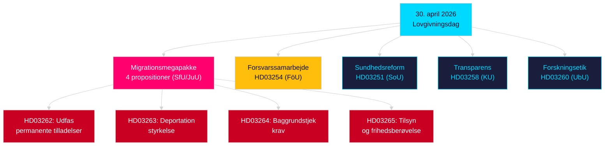

# Aftenanalyse — 30. april 2026: Reformering af migrations- og forsvarssamarbejdslove

**Forfatter**: James Pether Sörling  
**Dato**: 2026-04-30  
**Konfidens**: HØJ [B2]  
**Klassifikation**: OSINT — Kun offentlige kilder  

---

## Resumé

Den svenske regering fremlagde den 30. april 2026 sit mest konsekvent lovgivningspakke i sessionen 2025/26: en fireforslagsændering af migrationsloven, der udfaser permanente opholdstilladelser og tilpasser svensk lovgivning til EU's migrations- og asylpagt, samt en stor militær samarbejdsproposition, der styrker Sveriges operationelle integration i NATO's strukturer. Med 149 dage til valget den 13. september 2026 er denne lovgivningssprint simultant et styre og en valgpositioneringskampagne.

## Beslutninger dette notat understøtter

1. **Oppositionens partipisker**: Vurder modstandets omfang mod migrationspakken (HD03262/263/264/265) og forsvarsloven (HD03254) — fire samtidige udvalgshenvisninger (SfU, JuU, FöU) komprimerer den parlamentariske tidsplan.
2. **Civilsamfundsorganisationer**: Vurder juridiske udfordringsvektorer mod HD03262's afskaffelse af permanente tilladelser mod EMRK art. 8 (familieliv) og EU-chartrets proportionalitet.
3. **NATO/forsvarsanalytikere**: Vurder HD03254's operationelle indhold — forbedrede bilaterale militære interoperabilitetsaftaler signalerer Sveriges strategiske integrationsambitioner efter tiltrædelsen.
4. **Valgstrateger**: Kalibrer vælgerreaktioner på migrations lovmaksimalisme i forvalgsvinduer (≤6 måneder: valgnærhedsmultiplikator gælder).

## 60-sekunders efterretningspunkter

- **Migrationsmegapakke**: HD03262 udfaser permanente opholdstilladelser helt; HD03263 styrker deportation; HD03264 indfører strengere baggrundstjek for tilladelser; HD03265 strammer tilsyn og frihedsberøvelse — den mest restriktive migrationslovgivning i moderne svensk historie siden nødforanstaltningerne i 2016 [A2].
- **Militært samarbejde**: HD03254 (FöU) styrker Sveriges operationelle militære samarbejdsramme — binder Sverige til dybere bilaterale og multilaterale forsvarsaftaler, afgørende med tanke på NATO artikel 5-forpligtelser og arktiske krav [A2].
- **Sundhedsintegration (Healthcare integration)**: HD03251 foreslår ensartede behandlingsveje for afhængighed, misbrug og psykiatrisk samkomorbiditet — en strukturel reform af misbrugsbehandling efter et årtis fragmenteret regionalt ansvar [A2].
- **Politisk transparens**: HD03258 udvider transparens i politisk partifinansierig og lobbyisme — signalerer forvalgsberedskabspositionering fra regeringen [A2].
- **Valgproximitets multiplikator**: Fire migrationspropositioner + forsvarslov = fem høj-kontroversielte love i ≤6-måneders valgvinduer (grænse 2026-03-13); DIW-scorer forhøjet 1,5× per valgproximitetsregel.
- **Oppositionsmotioner**: S dominerer motionsbatchen med 8 indsendelser; SD indsender 2; MP indsender 2 — emner spænder fra rumindustri, kulturarv, sundhed, bolig og social velfærd.

## Vigtigste fremtidige trigger

**Udvalg SfU-høring om HD03262** (forventet inden 2 uger): Afskaffelsen af permanente opholdstilladelser vil møde den mest intensive oppositionsgranskning i sessionen — følg Socialdemokraternes formelle modforslag og eventuelle KD/L-reservationer inden for koalitionen.

## Nøgle-Mermaid: Dagens lovgivningsarkitektur

<!-- source-sha: d7dc1f1126e721cf29b3d6e70e1445903be3c419 -->
