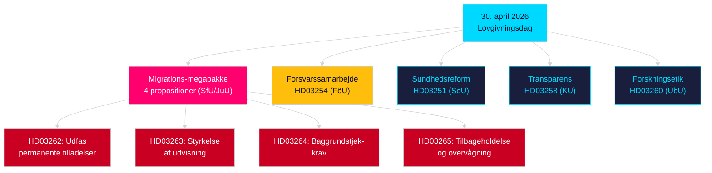

# Aftenanalyse — 30. april 2026: Overhaul af Sveriges migrationslov og forsvarssamarbejde skrider frem

**Forfatter**: James Pether Sörling  
**Dato**: 2026-04-30  
**Konfidensgrad**: HIGH [B2]  
**Klassificering**: OSINT — Kun offentlige kilder  

---

## Resumé

Sveriges regering leverede sin mest konsekvente enkeltdagslovpakke i sessionen 2025/26 den 30. april 2026: en fire-propositions migrationstransformation, der udfaser permanente opholdstilladelser og tilpasser svensk lovgivning til EU's migrations- og asylpagt, sammen med en større militær samarbejdsproposition der styrker Sveriges operationelle integration i NATO-strukturer. Med 149 dage til det parlamentariske valg den 13. september 2026 er denne lovgivningssprint samtidig en styringshandling og en valgpositioneringskampagne.

## Beslutninger dette brev understøtter

1. **Oppositionspartiernes partipisker**: Vurder omfanget af det nødvendige modstand mod migrationspakken (HD03262/263/264/265) og forsvarspropositionen (HD03254) — fire samtidige udvalgsreferencer (SfU, JuU, FöU) komprimerer den parlamentariske tidslinje.
2. **Civilsamfundsorganisationer**: Evaluer juridiske udfordringsvektorer for HD03262's afskaffelse af permanente tilladelser mod EMRK art. 8 (familieliv) og EU-chartrets proportionalitet.
3. **NATO/forsvarsanalytikere**: Vurder HD03254's operationelle indhold — styrkede bilaterale militære interoperabilitetsaftaler signalerer Sveriges strategiske integrationsambitioner efter NATO-tiltrædelsen.
4. **Valgstrateger**: Kalibrer vælgerrespons på migrationslovsmaksimalisme i forvalgsvinduer (≤6 måneder: valgproximitetsmultiplikator gælder).

## 60-sekunders efterretningspunkter

- **Migrations-megapakke**: HD03262 udfaser permanente opholdstilladelser fuldstændigt; HD03263 styrker udvisning; HD03264 indfører strengere baggrundstjekskrav for tilladelser; HD03265 strammes overvågning og tilbageholdelse — den mest restriktive migrationslovgivning i svensk historie siden nødforanstaltningerne i 2016 [A2].
- **Militært samarbejde**: HD03254 (FöU) styrker Sveriges operationelle militære samarbejdsramme — binder Sverige til dybere bilaterale og multilaterale forsvarsaftaler, afgørende i betragtning af NATO's artikel 5-forpligtelser og arktiske teaterkrav [A2].
- **Sundhedsintegration**: HD03251 foreslår enhedsveje for afhængighed, stofmisbrug og psykiatrisk komorbiditet — en strukturel reform af afhængighedsvæsenet efter et årti med fragmenteret regionalt ansvar [A2].
- **Politisk transparens**: HD03258 udvider transparensen i politisk partifinansering og lobbyisme — signalerer forvalgansvarlighedspositionering af regeringen [A2].
- **Valgproximitetsmultiplikator**: Fire migrationspropositoner + forsvarsproposition = fem høj-kontroversielle lovforslag i ≤6-månaders valgvinduer (grænse 2026-03-13); DIW-score forhøjet med 1,5× per valgproximitetregel.
- **Oppositionsmotioner**: S dominerer motionsbatchen med 8 indlæg; SD indgiver 2; MP indgiver 2 — emner spænder over rumfartsindustri, kulturarv, sundhedsvæsen, bolig og social velfærd.

## Vigtigste fremadrettede trigger

**Udvalgshøring SfU om HD03262** (forventes inden 2 uger): Afskaffelsen af permanente opholdstilladelser vil møde den mest intense oppositionsgranskning i sessionen — hold øje med Socialdemokraternes formelle modforslag og eventuelle KD/L-forbehold inden for koalitionen.

## Vigtigste Mermaid: Dagens lovgivningsarkitektur

<!-- source-sha: 34f4e52b496d9d798f623f205ad98b050ff2f0e7 -->
