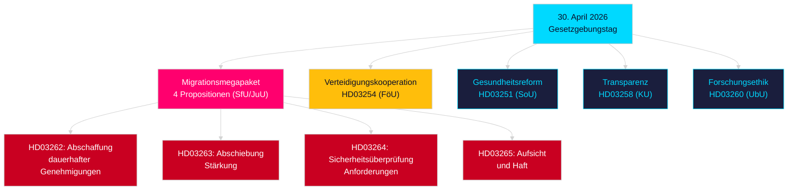

# Abendanalyse — 30. April 2026: Schwedens Reform des Migrationsrechts und Fortschritte bei der Verteidigungskooperation

**Autor**: James Pether Sörling  
**Datum**: 2026-04-30  
**Konfidenz**: HOCH [B2]  
**Klassifizierung**: OSINT — Nur öffentliche Quellen  

---

## Zusammenfassung

Die schwedische Regierung legte am 30. April 2026 das folgenreichste gesetzgeberische Paket eines einzelnen Tages der Session 2025/26 vor: eine Vier-Propositions-Transformation des Migrationsrechts, die unbefristete Aufenthaltserlaubnisse abschafft und das schwedische Recht an den EU-Migrations- und Asylpakt anpasst, sowie eine bedeutende Proposition zur Verteidigungskooperation, die Schwedens operative Integration in NATO-Strukturen stärkt. Mit 149 Tagen bis zur Parlamentswahl am 13. September 2026 ist dieser Gesetzgebungssprint zugleich ein Regierungsakt und eine Wahlkampfpositionierung.

## Entscheidungen, die dieses Briefing unterstützt

1. **Oppositionspartei-Einpeitscher**: Bewertung des Widerstands gegen das Migrationspaket (HD03262/263/264/265) und die Verteidigungsproposition (HD03254) — vier gleichzeitige Ausschussüberweisungen (SfU, JuU, FöU) komprimieren den parlamentarischen Zeitplan.
2. **Zivilgesellschaftsorganisationen**: Bewertung rechtlicher Anfechtungsvektoren gegen die Abschaffung dauerhafter Genehmigungen in HD03262 im Bezug auf EMRK Art. 8 (Familienleben) und den Verhältnismäßigkeitsgrundsatz der EU-Grundrechtecharta.
3. **NATO/Verteidigungsanalysten**: Bewertung des operativen Inhalts von HD03254 — verbesserte bilaterale militärische Interoperabilitätsabkommen signalisieren Schwedens strategische Integrationsambitionenach dem NATO-Beitritt.
4. **Wahlstrategen**: Kalibrierung der Wählerreaktionen auf den Maximalismus des Migrationsrechts im Vorwahlzeitraum (≤6 Monate: Wahlnähe-Multiplikator gilt).

## 60-Sekunden-Informationspunkte

- **Migrationsmega-Paket**: HD03262 schafft unbefristete Aufenthaltserlaubnisse vollständig ab; HD03263 stärkt Abschiebungen; HD03264 führt strengere Anforderungen an Sicherheitsüberprüfungen für Genehmigungen ein; HD03265 verschärft Aufsicht und Haft — das restriktivste Migrationsrecht in der modernen schwedischen Geschichte seit den Notmaßnahmen 2016 [A2].
- **Militärische Kooperation**: HD03254 (FöU) stärkt Schwedens operatives militärisches Kooperationsrahmenwerk — bindet Schweden an tiefere bilaterale und multilaterale Verteidigungsverträge, entscheidend angesichts der NATO-Artikel-5-Verpflichtungen und arktischer Anforderungen [A2].
- **Gesundheitsintegration (Healthcare integration)**: HD03251 schlägt einheitliche Behandlungspfade für Sucht, Substanzmissbrauch und psychiatrische Komorbidität vor — eine strukturelle Reform der Suchtbehandlung nach einem Jahrzehnt fragmentierter regionaler Verantwortung [A2].
- **Politische Transparenz**: HD03258 erweitert die Transparenz bei politischen Parteifinanzen und Lobbying — signalisiert Vorwahlverantwortlichkeitspositionierung der Regierung [A2].
- **Wahlnähe-Multiplikator**: Vier Migrationspropositionen + Verteidigungsproposition = fünf hochkontroverse Gesetze im ≤6-Monats-Wahlfenster (Grenzwert 2026-03-13); DIW-Werte um 1,5× erhöht gemäß Wahlnähe-Regel.
- **Oppositionsanträge**: S dominiert den Antragsblock mit 8 Einreichungen; SD reicht 2 ein; MP reicht 2 ein — Themen umfassen Raumfahrtindustrie, Kulturerbe, Gesundheit, Wohnen und Sozialwohlfahrt.

## Wichtigster zukünftiger Auslöser

**Ausschuss-SfU-Anhörung zu HD03262** (erwartet innerhalb von 2 Wochen): Die Abschaffung dauerhafter Aufenthaltserlaubnisse wird der intensivsten Oppositionskontrolle der Session unterliegen — achten Sie auf den formellen Gegenvorschlag der Sozialdemokraten und eventuelle KD/L-Vorbehalte innerhalb der Koalition.

## Schlüssel-Mermaid: Legislative Architektur des Tages

<!-- source-sha: d7dc1f1126e721cf29b3d6e70e1445903be3c419 -->
