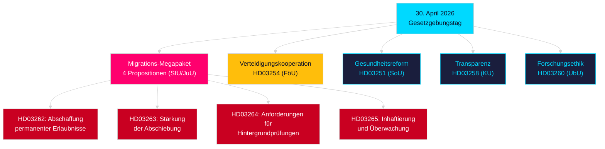

# Abendanalyse — 30. April 2026: Schweden reformiert Migrationsrecht und treibt Verteidigungskooperation voran

**Autor**: James Pether Sörling  
**Datum**: 2026-04-30  
**Konfidenz**: HIGH [B2]  
**Klassifizierung**: OSINT — Ausschließlich öffentliche Quellen  

---

## Zusammenfassung

Die schwedische Regierung legte am 30. April 2026 das umfassendste Gesetzespaket eines einzelnen Tages in der Sitzungsperiode 2025/26 vor: eine aus vier Gesetzentwürfen bestehende Migrationstransformation, die dauerhafte Aufenthaltsgenehmigungen abschafft und das schwedische Recht an den EU-Migrations- und Asylpakt anpasst, sowie eine umfangreiche Militärkooperationsproposition, die Schwedens operative Integration in NATO-Strukturen stärkt. Mit 149 Tagen bis zur Parlamentswahl am 13. September 2026 ist dieser Gesetzgebungssprint gleichzeitig ein Regierungsakt und eine Wahlpositionierungsmaßnahme.

## Entscheidungen, die dieses Briefing unterstützt

1. **Fraktionsdisziplinare der Oppositionsparteien**: Bewerten Sie den Umfang des erforderlichen Widerstands gegen das Migrationspaket (HD03262/263/264/265) und die Verteidigungsproposition (HD03254) — vier gleichzeitige Ausschussverweise (SfU, JuU, FöU) verdichten den parlamentarischen Zeitplan.
2. **Zivilgesellschaftliche Organisationen**: Beurteilen Sie rechtliche Anfechtungsvektoren für HD03262s Abschaffung dauerhafter Genehmigungen gegenüber EMRK Art. 8 (Familienleben) und dem Verhältnismäßigkeitsgrundsatz der EU-Grundrechtecharta.
3. **NATO-/Verteidigungsanalysten**: Bewerten Sie den operativen Inhalt von HD03254 — verstärkte bilaterale Militärinteroperabilitätsabkommen signalisieren Schwedens strategische Integrationsambitionenach dem NATO-Beitritt.
4. **Wahlstrategen**: Kalibrieren Sie die Wählerreaktion auf Migrations-Maximalismus in Vorwahlzeiträumen (≤6 Monate: Wahlnähemultiplikator gilt).

## 60-Sekunden-Geheimdienstpunkte

- **Migrations-Megapaket**: HD03262 schafft dauerhafte Aufenthaltsgenehmigungen vollständig ab; HD03263 verschärft Abschiebungen; HD03264 führt strengere Hintergrundprüfungsanforderungen für Genehmigungen ein; HD03265 verschärft Überwachung und Inhaftierung — die restriktivste Migrationsgesetzgebung in der schwedischen Geschichte seit den Notmaßnahmen 2016 [A2].
- **Militärische Zusammenarbeit**: HD03254 (FöU) stärkt Schwedens operativen Rahmen für militärische Zusammenarbeit — verpflichtet Schweden zu tieferen bilateralen und multilateralen Verteidigungsabkommen, entscheidend angesichts der NATO-Artikel-5-Verpflichtungen und der Anforderungen des arktischen Operationsraums [A2].
- **Gesundheitsintegration**: HD03251 schlägt einheitliche Behandlungspfade für Abhängigkeit, Drogenkonsum und psychiatrische Komorbidität vor — eine strukturelle Reform der Suchtversorgung nach einem Jahrzehnt fragmentierter regionaler Zuständigkeit [A2].
- **Politische Transparenz**: HD03258 erweitert die Transparenz bei politischer Parteienfinanzierung und Lobbying — signalisiert die Rechenschaftspositionierung der Regierung vor der Wahl [A2].
- **Wahlnähemultiplikator**: Vier Migrationspropositionen + Verteidigungsproposition = fünf hochkontroverse Gesetzesvorhaben in ≤6-monatigem Wahlfenster (Stichtag 2026-03-13); DIW-Score erhöht um 1,5× gemäß Wahlnäheregel.
- **Oppositionsmotionen**: S dominiert den Motionsblock mit 8 Eingaben; SD reicht 2 ein; MP reicht 2 ein — Themen umfassen Raumfahrtindustrie, Kulturerbe, Gesundheitswesen, Wohnen und soziale Wohlfahrt.

## Wichtigster bevorstehender Auslöser

**Ausschussanhörung SfU zu HD03262** (erwartet innerhalb von 2 Wochen): Die Abschaffung dauerhafter Aufenthaltsgenehmigungen wird der intensivsten Oppositionsprüfung der Sitzungsperiode begegnen — beobachten Sie den formellen Gegenantrag der Sozialdemokraten und mögliche KD/L-Vorbehalte innerhalb der Koalition.

## Wichtigstes Mermaid: Gesetzgebungsarchitektur des Tages

<!-- source-sha: 34f4e52b496d9d798f623f205ad98b050ff2f0e7 -->
