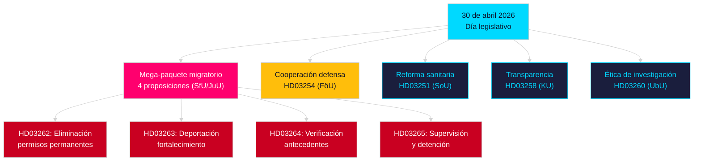

# Análisis vespertino — 30 de abril de 2026: La reforma de la ley de migración sueca y avances en la cooperación de defensa

**Autor**: James Pether Sörling  
**Fecha**: 2026-04-30  
**Confianza**: ALTA [B2]  
**Clasificación**: OSINT — Solo fuentes públicas  

---

## Resumen

El 30 de abril de 2026, Suecia presentó el paquete legislativo diario más significativo de 2025/26: cuatro proposiciones que transforman el derecho migratorio (eliminación de permisos permanentes, alineación con el Pacto UE) y una proposición de cooperación militar OTAN. Con 149 días hasta las elecciones del 13 de septiembre de 2026, combina gobernanza y posicionamiento electoral.

## Decisiones que apoya este informe

1. **Líderes de la oposición**: Evaluar la resistencia al paquete migratorio (HD03262/263/264/265) y HD03254 — cuatro comités (SfU, JuU, FöU) convocados simultáneamente.
2. **Organizaciones de la sociedad civil**: Evaluar impugnaciones legales contra HD03262 en base al artículo 8 del CEDH y la proporcionalidad EU.
3. **Analistas de la OTAN/defensa**: Evaluar el contenido operativo de HD03254 — los acuerdos de interoperabilidad señalan la integración estratégica post-adhesión.
4. **Estrategas electorales**: Calibrar las reacciones al maximalismo migratorio en ventana preelectoral (≤6 meses: multiplicador activo).

## Puntos de inteligencia en 60 segundos

- **Mega-paquete migratorio**: HD03262 elimina progresivamente todos los permisos de residencia permanentes; HD03263 fortalece las deportaciones; HD03264 introduce requisitos más estrictos de verificación de antecedentes para los permisos; HD03265 endurece la supervisión y la detención — la legislación migratoria más restrictiva de la historia sueca moderna desde las medidas de emergencia de 2016 [A2].
- **Cooperación militar**: HD03254 (FöU) refuerza el marco de cooperación militar operativa de Suecia — vincula a Suecia a acuerdos de defensa bilaterales y multilaterales más profundos, críticos dado el compromiso del Artículo 5 de la OTAN y los requisitos del teatro ártico [A2].
- **Integración sanitaria (Healthcare integration)**: HD03251 propone vías de atención unificadas para la adicción, el abuso de sustancias y la comorbilidad psiquiátrica — una reforma estructural del sector de atención a la adicción tras una década de responsabilidad regional fragmentada [A2].
- **Transparencia política**: HD03258 amplía la transparencia en la financiación de partidos políticos y el lobby — señala el posicionamiento de responsabilidad preelectoral del gobierno [A2].
- **Multiplicador de proximidad electoral**: Cuatro proposiciones migratorias + ley de defensa = cinco leyes altamente controvertidas en la ventana electoral ≤6 meses (umbral 2026-03-13); puntuaciones DIW elevadas 1,5× por regla de proximidad electoral.
- **Mociones de la oposición**: S domina el lote de mociones con 8 presentaciones; SD presenta 2; MP presenta 2 — los temas abarcan la industria aeroespacial, patrimonio cultural, salud, vivienda y bienestar social.

## Desencadenante futuro principal

**Audiencia de la comisión SfU sobre HD03262** (esperada en 2 semanas): La abolición de los permisos de residencia permanentes se enfrentará al escrutinio de oposición más intenso de la sesión — seguir la contra-propuesta formal de los Socialdemokraterna y posibles reservas de KD/L dentro de la coalición.

## Mermaid clave: Arquitectura legislativa del día

<!-- source-sha: 34f4e52b496d9d798f623f205ad98b050ff2f0e7 -->
