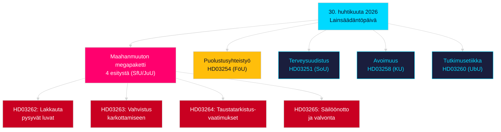

# Ilta-analyysi — 30. huhtikuuta 2026: Ruotsin maahanmuuttolaki uudistuu ja puolustusyhteistyö etenee

**Kirjoittaja**: James Pether Sörling  
**Päivämäärä**: 2026-04-30  
**Luottamustaso**: HIGH [B2]  
**Luokitus**: OSINT — Vain julkiset lähteet  

---

## Tiivistelmä

Ruotsin hallitus toimitti 30. huhtikuuta 2026 istuntokauden 2025/26 tähän mennessä kattavimman yksittäisen päivän lakipaketin: neljän esityksen maahanmuuttouudistuksen, joka lakkauttaa pysyvät oleskeluluvat ja sopeuttaa Ruotsin lainsäädännön EU:n muuttoliike- ja turvapaikkapaktiin, sekä merkittävän sotilasyhteistyöesityksen, joka vahvistaa Ruotsin operatiivista integraatiota NATO-rakenteisiin. Kun parlamenttivaaleista 13. syyskuuta 2026 on 149 päivää, tämä lainsäädäntösprint on samanaikaisesti hallintotoimi ja vaaliasemointi.

## Päätökset, joita tämä tiedote tukee

1. **Oppositiopuolueiden puoluesihteerit**: Arvioi maahanmuuttopakettia (HD03262/263/264/265) ja puolustusesitystä (HD03254) vastaan tarvittavan vastarinnan laajuus — neljä samanaikaista valiokuntaviittausta (SfU, JuU, FöU) tiivistää parlamentaarista aikataulua.
2. **Kansalaisyhteiskunnan järjestöt**: Arvioi HD03262:n pysyvien lupien poistamisen juridiset haastevektorit EIS 8 artiklaa (perhe-elämä) ja EU:n perusoikeuskirjan suhteellisuusperiaatetta vastaan.
3. **NATO/puolustusanalyytikot**: Arvioi HD03254:n operatiivinen sisältö — vahvistetut kahdenväliset sotilaalliset yhteentoimivuussopimukset viestivät Ruotsin strategisista integraatiotavoitteista NATO-jäsenyyden jälkeen.
4. **Vaalikampanjoijat**: Kalibroi äänestäjävastaus maahanmuuttolain maksimalismille vaaliikkunoissa (≤6 kuukautta: vaalilähestymiskerroin pätee).

## 60 sekunnin tiedusteluhuomiot

- **Maahanmuuton megapaketti**: HD03262 lakkauttaa pysyvät oleskeluluvat kokonaan; HD03263 vahvistaa karkottamista; HD03264 ottaa käyttöön tiukemmat taustatarkistusvaatimukset luville; HD03265 tiukentaa valvontaa ja säilöönottoa — tiukin maahanmuuttolainsäädäntö Ruotsin historiassa vuoden 2016 hätätoimien jälkeen [A2].
- **Sotilasyhteistyö**: HD03254 (FöU) vahvistaa Ruotsin operatiivista sotilasyhteistyökehystä — sitoo Ruotsin syvempiin kahdenvälisiin ja monenvälisiin puolustussopimuksiin, mikä on ratkaisevan tärkeää NATO:n 5. artiklan velvoitteiden ja arktisen teatterin vaatimusten valossa [A2].
- **Terveydenhuollon integrointi**: HD03251 ehdottaa yhtenäisiä hoitopolkuja riippuvuudelle, päihteidenkäytölle ja psykiatriselle komorbidisuudelle — riippuvuushoidon rakenteellinen uudistus vuosikymmenen hajanaistetun alueellisen vastuun jälkeen [A2].
- **Poliittinen avoimuus**: HD03258 laajentaa poliittisen puoluerahoituksen ja lobbauksen avoimuutta — viestii hallituksen vaaleja edeltävästä tilivelvollisuusasemoinnista [A2].
- **Vaalilähestymiskerroin**: Neljä maahanmuuttoesitystä + puolustusesitys = viisi erittäin kiistanalaista lakiehdotusta ≤6 kuukauden vaali-ikkunassa (raja 2026-03-13); DIW-pisteet korotettu 1,5× vaalilähestymissäännön mukaisesti.
- **Oppositiomotiot**: S hallitsee motiopakettia 8 ehdotuksella; SD toimittaa 2; MP toimittaa 2 — aiheet kattavat avaruusteollisuuden, kulttuuriperinnön, terveydenhuollon, asumisen ja sosiaalisen hyvinvoinnin.

## Tärkein tuleva laukaisin

**SfU:n valiokuntakuuleminen HD03262:sta** (odotetaan 2 viikon kuluessa): Pysyvien oleskelulupien lakkauttaminen kohtaa istuntokauden intensiivisimmän oppositiotutkimuksen — seuraa sosiaalidemokraattien virallista vastaesitystä ja mahdollisia KD/L-varaumia koalition sisällä.

## Tärkein Mermaid: Päivän lainsäädäntöarkkitehtuuri

<!-- source-sha: 34f4e52b496d9d798f623f205ad98b050ff2f0e7 -->
