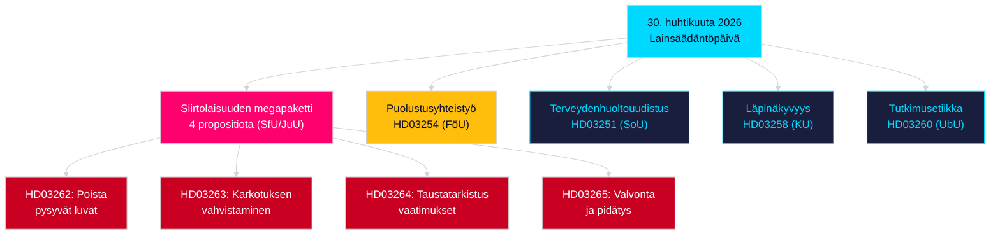

# Ilta-analyysi — 30. huhtikuuta 2026: Maahanmuutto- ja puolustusyhteistyölakien uudistaminen

**Tekijä**: James Pether Sörling  
**Päivämäärä**: 2026-04-30  
**Luottamus**: KORKEA [B2]  
**Luokittelu**: OSINT — Vain julkiset lähteet  

---

## Yhteenveto

Ruotsin hallitus esitti 30. huhtikuuta 2026 istuntokauden 2025/26 merkittävimmän yksittäisen päivän lainsäädäntöpaketin: neljän proposition siirtolaisuuslainsäädännön muutoksen, joka poistaa pysyvät oleskeluluvat ja sovittaa Ruotsin lainsäädännön EU:n muuttoliike- ja turvapaikkasopimukseen, sekä merkittävän sotilaallisen yhteistyöpropositon, joka vahvistaa Ruotsin operatiivista integraatiota NATO:n rakenteisiin. 149 päivää ennen 13. syyskuuta 2026 pidettäviä yleisiä vaaleja tämä lainsäädäntösprintti on samanaikaisesti hallintoteko ja vaalikampanjastrateginen asemointi.

## Päätökset, joita tämä tiedote tukee

1. **Opposition puoluekurit**: Arvioi vastarinnan laajuus siirtolaisuuspakettia (HD03262/263/264/265) ja puolustuslakia (HD03254) vastaan — neljä samanaikaista valiokuntaohjausta (SfU, JuU, FöU) tiivistää parlamentaarista aikataulua.
2. **Kansalaisyhteiskunnan organisaatiot**: Arvioi HD03262:n pysyvien lupien lakkauttamisen juridiset haastevektorit suhteessa EIS 8 artiklaan (perhe-elämä) ja EU:n perusoikeuskirjan suhteellisuusperiaatteeseen.
3. **NATO/puolustusanalyytikot**: Arvioi HD03254:n operatiivinen sisältö — parannetut kahdenväliset sotilaalliset yhteentoimivuussopimukset signaloivat Ruotsin strategisia integraatioambitionia liittymisen jälkeen.
4. **Vaalikonsultit**: Kalibroi äänestäjäreaktiot siirtolaisuuslain maksimalismiin ennen vaalistrategisessa ikkunassa (≤6 kuukautta: vaaliläheisyyskertoimea sovelletaan).

## 60 sekunnin tiedustelukopit

- **Siirtolaisuuden megapaketti**: HD03262 poistaa kokonaan pysyvät oleskeluluvat; HD03263 vahvistaa karkotuksia; HD03264 ottaa käyttöön tiukempia taustatarkistusvaatimuksia lupiin; HD03265 tiukentaa valvontaa ja pidätystä — tiukin siirtolaislainsäädäntö modernissa Ruotsin historiassa vuoden 2016 hätätoimien jälkeen [A2].
- **Sotilaallinen yhteistyö**: HD03254 (FöU) vahvistaa Ruotsin operatiivista sotilaallista yhteistyökehystä — sitoo Ruotsin syvempiin kahdenvälisiin ja monenvälisiin puolustussopimuksiin, kriittistä NATO 5 artiklan velvoitteiden ja arktisten vaatimusten vuoksi [A2].
- **Terveydenhuollon integraatio (Healthcare integration)**: HD03251 ehdottaa yhtenäisiä hoitopolkuja riippuvuudelle, päihdehäiriölle ja psykiatriselle rinnakkaissairastavuudelle — rakenteellinen uudistus riippuvuushoidossa vuosikymmenen hajanaisen alueellisen vastuun jälkeen [A2].
- **Poliittinen läpinäkyvyys**: HD03258 laajentaa läpinäkyvyyttä poliittisessa puoluerahoituksessa ja lobbytoiminnassa — signaloi hallituksen vaalienedistä vastuuvelvollisuusasemointia [A2].
- **Vaaliläheisyyskerroin**: Neljä siirtolaisuuspropositiota + puoloustuspropositio = viisi korkean kiistan lakia ≤6 kuukauden vaali-ikkunassa (raja 2026-03-13); DIW-pisteet korotettu 1,5× vaaliläheisyyssäännöllä.
- **Opposition motiot**: S hallitsee motioerää 8 esityksellä; SD jättää 2; MP jättää 2 — aiheet kattavat avaruusteollisuuden, kulttuuriperinnön, terveydenhuollon, asumisen ja sosiaaliturvan.

## Tärkein tulevaisuuden laukaisija

**Valiokunta SfU:n kuuleminen HD03262:sta** (odotetaan 2 viikon kuluessa): Pysyvien oleskelulupien lakkauttaminen kohtaa istuntokauden intensiivisimmän oppositiovalvonnan — seuraa Sosiaalidemokraattien muodollista vastaproposiota ja mahdollisia KD/L-varaumia koalitiossa.

## Avainkaavio: Päivän lainsäädäntöarkkitehtuuri

<!-- source-sha: d7dc1f1126e721cf29b3d6e70e1445903be3c419 -->
