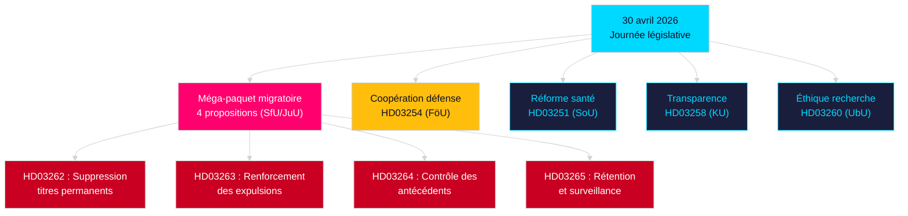

# Analyse du soir — 30 avril 2026 : La Suède réforme son droit migratoire et fait avancer la coopération défense

**Auteur** : James Pether Sörling  
**Date** : 2026-04-30  
**Niveau de confiance** : HIGH [B2]  
**Classification** : OSINT — Sources publiques uniquement  

---

## Résumé exécutif

Le gouvernement suédois a déposé le 30 avril 2026 le train de lois le plus substantiel en une seule journée de la session 2025/26 : une transformation migratoire en quatre propositions supprimant les permis de résidence permanents et alignant le droit suédois sur le Pacte européen sur la migration et l'asile, accompagnée d'une proposition de coopération militaire majeure renforçant l'intégration opérationnelle de la Suède au sein des structures OTAN. À 149 jours des élections législatives du 13 septembre 2026, ce sprint législatif constitue à la fois un acte de gouvernance et une manœuvre de positionnement électoral.

## Décisions que ce bref soutient

1. **Chefs de file parlementaires de l'opposition** : Évaluer l'ampleur de la résistance à opposer au paquet migratoire (HD03262/263/264/265) et à la proposition de défense (HD03254) — quatre renvois simultanés en commission (SfU, JuU, FöU) compriment le calendrier parlementaire.
2. **Organisations de la société civile** : Évaluer les vecteurs de contestation juridique de la suppression des titres permanents prévue par HD03262 au regard de l'art. 8 CEDH (vie familiale) et du principe de proportionnalité de la Charte des droits fondamentaux de l'UE.
3. **Analystes NATO/défense** : Examiner le contenu opérationnel de HD03254 — des accords bilatéraux d'interopérabilité militaire renforcés signalent les ambitions d'intégration stratégique de la Suède post-adhésion à l'OTAN.
4. **Stratèges électoraux** : Calibrer la réponse électorale au maximalisme en matière de migration dans les fenêtres pré-électorales (≤6 mois : multiplicateur de proximité électorale applicable).

## Points de renseignement en 60 secondes

- **Méga-paquet migratoire** : HD03262 supprime intégralement les titres de séjour permanents ; HD03263 renforce les expulsions ; HD03264 instaure des exigences de contrôle des antécédents plus strictes pour les titres ; HD03265 resserre la surveillance et la rétention — la législation migratoire la plus restrictive de l'histoire suédoise depuis les mesures d'urgence de 2016 [A2].
- **Coopération militaire** : HD03254 (FöU) renforce le cadre de coopération militaire opérationnelle de la Suède — engage le pays dans des accords bilatéraux et multilatéraux de défense plus profonds, décisifs au regard des obligations de l'article 5 de l'OTAN et des exigences du théâtre arctique [A2].
- **Intégration sanitaire** : HD03251 propose des parcours de soins unifiés pour les dépendances, la toxicomanie et les comorbidités psychiatriques — une réforme structurelle des services d'addictologie après une décennie de responsabilité régionale fragmentée [A2].
- **Transparence politique** : HD03258 étend la transparence du financement des partis politiques et du lobbying — signal de positionnement gouvernemental en matière de redevabilité en période pré-électorale [A2].
- **Multiplicateur de proximité électorale** : Quatre propositions migratoires + proposition de défense = cinq projets de loi hautement controversés dans une fenêtre électorale ≤6 mois (seuil 2026-03-13) ; score DIW majoré de 1,5× selon la règle de proximité électorale.
- **Motions de l'opposition** : S domine le paquet de motions avec 8 dépôts ; SD en dépose 2 ; MP en dépose 2 — les sujets couvrent l'industrie spatiale, le patrimoine culturel, la santé, le logement et la protection sociale.

## Principal déclencheur à venir

**Audition en commission SfU sur HD03262** (attendue d'ici 2 semaines) : la suppression des titres de séjour permanents fera l'objet du contrôle parlementaire de l'opposition le plus intense de la session — surveiller la contre-proposition formelle des sociaux-démocrates et les éventuelles réserves de KD/L au sein de la coalition.

## Principal diagramme Mermaid : Architecture législative du jour

<!-- source-sha: 34f4e52b496d9d798f623f205ad98b050ff2f0e7 -->
