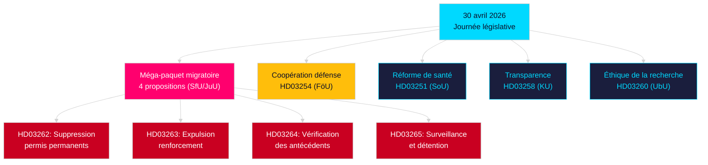

# Analyse du soir — 30 avril 2026: Réforme du droit migratoire suédois et avancées de la coopération défense

**Auteur**: James Pether Sörling  
**Date**: 2026-04-30  
**Confiance**: ÉLEVÉE [B2]  
**Classification**: OSINT — Sources publiques uniquement  

---

## Résumé

Le 30 avril 2026, la Suède a présenté son paquet législatif quotidien le plus consequent de 2025/26: quatre propositions transformant le droit migratoire (fin des permis permanents, alignement sur le Pacte UE) et une proposition de coopération militaire OTAN. À 149 jours des élections du 13 septembre 2026, ce sprint combine gouvernance et positionnement électoral.

## Décisions que ce document soutient

1. **Dirigeants de l'opposition**: Évaluer la résistance face au paquet migratoire (HD03262/263/264/265) et à HD03254 — quatre commissions (SfU, JuU, FöU) simultanément saisies.
2. **Organisations de la société civile**: Évaluer les recours contre HD03262 au regard de l'article 8 CEDH et de la proportionnalité EU.
3. **Analystes NATO/défense**: Évaluer HD03254 — les accords d'interopérabilité militaire signalent les ambitions d'intégration stratégique post-adhésion.
4. **Stratèges électoraux**: Calibrer les réactions des électeurs au maximalisme migratoire (≤6 mois: multiplicateur de proximité électorale actif).

## Points de renseignement en 60 secondes

- **Méga-paquet migratoire**: HD03262 supprime progressivement tous les permis de séjour permanents; HD03263 renforce les expulsions; HD03264 introduit des exigences de vérification des antécédents plus strictes pour les permis; HD03265 renforce la surveillance et la détention — la législation migratoire la plus restrictive de l'histoire suédoise moderne depuis les mesures d'urgence de 2016 [A2].
- **Coopération militaire**: HD03254 (FöU) renforce le cadre de coopération militaire opérationnel de la Suède — lie la Suède à des accords de défense bilatéraux et multilatéraux plus profonds, critiques étant donné les engagements de l'article 5 de l'OTAN et les exigences du théâtre arctique [A2].
- **Intégration des soins de santé (Healthcare integration)**: HD03251 propose des parcours de soins unifiés pour la dépendance, la consommation de substances et la comorbidité psychiatrique — une réforme structurelle du secteur des soins aux dépendances après une décennie de responsabilité régionale fragmentée [A2].
- **Transparence politique**: HD03258 élargit la transparence dans le financement des partis politiques et le lobbying — signale un positionnement pré-électoral de responsabilité de la part du gouvernement [A2].
- **Multiplicateur de proximité électorale**: Quatre propositions migratoires + projet de loi de défense = cinq lois très controversées dans la fenêtre électorale ≤6 mois (seuil 2026-03-13); scores DIW élevés de 1,5× par règle de proximité électorale.
- **Motions de l'opposition**: S domine le lot de motions avec 8 soumissions; SD en dépose 2; MP en dépose 2 — les sujets couvrent l'industrie spatiale, le patrimoine culturel, la santé, le logement et le bien-être social.

## Déclencheur futur principal

**Audience de la commission SfU sur HD03262** (attendue dans les 2 prochaines semaines): L'abolition des permis de séjour permanents fera l'objet du contrôle oppositionnel le plus intense de la session — suivre la contre-proposition formelle des Socialdemokraterna et les éventuelles réserves de KD/L au sein de la coalition.

## Mermaid clé: Architecture législative de la journée

<!-- source-sha: 34f4e52b496d9d798f623f205ad98b050ff2f0e7 -->
