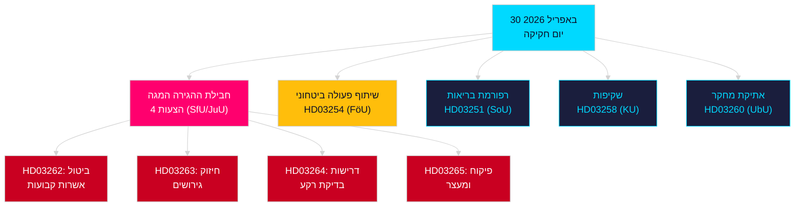

<!-- dir: rtl -->
# ניתוח ערב — 30 באפריל 2026: רפורמת חוק ההגירה השוודי והתקדמות בשיתוף פעולה ביטחוני

**מחבר**: James Pether Sörling  
**תאריך**: 2026-04-30  
**אמינות**: גבוהה [B2]  
**סיווג**: OSINT — מקורות ציבוריים בלבד  

---

## סיכום מנהלים

הממשלה השוודית הגישה ב-30 באפריל 2026 את חבילת החקיקה המשמעותית ביותר ליום אחד של הפגרה 2025/26: שינוי מהותי בחוק ההגירה בארבעה הצעות חוק שמבטלות בהדרגה אשרות שהייה קבועות ומיישרות קו עם הסכם ההגירה והמקלט של האיחוד האירופי, לצד הצעת חוק חשובה לשיתוף פעולה צבאי המחזקת את האינטגרציה המבצעית של שוודיה בתוך מבני נאט"ו. עם 149 ימים עד לבחירות הכלליות ב-13 בספטמבר 2026, ריצה חקיקתית זו היא בו-זמנית מעשה ממשלה ומיצוב קמפיין בחירות.

## החלטות שתיעוד זה תומך בהן

1. **מנהיגי האופוזיציה**: הערכת היקף ההתנגדות הנדרשת מול חבילת ההגירה (HD03262/263/264/265) וחוק הביטחון (HD03254) — ארבעה הפניות בו-זמניות לוועדות (SfU, JuU, FöU) מדחסות את הלוח הזמני הפרלמנטרי.
2. **ארגוני החברה האזרחית**: הערכת וקטורי ערעור משפטי נגד ביטול האישורים הקבועים על פי HD03262 ביחס לסעיף 8 של האמנה האירופית לזכויות אדם (חיי משפחה) ועקרון המידתיות של אמנת הזכויות הבסיסיות של האיחוד האירופי.
3. **אנליסטי נאט"ו/ביטחון**: הערכת התוכן המבצעי של HD03254 — הסכמי הפעלה בין-אופרטיביים דו-צדדיים משופרים מאותתים על שאיפות אינטגרציה אסטרטגית של שוודיה לאחר הצטרפותה.
4. **אסטרטגי בחירות**: כיול תגובות בוחרים למקסימליזם בחוק ההגירה בחלון שלפני הבחירות (≤6 חודשים: מכפיל קרבת בחירות חל).

## נקודות מודיעין ב-60 שניות

- **חבילת ההגירה המגה**: HD03262 מבטל בהדרגה את כל אשרות השהייה הקבועות; HD03263 מחזק גירושים; HD03264 מציג דרישות בדיקת רקע מחמירות יותר לאישורים; HD03265 מחמיר פיקוח ומעצר — החקיקה המגבילה ביותר בתולדות שוודיה המודרנית מאז אמצעי החירום של 2016 [A2].
- **שיתוף פעולה צבאי**: HD03254 (FöU) מחזק את מסגרת שיתוף הפעולה הצבאי המבצעי של שוודיה — קושר את שוודיה להסכמי הגנה דו-צדדיים ורב-צדדיים עמוקים יותר, קריטיים בהתחשב בהתחייבויות סעיף 5 של נאט"ו ודרישות התיאטרון הארקטי [A2].
- **אינטגרציה בריאותית (Healthcare integration)**: HD03251 מציע מסלולי טיפול מאוחדים להתמכרות, שימוש בסמים ותחלואה נפשית משולבת — רפורמה מבנית במגזר טיפול ההתמכרות לאחר עשור של אחריות אזורית מפוצלת [A2].
- **שקיפות פוליטית**: HD03258 מרחיב שקיפות במימון מפלגות פוליטיות ולוביינג — מאותת על מיצוב אחריות ממשלתי לפני הבחירות [A2].
- **מכפיל קרבת בחירות**: ארבע הצעות הגירה + חוק ביטחון = חמישה חוקים שנויים במחלוקת בחלון הבחירות ≤6 חודשים (סף 2026-03-13); ציוני DIW גבוהים פי 1.5 לפי כלל הקרבה.
- **הצעות אופוזיציה**: S דומינה בחבילת ההצעות עם 8 הגשות; SD מגישה 2; MP מגישה 2 — נושאים כוללים תעשיית חלל, מורשת תרבותית, בריאות, דיור ורווחה חברתית.

## הגורם המעורר העתידי המרכזי

**שימוע ועדת SfU בנושא HD03262** (צפוי תוך שבועיים): ביטול אשרות השהייה הקבועות יעמוד בפני הפיקוח האופוזיציוני האינטנסיבי ביותר של הפגרה — עקוב אחר הצעת הנגד הרשמית של הסוציאל-דמוקרטים וסייגים אפשריים של KD/L בתוך הקואליציה.

## מרמייד מפתח: ארכיטקטורה חקיקתית של היום

<!-- source-sha: d7dc1f1126e721cf29b3d6e70e1445903be3c419 -->
