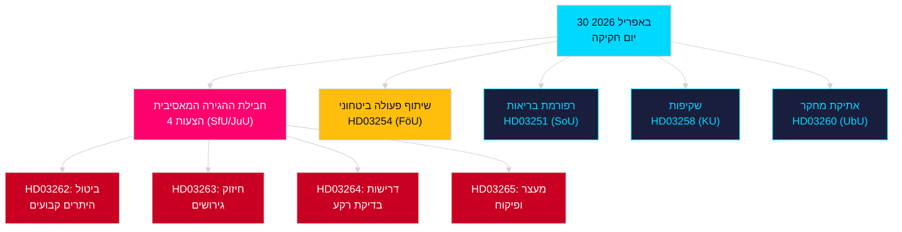

<!-- dir: rtl -->
# ניתוח ערב — 30 באפריל 2026: שוודיה מרפורמת את דיני ההגירה ומקדמת שיתוף פעולה ביטחוני

**מחבר**: James Pether Sörling  
**תאריך**: 2026-04-30  
**רמת אמינות**: HIGH [B2]  
**סיווג**: OSINT — מקורות ציבוריים בלבד  

---

## תקציר מנהלים

ממשלת שוודיה הגישה ב-30 באפריל 2026 את חבילת החקיקה המקיפה ביותר ביום אחד במושב 2025/26: טרנספורמציה הגירתית בת ארבע הצעות המבטלת היתרי שהייה קבועים ומיישרת את החוק השוודי עם הסכם ההגירה והמקלט של האיחוד האירופי, יחד עם הצעת שיתוף פעולה צבאי מרכזית המחזקת את השילוב המבצעי של שוודיה במבני נאט"ו. עם 149 ימים עד הבחירות לפרלמנט ב-13 בספטמבר 2026, ספרינט חקיקה זה הוא בו-זמנית מהלך ממשלתי וקמפיין למיצוב אלקטורלי.

## החלטות שתזכיר זה תומך בהן

1. **ראשי סיעות של מפלגות אופוזיציה**: הערכת היקף ההתנגדות הנדרשת לחבילת ההגירה (HD03262/263/264/265) ולהצעת ההגנה (HD03254) — ארבעה הפניות בו-זמניות לוועדות (SfU, JuU, FöU) מדחסות את לוח הזמנים הפרלמנטרי.
2. **ארגוני חברה אזרחית**: הערכת וקטורי הערעור המשפטי על ביטול ההיתרים הקבועים בHD03262 מול סעיף 8 לאמנה האירופית לזכויות אדם (חיי משפחה) ועקרון המידתיות של מגילת הזכויות הבסיסיות של האיחוד האירופי.
3. **אנליסטי נאט"ו/ביטחון**: הערכת התוכן המבצעי של HD03254 — הסכמי יכולת פעולה משותפת צבאית דו-צדדיים מחוזקים מסמנים את שאיפות השילוב האסטרטגי של שוודיה לאחר הצטרפותה לנאט"ו.
4. **אסטרטגיסטים בחירותיים**: כיול תגובת הבוחרים למקסימליזם בחוקי ההגירה בתקופות טרום-בחירות (≤6 חודשים: מכפיל קרבת הבחירות חל).

## נקודות מודיעין ב-60 שניות

- **חבילת ההגירה המאסיבית**: HD03262 מבטל לחלוטין היתרי שהייה קבועים; HD03263 מחזק גירושים; HD03264 מכניס דרישות בדיקת רקע מחמירות יותר להיתרים; HD03265 מהדק פיקוח ומעצר — חקיקת ההגירה המגבילה ביותר בתולדות שוודיה מאז אמצעי החירום של 2016 [A2].
- **שיתוף פעולה צבאי**: HD03254 (FöU) מחזק את המסגרת המבצעית לשיתוף פעולה צבאי של שוודיה — מחייב את שוודיה להסכמי הגנה דו-צדדיים ורב-צדדיים עמוקים יותר, קריטי לנוכח התחייבויות סעיף 5 של נאט"ו ודרישות מסרח הארקטי [A2].
- **אינטגרציה בריאותית**: HD03251 מציע מסלולי טיפול מאוחדים לתלות, שימוש בסמים ותחלואה נפשית נלווית — רפורמה מבנית בשירותי הממכרות לאחר עשור של אחריות אזורית מפוצלת [A2].
- **שקיפות פוליטית**: HD03258 מרחיב את השקיפות במימון מפלגות פוליטיות ובלוביסם — מסמן מיצוב ממשלתי של אחריותיות ערב הבחירות [A2].
- **מכפיל קרבת הבחירות**: ארבע הצעות הגירה + הצעת הגנה = חמישה הצעות חוק שנויות במחלוקת עזה בחלון בחירות ≤6 חודשים (סף 2026-03-13); ציון DIW הוגדל ב-1.5× לפי כלל קרבת הבחירות.
- **הצעות האופוזיציה**: S מוביל את בלוק ההצעות עם 8 הגשות; SD מגיש 2; MP מגיש 2 — נושאים охватים תעשיית חלל, מורשת תרבותית, בריאות, דיור ורווחה חברתית.

## הטריגר העתידי העיקרי

**שימוע ועדת SfU על HD03262** (צפוי תוך שבועיים): ביטול היתרי השהייה הקבועים יעמוד בפני הבדיקה הפרלמנטרית האינטנסיבית ביותר של האופוזיציה במושב — לעקוב אחר הצעת-הנגד הרשמית של הסוציאל-דמוקרטים ואחר הסתייגויות KD/L אפשריות בתוך הקואליציה.

## תרשים Mermaid העיקרי: ארכיטקטורת החקיקה של היום

<!-- source-sha: 34f4e52b496d9d798f623f205ad98b050ff2f0e7 -->
