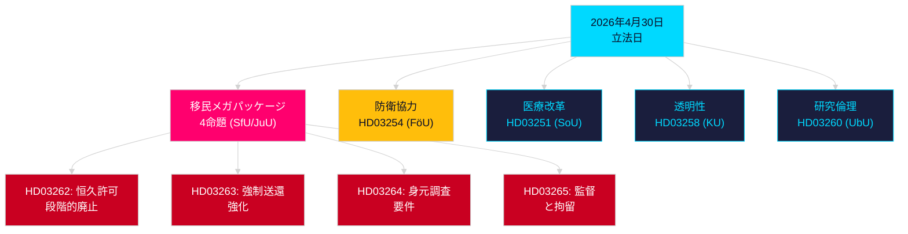

# 夕方分析 — 2026年4月30日：スウェーデンの移民法改革と防衛協力の進展

**著者**: James Pether Sörling  
**日付**: 2026-04-30  
**信頼度**: 高 [B2]  
**分類**: OSINT — 公開情報源のみ  

---

## 要約

スウェーデン政府は2026年4月30日、2025/26会期で最も影響力の大きい一日の立法パッケージを提出した。恒久的居住許可を段階的に廃止し、スウェーデン法をEU移民・庇護協定に整合させる4つの命題による移民法の大転換と、NATOの構造内でのスウェーデンの作戦統合を強化する重要な軍事協力命題である。2026年9月13日の総選挙まで149日となった中、この立法スプリントはガバナンスの行為と選挙キャンペーンポジショニングを同時に示すものである。

## この文書が支援する決定

1. **野党リーダー**: 移民パッケージ (HD03262/263/264/265) と防衛法案 (HD03254) に対して必要な抵抗の規模を評価する — 4つの同時委員会付託 (SfU, JuU, FöU) が議会スケジュールを圧縮する。
2. **市民社会組織**: HD03262による恒久許可廃止に対する法的異議申立ベクターを、欧州人権条約第8条（家族生活）とEU基本権憲章の比例原則に照らして評価する。
3. **NATO/防衛アナリスト**: HD03254の作戦内容を評価する — 強化された二国間軍事相互運用性合意はNATO加盟後のスウェーデンの戦略的統合野心を示す。
4. **選挙ストラテジスト**: 選挙前窓（≤6ヶ月：選挙近接乗数が適用）における移民法の最大主義に対する有権者の反応を調整する。

## 60秒インテリジェンスポイント

- **移民メガパッケージ**: HD03262はすべての恒久居住許可を段階的に廃止；HD03263は強制送還を強化；HD03264は許可取得に対する身元調査要件を厳格化；HD03265は監督・拘留を強化 — 2016年の緊急措置以来、現代スウェーデン史上最も厳格な移民法制 [A2]。
- **軍事協力**: HD03254 (FöU) はスウェーデンの作戦軍事協力枠組みを強化 — NATO第5条の義務と北極圏作戦要件を踏まえ、より深い二国間・多国間防衛協定にスウェーデンを結びつける [A2]。
- **医療統合 (Healthcare integration)**: HD03251は依存症、薬物乱用、精神科的合併症に対する統合ケアパスウェイを提案する — 断片化した地域責任の10年を経た依存症ケア部門の構造改革 [A2]。
- **政治的透明性**: HD03258は政党資金調達とロビー活動の透明性を拡大する — 選挙前の政府アカウンタビリティポジショニングを示す [A2]。
- **選挙近接乗数**: 4つの移民命題 + 防衛法案 = ≤6ヶ月選挙窓における5つの高争議性法律（閾値2026-03-13）；近接ルールによりDIWスコアが1.5×増加。
- **野党動議**: Sが8件の提出で動議パッケージを支配；SDが2件；MPが2件 — テーマは宇宙産業、文化遺産、医療、住宅、社会福祉を含む。

## 主要な今後のトリガー

**HD03262に関するSfU委員会公聴会**（2週間以内に予定）: 恒久居住許可の廃止は会期で最も激しい野党審査を受ける — 社会民主党の正式な対案と連立内KD/Lの潜在的な留保に注目。

## 主要Mermaid: 当日の立法アーキテクチャ

<!-- source-sha: d7dc1f1126e721cf29b3d6e70e1445903be3c419 -->
