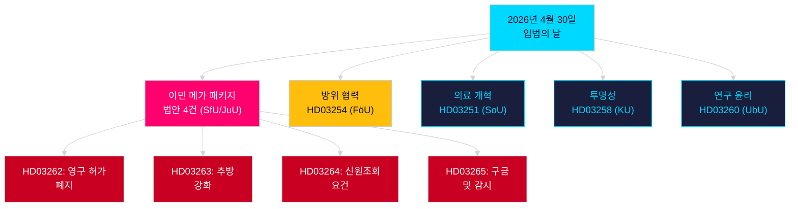

# 저녁 분석 — 2026년 4월 30일: 스웨덴, 이민법 개혁 및 방위 협력 추진

**저자**: James Pether Sörling  
**날짜**: 2026-04-30  
**신뢰도**: HIGH [B2]  
**분류**: OSINT — 공개 출처만  

---

## 요약

스웨덴 정부는 2026년 4월 30일 2025/26 회기에서 단일 일 기준 가장 포괄적인 입법 패키지를 제출했다. 영구 거주 허가를 폐지하고 스웨덴 법률을 EU 이주·망명 협정에 맞추는 4개 법안으로 구성된 이민 대변혁과, 스웨덴의 나토 구조 내 작전적 통합을 강화하는 주요 군사 협력 법안이다. 2026년 9월 13일 의회 선거까지 149일을 남긴 이 입법 스프린트는 거버넌스 행위이자 선거 포지셔닝 캠페인이다.

## 이 브리프가 지원하는 결정사항

1. **야당 원내대표**: 이민 패키지(HD03262/263/264/265)와 방위 법안(HD03254)에 필요한 저항 규모 평가 — 위원회 동시 회부 4건(SfU, JuU, FöU)이 의회 일정을 압박한다.
2. **시민사회 단체**: HD03262의 영구 허가 폐지에 대한 법적 이의 제기 벡터를 ECHR 제8조(가족생활)와 EU 기본권 헌장 비례 원칙 관점에서 평가한다.
3. **나토/방위 분석가**: HD03254의 작전적 내용 평가 — 강화된 양자 군사 상호운용성 협정은 나토 가입 이후 스웨덴의 전략적 통합 야망을 시사한다.
4. **선거 전략가**: 선거 전 기간(≤6개월: 선거 근접 승수 적용)에서 이민법 강경 정책에 대한 유권자 반응을 측정한다.

## 60초 인텔리전스 포인트

- **이민 메가 패키지**: HD03262는 영구 거주 허가를 완전 폐지; HD03263은 추방을 강화; HD03264는 허가를 위한 신원조회 요건 강화; HD03265는 감시와 구금을 강화 — 2016년 긴급조치 이후 스웨덴 역사상 가장 엄격한 이민 입법 [A2].
- **군사 협력**: HD03254(FöU)는 스웨덴의 작전적 군사 협력 프레임워크를 강화 — 나토 제5조 의무와 북극권 작전 요건을 고려할 때 더 깊은 양자·다자 방위 협정에 스웨덴을 결부시킨다 [A2].
- **의료 통합**: HD03251은 의존성, 약물 사용 및 정신과적 동반이환을 위한 통합 치료 경로를 제안 — 10년간 분산된 지역 책임 체제 이후 중독 서비스의 구조적 개혁 [A2].
- **정치적 투명성**: HD03258은 정당 자금과 로비 활동의 투명성을 확대 — 선거 전 정부 책임 포지셔닝을 신호한다 [A2].
- **선거 근접 승수**: 이민 법안 4건 + 방위 법안 = ≤6개월 선거 창 내 고도로 논쟁적인 법안 5건(기준 2026-03-13); DIW 점수가 선거 근접 규칙에 따라 1.5배 인상.
- **야당 발의**: S가 8건 제출로 발의안 블록 주도; SD 2건; MP 2건 제출 — 주제는 우주 산업, 문화유산, 의료, 주택, 사회 복지를 아우른다.

## 가장 중요한 향후 트리거

**HD03262에 관한 SfU 위원회 청문회**(2주 내 예상): 영구 거주 허가 폐지는 회기에서 가장 강도 높은 야당 검토를 받게 될 것 — 사회민주당의 공식 반대 제안 및 연립 내 KD/L의 잠재적 유보 사항에 주목.

## 주요 Mermaid 다이어그램: 오늘의 입법 아키텍처

<!-- source-sha: 34f4e52b496d9d798f623f205ad98b050ff2f0e7 -->
