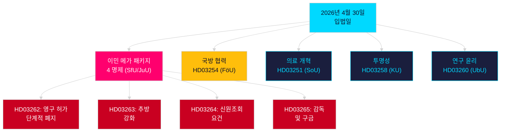

# 저녁 분석 — 2026년 4월 30일: 스웨덴 이민법 개혁 및 국방 협력 진전

**저자**: James Pether Sörling  
**날짜**: 2026-04-30  
**신뢰도**: 높음 [B2]  
**분류**: OSINT — 공개 출처만  

---

## 요약

스웨덴 정부는 2026년 4월 30일 2025/26 회기의 가장 중요한 단일일 입법 패키지를 제출했다: 영구 거주 허가를 단계적으로 폐지하고 스웨덴 법을 EU 이민 및 망명 협약에 맞추는 4개 명제로 이루어진 이민법 전환, 그리고 NATO 구조 내 스웨덴의 작전 통합을 강화하는 중요한 군사 협력 명제. 2026년 9월 13일 총선까지 149일이 남은 상황에서, 이 입법 스프린트는 동시에 거버넌스 행위이자 선거 캠페인 포지셔닝이다.

## 이 문서가 지원하는 결정

1. **야당 지도자**: 이민 패키지 (HD03262/263/264/265)와 국방 법안 (HD03254)에 필요한 저항 규모 평가 — 4개의 동시 위원회 회부 (SfU, JuU, FöU)가 의회 일정을 압축한다.
2. **시민사회 단체**: HD03262의 영구 허가 폐지에 대한 법적 이의 제기 벡터를 유럽인권협약 제8조(가족생활) 및 EU 기본권 헌장의 비례 원칙에 비추어 평가한다.
3. **NATO/국방 분석가**: HD03254의 작전 내용 평가 — 강화된 양자 군사 상호운용성 협정은 NATO 가입 이후 스웨덴의 전략적 통합 야망을 나타낸다.
4. **선거 전략가**: 선거 전 기간 (≤6개월: 선거 근접 배수 적용) 이민법 극대주의에 대한 유권자 반응 조율.

## 60초 인텔리전스 포인트

- **이민 메가 패키지**: HD03262는 모든 영구 거주 허가를 단계적으로 폐지; HD03263은 추방 강화; HD03264는 허가에 대한 신원조회 요건 강화; HD03265는 감독과 구금 강화 — 2016년 긴급 조치 이후 현대 스웨덴 역사상 가장 엄격한 이민 법제 [A2].
- **군사 협력**: HD03254 (FöU)는 스웨덴의 작전 군사 협력 프레임워크 강화 — NATO 제5조 의무와 북극 작전 요구사항을 감안하여 더 깊은 양자 및 다자 방위 협정에 스웨덴을 결속 [A2].
- **의료 통합 (Healthcare integration)**: HD03251은 중독, 약물 남용, 정신과적 동반 질환에 대한 통합 치료 경로 제안 — 10년간의 분절된 지역 책임 이후 중독 치료 분야의 구조적 개혁 [A2].
- **정치적 투명성**: HD03258은 정당 자금 및 로비의 투명성 확대 — 선거 전 정부 책임 포지셔닝 시사 [A2].
- **선거 근접 배수**: 4개 이민 명제 + 국방 법안 = ≤6개월 선거 창에서 5개의 고논쟁성 법률(임계값 2026-03-13); DIW 점수 근접 규칙에 의해 1.5× 증가.
- **야당 동의**: S가 8개 제출로 동의 패키지 지배; SD가 2개; MP가 2개 — 주제는 우주 산업, 문화유산, 의료, 주거, 사회 복지 포함.

## 주요 미래 트리거

**HD03262에 관한 SfU 위원회 청문회** (2주 이내 예정): 영구 거주 허가 폐지는 회기의 가장 강렬한 야당 심사를 받을 것이다 — 사회민주당의 공식 반제안과 연립 내 KD/L의 잠재적 유보 사항 주시.

## 핵심 Mermaid: 당일 입법 아키텍처

<!-- source-sha: 34f4e52b496d9d798f623f205ad98b050ff2f0e7 -->
