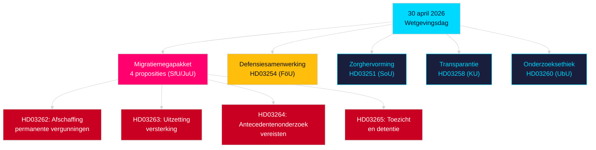

# Avondanalyse — 30 april 2026: Zweedse hervorming van het migratierecht en voortgang van defensiesamenwerking

**Auteur**: James Pether Sörling  
**Datum**: 2026-04-30  
**Betrouwbaarheid**: HOOG [B2]  
**Classificatie**: OSINT — Alleen publieke bronnen  

---

## Samenvatting

De Zweedse regering heeft op 30 april 2026 het meest ingrijpende eendaagse wetgevingspakket van de sessie 2025/26 ingediend: een transformatie van het migratierecht in vier proposities die permanente verblijfsvergunningen afschaft en het Zweedse recht in overeenstemming brengt met het EU-Migratie- en Asielpact, samen met een belangrijke propositie over militaire samenwerking die de operationele integratie van Zweden binnen NAVO-structuren versterkt. Met nog 149 dagen tot de verkiezingen van 13 september 2026 is deze wetgevende sprint tegelijkertijd een bestuursdaad en een electorale campagnepositionering.

## Beslissingen die dit document ondersteunt

1. **Oppositieleiders**: Beoordeling van de schaal van verzet die vereist is tegen het migratiepakket (HD03262/263/264/265) en de defensiewet (HD03254) — vier gelijktijdige commissieverwijs ingen (SfU, JuU, FöU) comprimeren het parlementaire tijdschema.
2. **Maatschappelijke organisaties**: Beoordeling van juridische aanvechtvectoren tegen de afschaffing van permanente vergunningen door HD03262 ten opzichte van EVRM Art. 8 (gezinsleven) en de EU-proportionaliteitseis.
3. **NAVO/defensieanalisten**: Beoordeling van de operationele inhoud van HD03254 — verbeterde bilaterale militaire interoperabiliteitsovereenkomsten signaleren de strategische integratie-ambities van Zweden na toetreding.
4. **Verkiezingsstrateegen**: Kalibratie van kiezersreacties op het maximalisme van het immigratierecht in het pre-electorale raam (≤6 maanden: de nabijheidsmultiplier voor verkiezingen is van toepassing).

## Inlichtingenpunten in 60 seconden

- **Migratiemegapakket**: HD03262 schrapt alle permanente verblijfsvergunningen; HD03263 versterkt uitzettingen; HD03264 introduceert strengere antecedentenonderzoeksvereisten voor vergunningen; HD03265 verscherpt toezicht en detentie — de meest restrictieve migratieregelgeving in de moderne Zweedse geschiedenis sinds de noodmaatregelen van 2016 [A2].
- **Militaire samenwerking**: HD03254 (FöU) versterkt het operationele kader voor militaire samenwerking van Zweden — verbindt Zweden aan diepere bilaterale en multilaterale defensieovereenkomsten, cruciaal gezien de NAVO Artikel 5-verplichtingen en Arctische toneeleisen [A2].
- **Zorgintegratie (Healthcare integration)**: HD03251 stelt uniforme zorgpaden voor voor verslaving, middelenmisbruik en psychiatrische comorbiditeit — een structurele hervorming van de verslavingszorgsector na een decennium van gefragmenteerde regionale verantwoordelijkheid [A2].
- **Politieke transparantie**: HD03258 vergroot de transparantie in de financiering van politieke partijen en lobbyen — signaleert pre-electorale verantwoordingspositionering van de regering [A2].
- **Nabijheidsmultiplier verkiezingen**: Vier migratiepropositie s + defensiewet = vijf controversiële wetten in het ≤6 maanden electorale raam (drempel 2026-03-13); DIW-scores verhoogd met 1,5× door nabijheidsregel.
- **Oppositiemoties**: S domineert het motiepakket met 8 inzendingen; SD dient er 2 in; MP dient er 2 in — onderwerpen omvatten de ruimtevaartindustrie, cultureel erfgoed, zorg, wonen en sociale zekerheid.

## Belangrijkste toekomstige trigger

**SfU-commissiehearing over HD03262** (verwacht binnen 2 weken): De afschaffing van permanente verblijfsvergunningen zal het meest intense oppositietoezicht van de sessie ondergaan — let op het formele tegensteldvoorstel van Socialdemokraterna en mogelijke KD/L-voorbehouden binnen de coalitie.

## Sleutel-Mermaid: Wetgevende architectuur van de dag

<!-- source-sha: 34f4e52b496d9d798f623f205ad98b050ff2f0e7 -->
