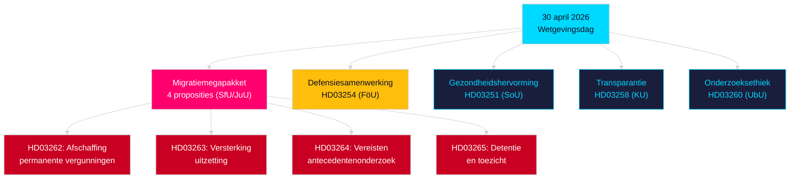

# Avondanalyse — 30 april 2026: Zweden hervormt migratierecht en bevordert defensiesamenwerking

**Auteur**: James Pether Sörling  
**Datum**: 2026-04-30  
**Betrouwbaarheidsniveau**: HIGH [B2]  
**Classificatie**: OSINT — Uitsluitend openbare bronnen  

---

## Samenvatting

De Zweedse regering diende op 30 april 2026 het meest omvangrijke pakket wetgeving van één dag in het zittingsjaar 2025/26 in: een viervoudige migratietransformatie die permanente verblijfsvergunningen afschaft en het Zweeds recht aanpast aan het EU-asiel- en migratiepact, samen met een omvangrijke militaire samenwerkingsproposie die de operationele integratie van Zweden in de NAVO-structuren versterkt. Met 149 dagen tot de parlementsverkiezingen van 13 september 2026 is deze wetgevingssprint tegelijkertijd een regeringsdaad en een verkiezingspositionering.

## Beslissingen die dit briefing ondersteunt

1. **Fractieleiders van oppositiepartijen**: Beoordeel de omvang van de benodigde weerstand tegen het migratiepakket (HD03262/263/264/265) en de defensieproposie (HD03254) — vier gelijktijdige commissieverwijzingen (SfU, JuU, FöU) comprimeren de parlementaire tijdlijn.
2. **Maatschappelijke organisaties**: Beoordeel juridische betwistingsvectoren voor de afschaffing van permanente verblijfsvergunningen in HD03262 tegenover EVRM art. 8 (gezinsleven) en het evenredigheidsbeginsel van het EU-handvest.
3. **NAVO-/defensieanalisten**: Beoordeel de operationele inhoud van HD03254 — versterkte bilaterale militaire interoperabiliteitsovereenkomsten signaleren Zwedens strategische integratie-ambities na de NAVO-toetreding.
4. **VerkiezingsstrateGen**: Kalibreer de kiezersreactie op migratiemaximalisme in voorverkiezingsperioden (≤6 maanden: kiezersproximiteitmultiplicator van toepassing).

## 60 seconden inlichtingenpunten

- **Migratiemegapakket**: HD03262 schaft permanente verblijfsvergunningen volledig af; HD03263 versterkt uitzetting; HD03264 introduceert strengere antecedentenonderzoeksvereisten voor vergunningen; HD03265 verscherpt toezicht en detentie — de meest restrictieve migratiewetgeving in de Zweedse geschiedenis sinds de noodmaatregelen van 2016 [A2].
- **Militaire samenwerking**: HD03254 (FöU) versterkt het operationele militaire samenwerkingskader van Zweden — verplicht Zweden tot diepere bilaterale en multilaterale defensieovereenkomsten, cruciaal gelet op de NAVO-artikel 5-verplichtingen en de vereisten voor het arctische theater [A2].
- **Gezondheidsintegratie**: HD03251 stelt uniforme behandelpaden voor afhankelijkheid, middelengebruik en psychiatrische comorbiditeit voor — een structurele hervorming van de verslavingszorg na een decennium van gefragmenteerde regionale verantwoordelijkheid [A2].
- **Politieke transparantie**: HD03258 vergroot de transparantie van politieke partijfinanciering en lobbying — signaleert de voorverkiezingsverantwoordingspositionering van de regering [A2].
- **Kiezersproximiteitmultiplicator**: Vier migratiepropositiеs + defensieproposie = vijf hoogst controversiële wetsvoorstellen in ≤6 maanden verkiezingsvenster (grens 2026-03-13); DIW-score verhoogd met 1,5× per kiezersproximiteitsregel.
- **Oppositiemoties**: S domineert het motieblok met 8 indieningen; SD dient 2 in; MP dient 2 in — onderwerpen bestrijken ruimtevaartindustrie, cultureel erfgoed, gezondheidszorg, huisvesting en sociale welvaart.

## Belangrijkste aankomende trigger

**Commissieverhoor SfU over HD03262** (verwacht binnen 2 weken): De afschaffing van permanente verblijfsvergunningen krijgt de meest intensieve oppositiescrutinie van het zittingsjaar — let op het formele tegenvoorstel van de sociaaldemocraten en mogelijke KD/L-voorbehouden binnen de coalitie.

## Belangrijkste Mermaid: Wetgevingsarchitectuur van de dag

<!-- source-sha: 34f4e52b496d9d798f623f205ad98b050ff2f0e7 -->
