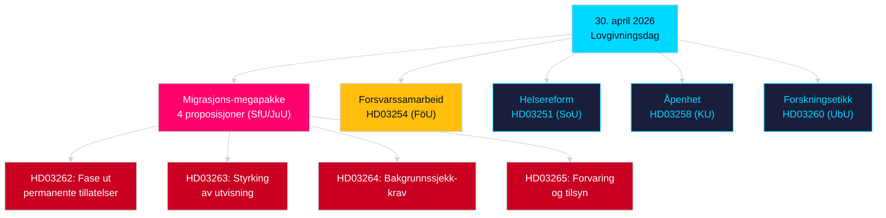

# Kveldsanalyse — 30. april 2026: Sveriges migrasjonslov omstruktureres og forsvarssamarbeid fremmes

**Forfatter**: James Pether Sörling  
**Dato**: 2026-04-30  
**Konfidensgrad**: HIGH [B2]  
**Klassifisering**: OSINT — Kun offentlige kilder  

---

## Sammendrag

Sveriges regjering leverte sin mest konsekvente enkeltdags lovpakke i 2025/26-sesjonen 30. april 2026: en fireproposisjons migrasjonstransformasjon som faser ut permanente oppholdstillatelser og tilpasser svensk lov til EUs migrasjons- og asylpakt, sammen med en større militær samarbeidsproposisjon som styrker Sveriges operative integrasjon i NATO-strukturer. Med 149 dager til stortingsvalget 13. september 2026 er denne lovgivningssprinten samtidig en styringshandling og en valgposisjoneringsaksjon.

## Beslutninger dette brevet støtter

1. **Opposisjonspartiers partipiskere**: Vurder omfanget av nødvendig motstand mot migrasjonspakken (HD03262/263/264/265) og forsvarsproposisjonen (HD03254) — fire samtidige utvalgshenvisninger (SfU, JuU, FöU) komprimerer den parlamentariske tidslinjen.
2. **Sivilsamfunnsorganisasjoner**: Evaluer juridiske utfordringsvektorer for HD03262s avskaffelse av permanente tillatelser mot EMK art. 8 (familieliv) og EU-chartrets proporsjonalitet.
3. **NATO/forsvarsanalytikere**: Vurder HD03254s operative innhold — styrkede bilaterale militære interoperabilitetsavtaler signaliserer Sveriges strategiske integrasjonsамbisjoner etter NATO-tiltreden.
4. **Valgstrateger**: Kalibrер velgerrespons på migrasjonslovsmaksimalisme i valgvinduer (≤6 måneder: valgproximitetsmultiplikator gjelder).

## 60 sekunders etterretningspunkter

- **Migrasjons-megapakke**: HD03262 faser ut permanente oppholdstillatelser fullstendig; HD03263 styrker utvisning; HD03264 innfører strengere bakgrunnssjekkkrav for tillatelser; HD03265 strammes overvåking og forvaring — den mest restriktive migrasjonslovgivningen i svensk historie siden nødtiltakene i 2016 [A2].
- **Militært samarbeid**: HD03254 (FöU) styrker Sveriges operative militære samarbeidsramme — binder Sverige til dypere bilaterale og multilaterale forsvarsavtaler, avgjørende gitt NATOs artikkel 5-forpliktelser og krav til arktisk teater [A2].
- **Helseintegrering**: HD03251 foreslår enhetlige behandlingsveier for avhengighet, rusmisbruk og psykiatrisk komorbiditet — en strukturell reform av avhengighetsomsorgen etter et tiår med fragmentert regionalt ansvar [A2].
- **Politisk åpenhet**: HD03258 utvider åpenheten i politisk partifinansering og lobbyisme — signaliserer forvalgansvarlighetposisjonering fra regjeringen [A2].
- **Valgproximitetsmultiplikator**: Fire migrasjonsproposisjoner + forsvarsproposisjon = fem høyt kontroversielle lovforslag i ≤6-månaders valgvindu (grense 2026-03-13); DIW-score økt med 1,5× per valgproximitetregel.
- **Opposisjonsmotsjoner**: S dominerer motsjonsgruppen med 8 innleveringer; SD leverer 2; MP leverer 2 — emner spenner over romfartsindustri, kulturarv, helsevesen, bolig og sosial velferd.

## Viktigste fremtidige trigger

**Utvalgsutspørring SfU om HD03262** (forventes innen 2 uker): Avskaffelsen av permanente oppholdstillatelser vil møte den mest intense opposisjonsgranskning i sesjonen — se etter Sosialdemokratenes formelle motforslag og eventuelle KD/L-forbehold innenfor koalisjonen.

## Viktigste Mermaid: Dagens lovgivningsarkitektur

<!-- source-sha: 34f4e52b496d9d798f623f205ad98b050ff2f0e7 -->
