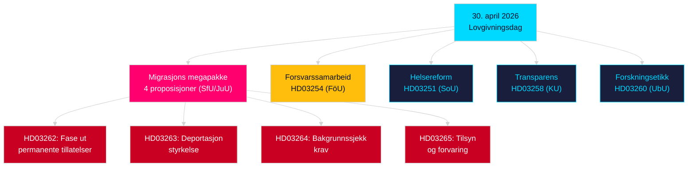

# Kveldsanalyse — 30. april 2026: Reformering av migrasjon og forsvarssamarbeidslover

**Forfatter**: James Pether Sörling  
**Dato**: 2026-04-30  
**Konfidens**: HØY [B2]  
**Klassifikasjon**: OSINT — Kun offentlige kilder  

---

## Sammendrag

Den svenske regjeringen la 30. april 2026 frem sin mest konsekvente enkeltdag lovgivningspakke i sesjonen 2025/26: en fire-proposisjons migrasjonlovsomforming som faser ut permanente oppholdstillatelser og tilpasser svensk lov til EUs migrasjons- og asylpakt, samt en stor militær samarbeidsproposisjon som styrker Sveriges operative integrasjon innen NATOs strukturer. Med 149 dager til valget 13. september 2026 er denne lovgivningssprinten simultant et styringsvedtak og en valgposisjonskampanje.

## Beslutninger dette notatet støtter

1. **Opposisjonens partipisker**: Vurder motstandets omfang mot migrasjonspakken (HD03262/263/264/265) og forsvarsloven (HD03254) — fire samtidige utvalgshenvisninger (SfU, JuU, FöU) komprimerer den parlamentariske tidslinjen.
2. **Sivilsamfunnsorganisasjoner**: Vurder juridiske utfordringsvektorer mot HD03262's avskaffelse av permanente tillatelser mot EMK art. 8 (familieliv) og EU-chartrets proporsjonalitet.
3. **NATO/forsvarsanalytikere**: Vurder HD03254's operative innhold — forbedrede bilaterale militære interoperabilitetsavtaler signalerer Sveriges strategiske integrasjonsambitioner etter tiltreden.
4. **Valgstrateger**: Kalibrer velgerreaksjoner på migrasjonsloven maksimalisme i forvalgsvinduer (≤6 måneder: valgproksimitets multiplikator gjelder).

## 60-sekunders etterretningspunkter

- **Migrasjons megapakke**: HD03262 faser ut permanente oppholdstillatelser fullt ut; HD03263 styrker deportasjon; HD03264 innfører strengere bakgrunnssjekk for tillatelser; HD03265 strammer tilsyn og forvaring — den mest restriktive migrasjonslovgivningen i moderne svensk historie siden nødtiltakene i 2016 [A2].
- **Militært samarbeid**: HD03254 (FöU) styrker Sveriges operative militære samarbeidsrammeverk — binder Sverige til dypere bilaterale og multilaterale forsvarsavtaler, kritisk med tanke på NATO artikkel 5-forpliktelser og arktiske krav [A2].
- **Helseintegrasjon (Healthcare integration)**: HD03251 foreslår enhetlige behandlingsprogrammer for avhengighet, rusmisbruk og psykiatrisk komorbiditet — en strukturell reform av avhengighetsbehandling etter et tiår med fragmentert regionalt ansvar [A2].
- **Politisk transparens**: HD03258 utvider åpenhet i politisk partifinansierig og lobbyisme — signalerer forvalgansvarlighetposisjonering fra regjeringen [A2].
- **Valgproksimitets multiplikator**: Fire migrasjonsproposisjoner + forsvarslov = fem høykontroversiell lovgivning i ≤6-månaders valgvinduet (grense 2026-03-13); DIW-scorer forhøyet 1,5× per valgproksimitetsregel.
- **Opposisjonsmotioner**: S dominerer motionsbatchen med 8 innleveringer; SD leverer 2; MP leverer 2 — emner spenner fra romindustri, kulturarv, helsevesen, bolig og sosial velferd.

## Viktigste fremtidige utløser

**Utvalg SfU-høring om HD03262** (forventet innen 2 uker): Avskaffelsen av permanente oppholdstillatelser vil møte den mest intense opposisjonsgranskningen i sesjonen — følg med på Sosialdemokratenes formelle motforslag og eventuelle KD/L-reservasjoner innen koalisjonen.

## Nøkkel-Mermaid: Dagens lovgivningsarkitektur

<!-- source-sha: d7dc1f1126e721cf29b3d6e70e1445903be3c419 -->
