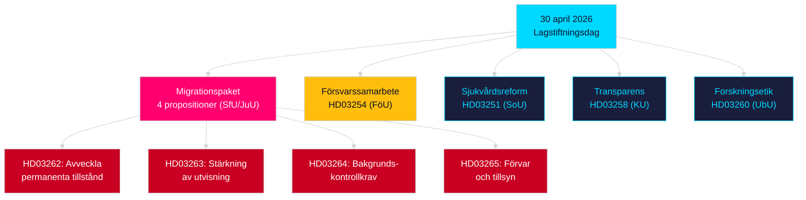

# Kvällsanalys — 30 april 2026: Sveriges migrationslags omvandling och försvarssamarbete går framåt

**Författare**: James Pether Sörling  
**Datum**: 2026-04-30  
**Konfidensgrad**: HIGH [B2]  
**Klassificering**: OSINT — Enbart offentliga källor  

---

## Sammanfattning

Sveriges regering levererade sitt mest konsekventa lagstiftningspaket för en enda dag under 2025/26 års session den 30 april 2026: en fyrapropositiners migrationslags omvandling som fasar ut permanenta uppehållstillstånd och anpassar svensk rätt till EU:s migrations- och asylpakt, tillsammans med en större militär samarbetsproposition som stärker Sveriges operativa integration inom NATO-strukturer. Med 149 dagar kvar till riksdagsvalet den 13 september 2026 är detta lagstiftningssprint samtidigt ett styrningsutövande och en valpositioneringskampanj.

## Beslut som detta underlag stöder

1. **Oppositionspartiers partipiskor**: Bedöm skalan av det motstånd som krävs mot migrationspaketet (HD03262/263/264/265) och försvarspropositionen (HD03254) — fyra simultana utskottsremisser (SfU, JuU, FöU) komprimerar parlamentstidsplanen.
2. **Civilsamhällesorganisationer**: Utvärdera rättsliga utmaningsvektorer för HD03262:s avskaffande av permanenta tillstånd mot ECHR art. 8 (familjeliv) och EU-stadgans proportionalitet.
3. **NATO/försvarsanalytiker**: Bedöm HD03254:s operativa innehåll — förstärkta bilaterala militära interoperabilitetsavtal signalerar Sveriges strategiska integrationsambitioner efter NATO-anslutningen.
4. **Valstrateger**: Kalibrera väljarrespons på migrationslagsmaximalism i det förvalselfönstret (≤6 månader: valproximitets multiplicator gäller).

## 60 sekunders underrättelsepunkter

- **Migrationspaket**: HD03262 fasar ut permanenta uppehållstillstånd helt; HD03263 stärker utvisning; HD03264 inför striktare bakgrundskontrollkrav för tillstånd; HD03265 stramar åt övervakning och förvar — den mest restriktiva migrationslagstiftningen i svensk historia sedan nödåtgärderna 2016 [A2].
- **Militärt samarbete**: HD03254 (FöU) förstärker Sveriges operativa militära samarbetsramverk — binder Sverige till djupare bilaterala och multilaterala försvarsavtal, avgörande med tanke på NATO:s artikel 5-åtaganden och krav på arktisk teater [A2].
- **Sjukvårdsintegration**: HD03251 föreslår enhetliga vårdvägar för beroende, missbruk och psykiatrisk samsjuklighet — en strukturell reform av missbruksvårdsektorn efter ett decennium av fragmenterat regionalt ansvar [A2].
- **Politisk transparens**: HD03258 utvidgar transparensen i politisk partifinansering och lobbyverksamhet — signalerar förvalsansvarighetspositionering av regeringen [A2].
- **Valnärhets multiplicator**: Fyra migrationspropositoner + försvarsproposition = fem högt kontroversiella propositioner i ≤6-månaders valfönstern (gräns 2026-03-13); DIW-poäng höjda med 1,5× per valnärhetsregel.
- **Oppositionsmotioner**: S dominerar motionsbatchen med 8 inlagor; SD lämnar 2; MP lämnar 2 — ämnen spänner över rymdindustri, kulturarv, sjukvård, bostad och socialskydd.

## Viktigaste framåtblickande utlösare

**Utskottsutfrågning SfU om HD03262** (förväntas inom 2 veckor): Avskaffandet av permanenta uppehållstillstånd kommer att möta den mest intensiva oppositionsgranskning under sessionen — bevaka Socialdemokraternas formella motförslag och eventuella KD/L-reservationer inom koalitionen.

## Viktigaste Mermaid: Dagens lagstiftningsarkitektur

<!-- source-sha: 34f4e52b496d9d798f623f205ad98b050ff2f0e7 -->
