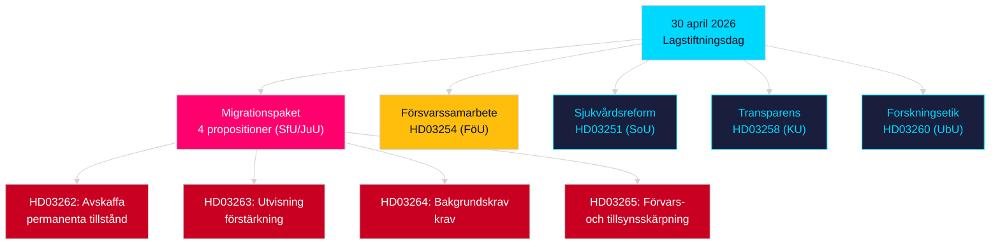

# Kvällsanalys — 30 april 2026: Reformering av migrations- och försvarssamarbetslagar

**Författare**: James Pether Sörling  
**Datum**: 2026-04-30  
**Konfidens**: HÖG [B2]  
**Klassificering**: OSINT — Endast offentliga källord  

---

## Sammanfattning

Regeringen lade den 30 april 2026 fram sitt mest konsekventa enskilda lagstiftningspaket under sessionen 2025/26: en fyrapropositional migration law omvandling som fasar ut permanenta uppehållstillstånd och anpassar svensk rätt till EU:s migrations- och asylpakt, vid sidan av en stor militär samarbetsproposition som stärker Sveriges operativa integration inom NATO:s strukturer. Med 149 dagar till det allmänna valet den 13 september 2026 är denna lagstiftningssprint samtidigt ett styre och en valpositioneringskampanj.

## Beslut detta PM stödjer

1. **Oppositionens partipiskor**: Bedöm motståndets skala mot migrationspaket (HD03262/263/264/265) och försvarspropositionen (HD03254) — fyra simultana utskottsremisser (SfU, JuU, FöU) komprimerar den parlamentariska tidtabellen.
2. **Civilsamhällesorganisationer**: Utvärdera juridiska utmaningsvektorer mot HD03262:s avskaffande av permanenta tillstånd mot EKMR art. 8 (familjeliv) och EU-stadgans proportionalitet.
3. **NATO/försvarsanalytiker**: Bedöm HD03254:s operativa innehåll — förbättrade bilaterala militära interoperabilitetsavtal signalerar Sveriges strategiska integrationsambitioner efter anslutningen.
4. **Valstrateger**: Kalibrera väljarreaktioner mot migrationslagens maximalism i det förvalslfönstret (≤6 månader: valproximitetsomräknare gäller).

## 60-sekunders underrättelsepunkter

- **Migrationspaket**: HD03262 fasar ut permanenta uppehållstillstånd helt; HD03263 stärker utvisning; HD03264 inför strängare bakgrundskravkrav för tillstånd; HD03265 skärper tillsyn och förvar — den mest restriktiva migrationstlagstiftningen i modern svensk historia sedan nödåtgärderna 2016 [A2].
- **Militärt samarbete**: HD03254 (FöU) stärker Sveriges operativa militära samarbetsramverk — binder Sverige till djupare bilaterala och multilaterala försvarsavtal, avgörande med tanke på NATO artikel 5-åtaganden och arktiska operationsteaterkrav [A2].
- **Sjukvårdsintegration (Healthcare integration)**: HD03251 föreslår enhetliga vägledningar för beroende, missbruk och psykiatrisk samsjuklighet — en strukturell reform av beroendevård efter ett decenniums splittrat regionalt ansvar [A2].
- **Politisk transparens**: HD03258 utökar transparens i politisk partifinansering och lobbyism — signalerar förvals-redovisningspositionering av regeringen [A2].
- **Valproximitetsomräknare**: Fyra migrationspropositioner + försvarsproposition = fem högt kontroversiella lagstiftningar i ≤6-månaders valsfönstret (gräns 2026-03-13); DIW-poäng förhöjt 1,5× per valproximitetsregel.
- **Oppositionsmotioner**: S dominerar motionsbatchen med 8 inlagor; SD lämnar 2; MP lämnar 2 — ämnen spänner från rymdindustri, kulturarv, sjukvård, boende och välfärd.

## Viktigaste framtida trigger

**Utskotts-SfU-utfrågning om HD03262** (förväntas inom 2 veckor): Avskaffandet av permanenta uppehållstillstånd möter den mest intensiva oppositionsgranskningen under sessionen — bevaka Socialdemokraternas formella motförslag och eventuella KD/L-reservationer inom koalitionen.

## Nyckel-Mermaid: Dagens lagstiftningsarkitektur

<!-- source-sha: d7dc1f1126e721cf29b3d6e70e1445903be3c419 -->
