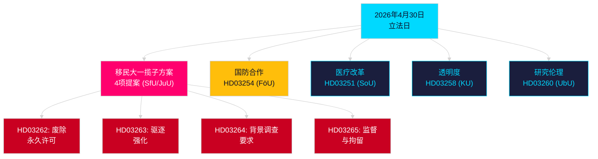

# 晚间分析 — 2026年4月30日：瑞典移民法改革与国防合作进展

**作者**: James Pether Sörling  
**日期**: 2026-04-30  
**置信度**: 高 [B2]  
**分类**: OSINT — 仅公开来源  

---

## 摘要

瑞典政府于2026年4月30日提交了2025/26届会期单日最具重大意义的立法一揽子方案：通过四项提案对移民法进行改革，逐步废除永久居留许可，使瑞典法律与欧盟移民和庇护协议接轨，以及一项强化瑞典在北约结构内作战整合的重要军事合作提案。距2026年9月13日大选还有149天，此次立法冲刺既是施政行为，也是选举定位运动。

## 本简报支持的决策

1. **反对党领袖**：评估针对移民一揽子方案 (HD03262/263/264/265) 和国防法案 (HD03254) 所需的抵制规模 — 四个同步委员会转介 (SfU, JuU, FöU) 压缩了议会时间表。
2. **公民社会组织**：依据《欧洲人权公约》第8条（家庭生活权）及欧盟《基本权利宪章》比例原则，评估对HD03262废除永久许可的法律质疑途径。
3. **北约/国防分析人士**：评估HD03254的作战内容 — 加强的双边军事互操作性协议显示瑞典加入北约后的战略整合抱负。
4. **选举战略家**：在选举前窗口期（≤6个月：选举接近乘数适用）调整选民对移民法极大主义的反应。

## 60秒情报要点

- **移民大一揽子方案**：HD03262逐步废除所有永久居留许可；HD03263加强驱逐；HD03264引入更严格的许可背景调查要求；HD03265收紧监督和拘留 — 自2016年紧急措施以来现代瑞典史上最严格的移民立法 [A2]。
- **军事合作**：HD03254 (FöU) 加强瑞典作战军事合作框架 — 将瑞典绑定于更深层的双边和多边防务协议，鉴于北约第5条义务和北极作战区域要求至关重要 [A2]。
- **医疗整合 (Healthcare integration)**：HD03251提议为成瘾、药物滥用和精神科共病建立统一护理路径 — 经历十年碎片化地区责任后对成瘾护理领域的结构性改革 [A2]。
- **政治透明度**：HD03258扩大政党资金和游说活动的透明度 — 显示政府选举前的问责定位 [A2]。
- **选举接近乘数**：四项移民提案 + 国防法案 = ≤6个月选举窗口内五部高争议法律（门槛2026-03-13）；按接近规则DIW分数提高1.5×。
- **反对党动议**：S以8份提交主导动议包；SD提交2份；MP提交2份 — 主题涵盖航天工业、文化遗产、医疗、住房和社会福利。

## 主要未来触发因素

**SfU委员会关于HD03262的听证会**（预计2周内）：废除永久居留许可将面临本届会期最强烈的反对派审查 — 关注社会民主党的正式反提案以及联合政府内KD/L的潜在保留意见。

## 关键Mermaid：当日立法架构

<!-- source-sha: 34f4e52b496d9d798f623f205ad98b050ff2f0e7 -->
