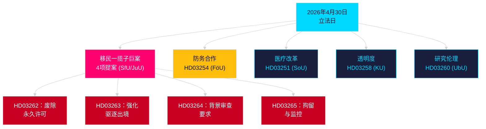

# 晚间分析 — 2026年4月30日：瑞典改革移民法律并推进防务合作

**作者**：James Pether Sörling  
**日期**：2026-04-30  
**置信度**：HIGH [B2]  
**分类**：OSINT — 仅公开来源  

---

## 执行摘要

瑞典政府于2026年4月30日提交了2025/26届会期单日立法数量最为可观的一批法案：一项由四份提案构成的移民制度根本性变革——废除永久居留许可并将瑞典法律与欧盟移民与庇护协定接轨——以及一项重大军事合作提案，强化瑞典在北约架构内的作战融合。距2026年9月13日议会选举还有149天，此次立法冲刺既是治理行为，也是选举定位行动。

## 本简报支持的决策

1. **反对党党团领袖**：评估对移民法案（HD03262/263/264/265）及防务提案（HD03254）所需抵制力度——四项同步委员会转交（SfU、JuU、FöU）压缩了议会时间表。
2. **公民社会组织**：评估HD03262废除永久许可的法律挑战路径——须比照《欧洲人权公约》第8条（家庭生活）和欧盟《基本权利宪章》的比例原则。
3. **北约/国防分析人士**：评估HD03254的作战内容——强化的双边军事互操作性协议标志着瑞典加入北约后的战略整合雄心。
4. **选举策略师**：在选举前期窗口（≤6个月：选举邻近乘数适用）校准选民对移民法最大化路线的反应。

## 60秒情报要点

- **移民一揽子巨案**：HD03262完全废除永久居留许可；HD03263强化驱逐出境；HD03264对许可引入更严格的背景审查要求；HD03265收紧监控与拘留——自2016年紧急措施以来瑞典历史上最严苛的移民立法 [A2]。
- **军事合作**：HD03254（FöU）强化瑞典的作战军事合作框架——将瑞典与更深层的双边及多边防务协定相捆绑，对北约第5条义务及北极战区需求至关重要 [A2]。
- **医疗整合**：HD03251提出针对依赖症、药物使用及精神共病的统一诊疗路径——经过十年碎片化区域责任后的成瘾服务结构性改革 [A2]。
- **政治透明度**：HD03258扩大政党政治资金和游说活动的透明度——预示政府在选举前的问责定位 [A2]。
- **选举邻近乘数**：四项移民提案＋防务提案＝≤6个月选举窗口内五项高度争议法案（截止日期2026-03-13）；DIW得分按选举邻近规则上调1.5倍。
- **反对党动议**：S以8项提交主导动议板块；SD提交2项；MP提交2项——议题涵盖航天工业、文化遗产、医疗、住房和社会福利。

## 最重要的近期触发因素

**SfU委员会就HD03262举行听证会**（预计2周内）：永久居留许可的废除将遭遇本届会期最激烈的反对党审查——重点关注社会民主党的正式反提案及联合政府内KD/L的潜在保留意见。

## 核心Mermaid图：今日立法架构

<!-- source-sha: 34f4e52b496d9d798f623f205ad98b050ff2f0e7 -->
