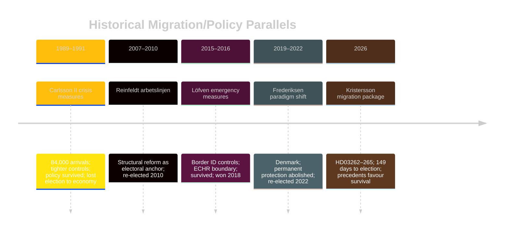

# Historical Parallels — Evening Analysis 30 April 2026

**Author**: James Pether Sörling  
**Date**: 2026-04-30  

---

## Named Historical Precedents

### Precedent 1 — Sweden 2007: Arbetslinjen as Pre-Election Anchor

**Period**: 2006–2010 (Reinfeldt I government)  
**Parallel**: Moderaterna campaigned on welfare reform ("arbetslinjen") as their defining narrative. The 2006 election was won on structural policy transformation delivered through legislation in the first 18 months of government.

**Relevance to 2026**: The Tidökoalitionen is attempting the same "mandate delivered" narrative with migration legislation. Key difference: 2006–2010 had a 4-year implementation window; 2026 has 149 days before election. The shorter window increases both risk (incomplete implementation) and reward (concentrated messaging).

**Outcome of precedent**: Reinfeldt won re-election in 2010 with increased mandate. Lesson: coherent legislative delivery can succeed electorally even with contested policy.

---

### Precedent 2 — Denmark 2019–2022: Paradigm Shift Migration Policy

**Period**: 2019–2022 (Frederiksen I government, Social Democratic)  
**Parallel**: Denmark abolished permanent protection status for Syrian refugees and tightened migration through 2019–2021 legislation. Social Democrats led, not the right.

**Relevance to 2026**: Denmark's migration maximalism came from the left, reducing SD's monopoly on the issue. The Swedish parallel would be S eventually adopting migration restrictions — not yet evident in 2026 but a strategic risk for SD's differentiation.

**Outcome of precedent**: Frederiksen won re-election 2022. Migration-restrictive policy was electorally durable.

---

### Precedent 3 — Sweden 1989–1991: Refugee Crisis and Policy Shift

**Period**: 1989–1991 (Carlsson II government)  
**Parallel**: Sweden received 84,000 asylum seekers in 1991 — a structural shock. The Carlsson government introduced tighter controls despite Social Democratic ideology. Policy was contested but passed.

**Relevance to 2026**: HD03262's permanent permit abolition is the most structural shift since 1991. The precedent suggests that major migration framework changes are implementable in Sweden but typically triggered by crisis, not pre-emptive electoral positioning.

**Outcome of precedent**: Policy passed; Carlsson lost 1991 election (to Bildt) — but the loss was about the economy (crisis of 1991), not migration policy specifically.

---

### Precedent 4 — Sweden 2015–2016: Emergency Measures and ID Checks

**Period**: 2015–2016 (Löfven I government)  
**Parallel**: The Löfven government introduced emergency temporary protection and border ID controls in November 2015 at peak migration crisis. These were legally contested but survived challenge.

**Relevance to 2026**: Demonstrates that Swedish courts (including Migration Court) have accepted emergency migration measures that were near the ECHR boundary. This precedent supports Scenario A — HD03262 may be politically and legally survivable even if individually challenged.

**Outcome of precedent**: Emergency measures became permanent; Swedish migration declined dramatically 2016–2021. Political credit went to Löfven for managing the crisis, despite initial criticism.

---

## Pattern Recognition

| Precedent | Migration Max | Pre-election | Legal Challenge | Electoral Outcome |
|-----------|-------------|-------------|----------------|-------------------|
| Reinfeldt 2007 (welfare) | No | Yes | No | Coalition re-elected |
| Denmark Frederiksen 2019 | Yes | No (4-year horizon) | Individual ECHR | Coalition re-elected |
| Carlsson 1989 (crisis) | Yes (reactive) | No | Partial | Lost election (economy) |
| Löfven 2015 (emergency) | Yes (reactive) | No | Partial | Won next election |

**Pattern**: Migration restriction legislation does not inherently damage electoral prospects. Pre-election delivery can be positive if framed as mandate fulfilment. Economic conditions are a stronger electoral determinant than migration policy per se.

## Mermaid: Historical Analogy Timeline

