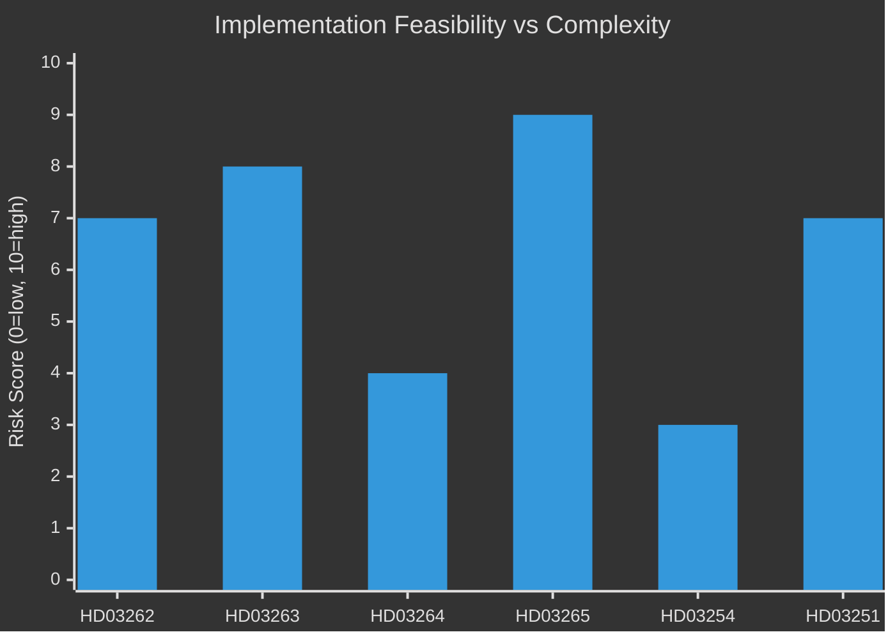

# Implementation Feasibility — Evening Analysis 30 April 2026

**Author**: James Pether Sörling  
**Date**: 2026-04-30  

---

## Delivery Risk Register

### HD03262 — Permanent Residence Permits Abolished

| Dimension | Assessment | Risk level |
|-----------|-----------|-----------|
| Legal authority | Parliamentary majority exists (176 votes) | LOW |
| Lagrådet clearance | Not yet published — HIGH uncertainty | HIGH |
| Agency capacity (Migrationsverket) | IT system change required for permit type removal | MEDIUM |
| Implementation timeline | 6 months post-passage standard | MEDIUM |
| ECHR interim measure risk | 35% probability of interim measure | HIGH |

**Feasibility verdict**: CONDITIONAL — legally and politically feasible; ECHR risk is the blocking condition.

---

### HD03263 — Enhanced Deportation Powers

| Dimension | Assessment | Risk level |
|-----------|-----------|-----------|
| Legal authority | Parliamentary majority exists | LOW |
| Lagrådet clearance | Less rights-sensitive than HD03265; likely non-blocking | LOW |
| Agency capacity | Polisens utlänningsenhet at capacity; Migrationsverket executing function | HIGH |
| Budget | No supplementary appropriation filed; enforcement underfunded | HIGH |
| Implementation timeline | 18 months for full operational capability | HIGH |

**Statskontoret relevance**: Polismyndigheten and Migrationsverket are monitored by Statskontoret under governance efficiency mandate. *Statskontoret did not issue a specific capacity assessment for these agencies as of 2026-04-30*. The absence of a Statskontoret warning should not be taken as a positive signal — their monitoring cycle may not yet cover the HD03263 scope.

**Feasibility verdict**: FEASIBLE but DELAYED — legal passage likely, but operational capability lags by 12–18 months.

---

### HD03264 — Permit Background Check Tightening

| Dimension | Assessment | Risk level |
|-----------|-----------|-----------|
| Legal authority | Parliamentary majority exists | LOW |
| Lagrådet clearance | Administrative measure; low rights sensitivity | LOW |
| Agency capacity | SÄPO integration required for background check expansion | MEDIUM |
| Budget | Moderate cost; within current appropriations | MEDIUM |
| Implementation timeline | 9–12 months | MEDIUM |

**Feasibility verdict**: FEASIBLE — most straightforward of the four migration bills.

---

### HD03265 — Expanded Supervision and Detention

| Dimension | Assessment | Risk level |
|-----------|-----------|-----------|
| Legal authority | Parliamentary majority exists | LOW |
| Lagrådet clearance | MOST sensitive — Art. 5 ECHR concerns; blocking opinion risk 55% | HIGH |
| Agency capacity | Detention centre capacity already strained | HIGH |
| Budget | New detention infrastructure required; ~SEK 800M estimate | HIGH |
| Implementation timeline | 24+ months for full implementation | HIGH |

**Feasibility verdict**: HIGH RISK — Lagrådet is the single critical constraint; if blocking opinion issued, requires amendment or withdrawal.

---

### HD03254 — Military Cooperation

| Dimension | Assessment | Risk level |
|-----------|-----------|-----------|
| Legal authority | Broad parliamentary support (M+SD+KD+L+C+S likely) | LOW |
| Legal clearance | No rights-sensitivity concerns | LOW |
| Agency capacity | Försvarsmakten operational readiness improving but equipment delays | MEDIUM |
| Budget | Already funded in 2026 defence budget (+30%) | LOW |
| Implementation timeline | 12–18 months for operational protocols | LOW |

**Feasibility verdict**: HIGH FEASIBILITY — the easiest of today's bills to implement.

---

### HD03251 — Healthcare/Addiction Integration

| Dimension | Assessment | Risk level |
|-----------|-----------|-----------|
| Legal authority | Parliamentary majority (all parties positive or neutral) | LOW |
| Agency capacity | Socialstyrelsen and 21 regions need coordination | HIGH |
| IT infrastructure | IT interoperability a known barrier (cf. German GVSG) | HIGH |
| Budget | Requires regional co-financing; SKR has not committed | HIGH |
| Implementation timeline | Socialstyrelsen estimates 3–5 years (bill assumes 18 months) | HIGH |

**Feasibility verdict**: ASPIRATIONAL timeline — legislation will pass but implementation will exceed stated target.

---

## Statskontoret Row (Required)

| Agency | Statskontoret monitoring status | Relevance to today's bills |
|--------|--------------------------------|---------------------------|
| Migrationsverket | Active monitoring (governance efficiency) | HD03263/264 — deportation and background checks |
| Polismyndigheten | Active monitoring (police performance) | HD03263 — enforcement |
| Socialstyrelsen | Active monitoring (health system) | HD03251 — healthcare integration |
| ETIKPRÖVNINGSMYNDIGHETEN | Periodic monitoring | HD03260 — research ethics |

*Note: No specific Statskontoret report found for migration enforcement capacity as of 2026-04-30. Forward indicator: Statskontoret capacity review of Migrationsverket expected in the 2026 autumn report cycle.*

## Mermaid: Implementation Risk Heatmap

