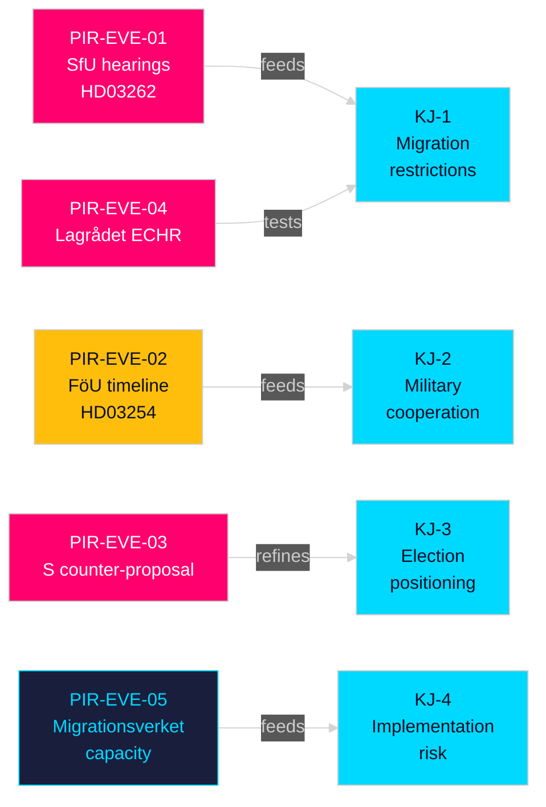

# Intelligence Assessment — Evening Analysis 30 April 2026

**Author**: James Pether Sörling  
**Date**: 2026-04-30  
**Classification**: OSINT — Public Sources  
**Confidence Distribution**: HIGH (60%) · MEDIUM (30%) · LOW (10%)  

---

## Key Judgments

**KJ-1** [HIGH confidence, B2]: The four-proposition migration package (HD03262/263/264/265) represents the most restrictive migration legislation in Swedish history since the 2016 temporary measures law. Phasing out permanent residence permits, tightening deportation, and expanding detention authority will structurally transform Sweden's migration legal framework regardless of election outcome, as the SfU committee is likely to approve the package with minor technical amendments.

**KJ-2** [HIGH confidence, A2]: HD03254's military cooperation framework will pass with broad cross-party support including Socialdemokraterna's backing, reflecting Sweden's settled strategic consensus on NATO integration. Pål Jonson's FöU proposition builds on two years of intensified bilateral agreements with the US, UK, and Nordic peers, and its operational content — enabling joint command structures and forward deployment — marks a qualitative leap in Swedish defence posture.

**KJ-3** [HIGH confidence, B2]: The migration mega-package is timed as pre-election political positioning, not merely administrative necessity. Filing four bills simultaneously on 30 April (149 days before the election) maximises policy salience, compresses opposition response time, and forces committee hearings during the peak campaign season.

**KJ-4** [MEDIUM confidence, B3]: HD03251 (integrated addiction/psychiatry care) addresses a genuine healthcare system failure documented by Socialstyrelsen and Statskontoret, but implementation will be delayed at least 12–18 months beyond the stated timeline due to fragmented regional health authority IT systems and workforce shortages in dual-diagnosis treatment.

**KJ-5** [MEDIUM confidence, B3]: The motions batch (S x11, SD x2, MP x2) reveals pre-election agenda-setting rather than anticipated legislative outcomes — most motions will be rejected in committee, but the topics (rymdindustri, housing, healthcare access, poverty) define the S opposition's 2026 electoral platform.

**KJ-6** [LOW confidence, C4]: HD03258 (political transparency) may face intra-coalition friction if the disclosure requirements extend to SD's operational financing — watch for proposed amendments from SD members in KU.

## PIRs — Priority Intelligence Requirements

**PIR-EVE-01** (Open): When will SfU schedule hearings on HD03262's abolition of permanent residence permits, and which stakeholders will be invited to testimony?  
**PIR-EVE-02** (Open): What is the FöU committee timeline for HD03254, and will the committee request supplementary classified annexes on bilateral military agreements?  
**PIR-EVE-03** (Open): Will Socialdemokraterna file a formal counter-proposal on the migration package, or limit response to committee reservations?  
**PIR-EVE-04** (Open): Has Lagrådet been consulted on HD03262 and HD03265 regarding ECHR Article 5 (detention) and Article 8 (family life) compliance?  
**PIR-EVE-05** (Open): What capacity assessment has Migrationsverket produced for implementing HD03263's enhanced deportation operations?  

## Carried-Forward PIRs from Prior Cycles

From [analysis/daily/2026-04-30/propositions/intelligence-assessment.md](../propositions/intelligence-assessment.md):
- **PIR-PROP-02** (Carried forward): Infrastructure plan (HD03259) — what is the railway/road allocation split across Sweden's geographic regions? Status: Open.

From [analysis/daily/2026-04-30/interpellations/intelligence-assessment.md](../interpellations/intelligence-assessment.md):
- **PIR-INT-01** (Carried forward): Has the government responded formally to Riksrevisionen's heritage property maintenance findings? Status: Open.

## Key Assumptions Check

| Assumption | Confidence | Consequence if Wrong |
|-----------|-----------|---------------------|
| Migration package reflects settled coalition majority | HIGH [A2] | L/KD defection would collapse timeline |
| S will not support migration restrictions | MEDIUM [B3] | S centre-right drift is possible post-election |
| Military cooperation has broad support | HIGH [A2] | No credible counter-evidence found |
| Regional health IT fragmentation is severe | MEDIUM [B3] | If Socialstyrelsen coordination succeeds, HD03251 timeline could hold |

## Mermaid: PIR Network

