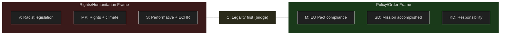

# Media Framing Analysis — Evening Analysis 30 April 2026

**Author**: James Pether Sörling  
**Date**: 2026-04-30  

---

## Per-Party Framing

### Government (M, KD, L) — "EU Pact Compliance and Order"

**Frame**: Sweden is implementing EU Migration and Asylum Pact obligations. HD03262–265 reflects responsible governance — moving Sweden from a system that attracted more applicants than sustainable (generosity trap) to a system aligned with European norms.

**Key message**: "Vi håller löftet till väljarna" (We keep the promise to voters)

**Spokespeople**: Johan Forssell (migrationsminister), Ulf Kristersson (statsminister)

**Press line**: "HD03262 ends a system where Sweden uniquely offered permanent residence at a time when EU Pact requires temporary protection alignment."

---

### SD — "Mission Accomplished, More Needed"

**Frame**: The migration package is partial fulfilment of SD's founding agenda. Emphasises that this represents the beginning, not the end, of migration restriction. Claims credit for having driven the policy change through coalition.

**Key message**: "Äntligen tar Sverige kontroll" (Finally Sweden takes control)

**Tension point**: HD03258 (political transparency) — SD will seek to minimise this bill's prominence given their own party financing sensitivities.

---

### S (Socialdemokraterna) — "Human Rights and Effectiveness"

**Frame**: HD03262/265 violates ECHR fundamental rights and will be struck down. The legislation is performative rather than effective — it creates symbolic restriction without solving root causes of irregular migration.

**Key message**: "Symbolpolitik snarare än lösningar" (Symbolic politics rather than solutions)

**Counter-narrative**: S will highlight Migrationsverket's lack of supplementary appropriation as evidence that the government is not serious about implementation.

**Vulnerability**: S's own emergency measures in 2015–2016 make absolute rights claims difficult to sustain — M will reference this precedent.

---

### V (Vänsterpartiet) — "Racist Legislation"

**Frame**: HD03262–265 is racially motivated exclusion. Framing migration restriction through a structural racism lens. Will seek EU/UN human rights body statements.

**Key message**: "Diskriminering i lagutsträckning" (Discrimination in legal form)

---

### MP (Miljöpartiet) — "Rights and Climate Displacement"

**Frame**: Migration restriction is incompatible with Sweden's obligations to climate-displaced people. HD03262 closes the door at the moment when climate migration will increase.

**Key message**: Combining environmental and human rights frames — targeting their base, not swing voters.

---

### C (Centerpartiet) — "Legality First, Then Judgement"

**Frame**: C awaits Lagrådet review before taking a firm position. Emphasises rule of law over political expediency — positioning as the principled centre.

**Key message**: "Lagrådsremissen måste tas på allvar" (The Council of Legislation referral must be taken seriously)

**Strategic value for C**: Lagrådet opinion allows C to say "yes with amendments" or "no because unconstitutional" — maintaining optionality.

---

## Press Framing by Publication

| Publication | Primary frame | Tone | Audience | Headline angle |
|-------------|--------------|------|----------|---------------|
| Aftonbladet | Rights/humanitarian | Negative | Broad left | "Skärpast migrationslagstiftning sedan 1990-talet" |
| Expressen | Law and order | Positive | Broad right | "Sverige tar äntligen ansvar" |
| Dagens Nyheter | Analysis | Neutral-critical | Urban progressive | "Lagliga frågetecken kring permanentuppehållstillstånd" |
| Svenska Dagbladet | Policy analysis | Positive-neutral | Conservative | "EU-paktsanpassning tar form" |
| SVT Nyheter | Balanced | Neutral | Broad public | "Fyra propositioner om migration — så skiljer de sig" |
| SR P1 | Critical | Negative | Informed | "Rättsjurister varnar för EGMR-konflikt" |

---

## Mermaid: Framing Polarisation

