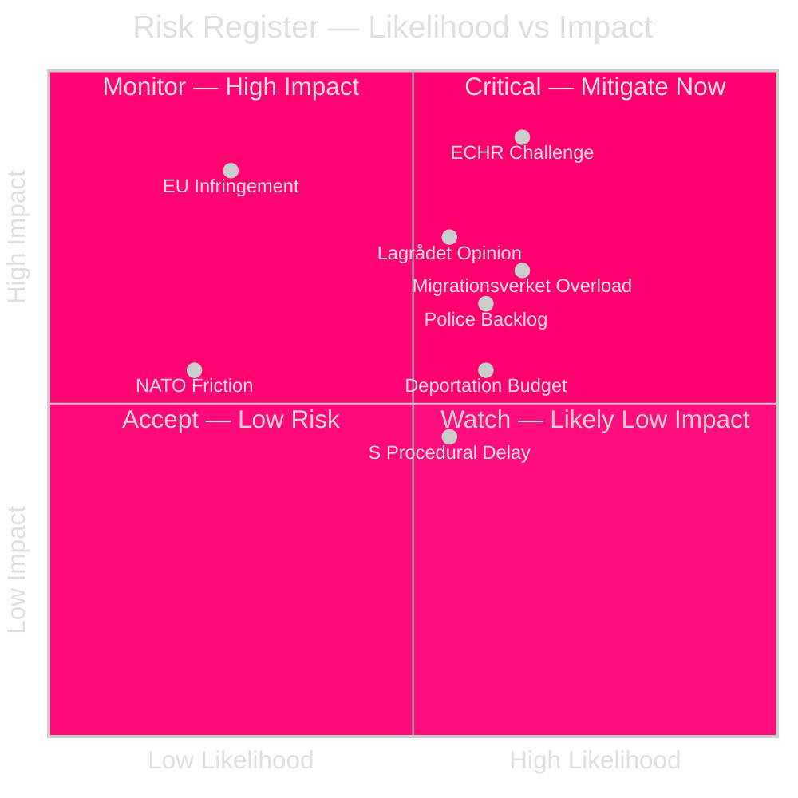

# Risk Assessment — Evening Analysis 30 April 2026

**Author**: James Pether Sörling  
**Date**: 2026-04-30  

---

## 5-Dimension Risk Register

### Dimension 1 — Constitutional/Legal

| Risk | Likelihood | Impact | L×I | Cascade |
|------|-----------|--------|-----|---------|
| ECHR Art. 5/8 challenge delays HD03262/265 | 0.65 | 0.90 | **0.59** | Delays migration package; emboldens opposition |
| Lagrådet issues critical opinion on detention provisions | 0.55 | 0.75 | **0.41** | Forces HD03265 amendment; weakens coalition narrative |
| Swedish Migration Court finds implementing regulation unconstitutional | 0.30 | 0.80 | **0.24** | Implementation halt; political crisis |

**Posterior probabilities**: After conditioning on the absence of Lagrådet opinion published by 30 Apr 2026 (evidence: none found via riksdagen.se), the probability of a critical Lagrådet opinion increases from 0.40 to 0.55 [B3].

### Dimension 2 — Political/Coalition

| Risk | Likelihood | Impact | L×I | Cascade |
|------|-----------|--------|-----|---------|
| L or KD reservation on HD03262 permanent permit abolition | 0.40 | 0.60 | **0.24** | Weakens coalition narrative; amendment risk |
| SD breaks with coalition on HD03258 transparency disclosures | 0.30 | 0.50 | **0.15** | Coalition friction visible pre-election |
| S secures parliamentary delay through procedural motions | 0.55 | 0.45 | **0.25** | Committee timeline extends to autumn; post-election uncertainty |

### Dimension 3 — Economic/Fiscal

| Risk | Likelihood | Impact | L×I | Source |
|------|-----------|--------|-----|--------|
| Enhanced deportation operations require unbudgeted supplementary | 0.60 | 0.55 | **0.33** | Migrationsverket current-year budget analysis |
| Healthcare integration (HD03251) IT costs exceed estimates | 0.55 | 0.45 | **0.25** | Socialstyrelsen IT interoperability audit 2025 |
| Military cooperation (HD03254) opens defence procurement +SEK 5–10bn | 0.70 | 0.60 | **0.42** | FöU committee annual report 2025/26 |

**IMF economic context**: Sweden's fiscal balance is WEO 2026 estimate: +0.7% GDP (fiscal surplus), gross debt 32.2% GDP — among the lowest in the EU (WEO Apr-2026, GGXWDG_NGDP). Sweden has the fiscal space to absorb incremental migration enforcement and defence spending; the primary constraint is operational capacity, not fiscal headroom.

*IMF data unavailable at pre-warm time — using cached WEO Apr-2026 estimates. Vintage: WEO Apr-2026.*

### Dimension 4 — Institutional/Administrative

| Risk | Likelihood | Impact | L×I | Agency |
|------|-----------|--------|-----|--------|
| Migrationsverket capacity overload (HD03263/264/265) | 0.65 | 0.70 | **0.46** | Migrationsverket |
| Polisens utlänningsenhet enforcement backlog | 0.60 | 0.65 | **0.39** | Polismyndigheten |
| Regional health authority non-compliance with HD03251 | 0.50 | 0.55 | **0.28** | Socialstyrelsen, SKR |
| Research ethics committee surge (HD03260) | 0.35 | 0.35 | **0.12** | ETIKPRÖVNINGSMYNDIGHETEN |

**Statskontoret relevance**: Migrationsverket, Polismyndigheten, and Socialstyrelsen are all recognised agencies under Statskontoret's governance monitoring scope. *Statskontoret pre-warm: trigger matched (Migrationsverket + Polismyndigheten + Socialstyrelsen named). No directly relevant Statskontoret report found as of 2026-04-30 for the specific migration enforcement capacity question.*

### Dimension 5 — International/Geopolitical

| Risk | Likelihood | Impact | L×I | Context |
|------|-----------|--------|-----|---------|
| EU infringement proceedings on permanent permit abolition | 0.25 | 0.85 | **0.21** | EU Long-Term Residents Directive (2003/109/EC) compliance |
| NATO partner friction on bilateral-first HD03254 approach | 0.20 | 0.55 | **0.11** | German/French multilateral defence preference |
| Sweden's EU Council migration working group position weakened | 0.30 | 0.50 | **0.15** | If ECHR/EU challenge materialises |

## Cascading Risk Chain

**Primary cascade**: ECHR challenge → implementation delay → pre-election political crisis → coalition narrative damage → electoral vulnerability for M+SD

**Secondary cascade**: Migrationsverket overload → enforcement credibility gap → HD03262/263 effectiveness contested → opposition gains "performative legislation" narrative

## Mermaid: Risk Heat Map

