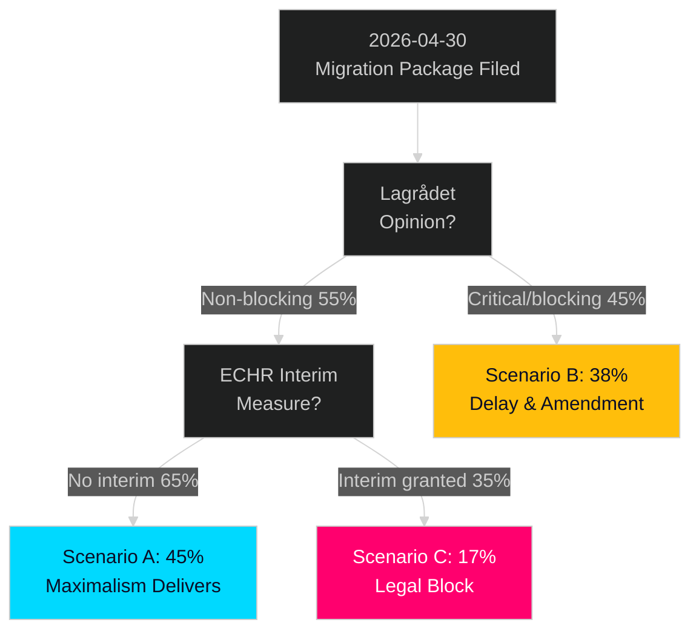

# Scenario Analysis — Evening Analysis 30 April 2026

**Author**: James Pether Sörling  
**Date**: 2026-04-30  

---

## Scenario Framework

**Planning horizon**: 2026-04-30 → 2026-09-13 (election day)  
**Primary focus**: Migration mega-package (HD03262–265) + September 2026 general election  
**Probability sum check**: Scenarios A + B + C must sum to 100%  

---

## Scenario A — "Migration Maximalism Delivers" (Probability: 45%)

**Narrative**: The coalition passes all four migration bills through Riksdag before summer recess. Lagrådet issues a cautionary but non-blocking opinion. EU Commission opens dialogue but stops short of formal infringement. ECHR receives no admissible challenge before election day. Coalition enters September 2026 election with a clear "promise delivered" narrative on migration.

**Key conditions**:
- Lagrådet opinion non-blocking (no unconstitutional finding) — probability: 0.55
- No ECHR interim measure granted before September — probability: 0.65
- JuU reports HD03262 in June 2026 — probability: 0.55
- SD maintains coalition discipline on HD03262–265 — probability: 0.80

**Electoral impact**: M+SD+KD+L retain or expand their combined seat share. Coalition government continues. Migration maximalism is institutionalised.

**Policy consequence**: HD03262–265 enter into force Q4 2026. Permanent permit issuance ceases. Deportation operations scale up in 2027.

---

## Scenario B — "Legal Complications Delay" (Probability: 38%)

**Narrative**: Lagrådet issues a significant critical opinion on HD03265 (expanded detention), requiring amendment. Committee timeline extends to post-summer. HD03262 passes but HD03265 is amended. ECHR receives admissibility application from Amnesty/FARR. Coalition still wins election but with a smaller majority; migration package is partially implemented.

**Key conditions**:
- Lagrådet critical opinion on HD03265 — probability: 0.55
- HD03265 requires amendment extending committee timeline — probability: 0.60
- Coalition wins election with reduced majority — probability: 0.55
- ECHR admissibility pending but no interim measure before election — probability: 0.50

**Electoral impact**: Coalition wins but narrative is "work in progress" rather than "delivered." SD faces internal pressure for full implementation.

**Policy consequence**: HD03262 and HD03263 pass as-is. HD03264/265 amended versions pass Q1 2027. Implementation begins but slower.

---

## Scenario C — "Legal Block and Opposition Gains" (Probability: 17%)

**Narrative**: ECHR grants interim measures on HD03262 before election. Lagrådet issues blocking opinion on HD03265. EU Commission opens formal infringement on HD03262. Coalition enters election defending "struck-down" legislation. Opposition successfully reframes election around welfare and economic security. S-led bloc wins election.

**Key conditions**:
- ECHR interim measure granted — probability: 0.25
- Lagrådet blocking opinion — probability: 0.30
- EU Commission formal infringement — probability: 0.20
- Opposition successfully reframes electoral terrain — probability: 0.40
- S-led bloc wins election — probability: 0.35

**Electoral impact**: Opposition bloc wins. S forms government with C, potentially MP/V support. HD03262–265 withdrawn or fundamentally amended.

**Policy consequence**: Migration policy pivots back toward integration framework. Defence cooperation (HD03254) likely continues regardless of government change given NATO obligations.

---

## Probability Calibration

| Scenario | Prior (30 Apr) | Event triggers (watch) |
|----------|---------------|------------------------|
| A (45%) | Baseline — legal challenge materialises slower than political timeline | JuU June report; SD discipline; no ECHR interim |
| B (38%) | Lagrådet critical opinion base rate; coalition manages but amended | Lagrådet opinion H1 May; S procedural motions |
| C (17%) | Low prior but not negligible given ECHR precedent | ECHR Rule 39 request; EU Commission formal letter |

**Sum check**: 45% + 38% + 17% = **100%** ✅

---

## Mermaid: Scenario Probability Tree

