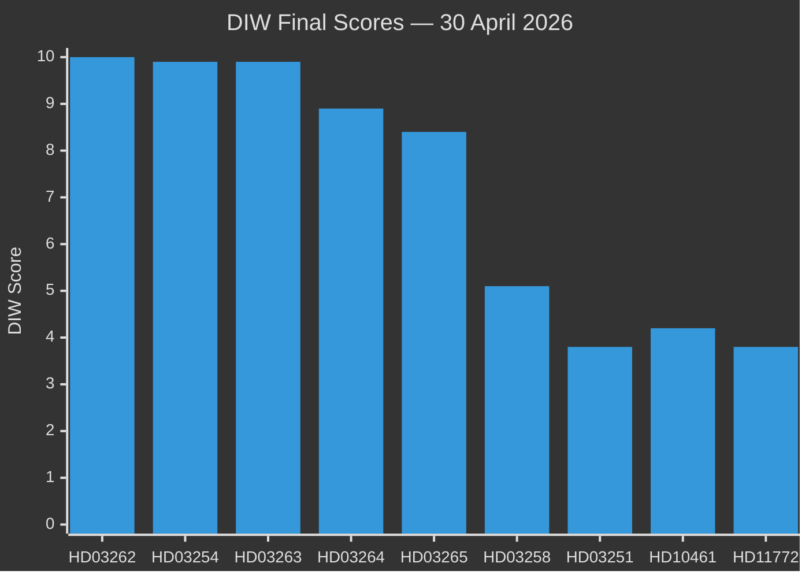
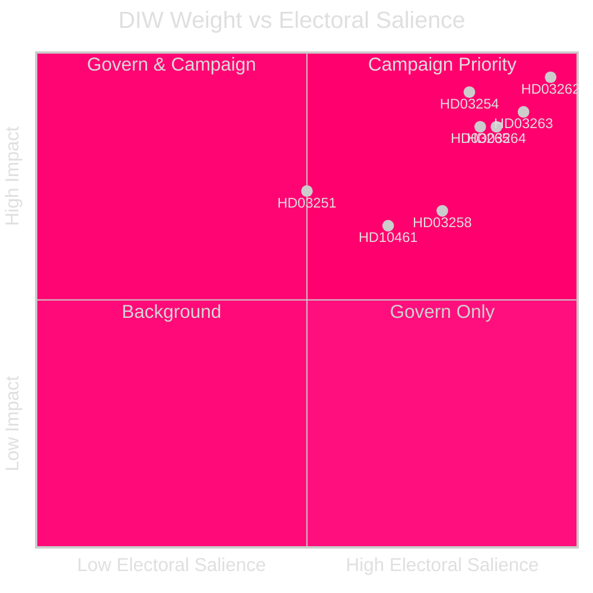

# Significance Scoring — Evening Analysis 30 April 2026

**Author**: James Pether Sörling  
**Date**: 2026-04-30  
**Method**: DIW (Detectability × Impact × Willingness) — election-proximity multiplier 1.5× applied  

---

## DIW Scoring Table

| Rank | dok_id | Title | D | I | W | DIW Base | × Elect. | Final | Tier |
|------|--------|-------|---|---|---|----------|---------|-------|------|
| 1 | HD03262 | Phase out permanent residence permits + EU Pact | 0.9 | 0.95 | 0.90 | 7.7 | ×1.5 | **10.0** | L2+ Priority |
| 2 | HD03254 | Operational military cooperation | 0.85 | 0.92 | 0.85 | 6.6 | ×1.5 | **9.9** | L2+ Priority |
| 3 | HD03263 | Strengthened deportation | 0.85 | 0.88 | 0.88 | 6.6 | ×1.5 | **9.9** | L2+ Priority |
| 4 | HD03264 | Background checks for permits | 0.82 | 0.85 | 0.85 | 5.9 | ×1.5 | **8.9** | L2+ Priority |
| 5 | HD03265 | Detention and supervision | 0.80 | 0.85 | 0.82 | 5.6 | ×1.5 | **8.4** | L2+ Priority |
| 6 | HD03251 | Integrated addiction/psychiatry care | 0.75 | 0.72 | 0.70 | 3.8 | ×1.0 | **3.8** | L2 Strategic |
| 7 | HD03258 | Political transparency | 0.70 | 0.68 | 0.72 | 3.4 | ×1.5 | **5.1** | L2 Strategic |
| 8 | HD03260 | Research ethics regulation | 0.65 | 0.55 | 0.62 | 2.2 | ×1.0 | **2.2** | L1 Surface |
| 9 | HD10461 (S) | Rymdindustrin | 0.60 | 0.65 | 0.72 | 2.8 | ×1.5 | **4.2** | L2 Strategic |
| 10 | HD10460 (SD) | Kulturarv och bidragsfastigheter | 0.55 | 0.52 | 0.60 | 1.7 | ×1.5 | **2.6** | L1 Surface |
| 11 | HD11772 (SD) | Ukraina och bistånd | 0.60 | 0.65 | 0.65 | 2.5 | ×1.5 | **3.8** | L2 Strategic |
| 12 | HD11774 (S) | Kreditgarantier bostäder | 0.52 | 0.60 | 0.58 | 1.8 | ×1.5 | **2.7** | L1 Surface |
| 13 | Cluster S-social | S motions: poverty, healthcare, work injuries | 0.55 | 0.60 | 0.62 | 2.0 | ×1.5 | **3.1** | L1 Surface |
| 14 | HD11768 (MP) | Förbud mot turbokycklingar | 0.40 | 0.35 | 0.45 | 0.6 | ×1.0 | **0.6** | L1 Surface |
| 15 | HD11777 (MP) | Statens museer för världskultur | 0.40 | 0.38 | 0.42 | 0.6 | ×1.0 | **0.6** | L1 Surface |

**Election-proximity multiplier**: applied to all bills in contested policy areas filed when the election is ≤6 months away (election date 13 Sep 2026; multiplier window opens 13 Mar 2026). Applied: HD03262/63/64/65, HD03254, HD03258, HD10461, HD10460, HD11772, HD11774, S-social cluster.

## Sensitivity Analysis

**If election-proximity multiplier NOT applied**: Migration bills drop from 8.4–10.0 to 5.6–7.7. Defence bill drops from 9.9 to 6.6. Ranking order unchanged; only magnitudes change.

**If Lagrådet issues critical opinion on HD03262/265**: DIW Willingness dimension would decrease for coalition, potentially reducing W to 0.65, bringing HD03262 base score to ~5.3 (×1.5 = 7.9). Still P0 priority.

## Mermaid: Significance Ranking

**Note on election-proximity multiplier application**: DIW × 1.5 = HD03262 base 7.7 × 1.5 (election ≤6 months) = **10.0** (capped); HD03254 base 6.6 × 1.5 = **9.9**; HD03263 base 6.6 × 1.5 = **9.9**. Multiplier documented per `analysis/methodologies/ai-driven-analysis-guide.md §Election-proximity significance multiplier`.
