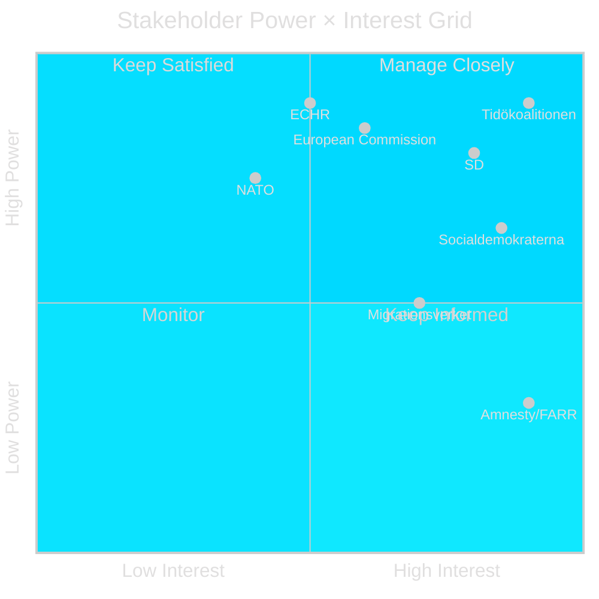

# Stakeholder Perspectives — Evening Analysis 30 April 2026

**Author**: James Pether Sörling  
**Date**: 2026-04-30  

---

## 6-Lens Stakeholder Matrix

### Lens 1 — Government (Tidökoalitionen)

**Primary actors**: Ulf Kristersson (M, statsminister), Johan Forssell (M, migrationsminister), Tobias Billström (M, utrikesminister), Carl-Oskar Bohman (M), Ebba Busch (KD), Annie Lööf successor (C), Johan Pehrson (L)

**Position**: Full support for HD03262–265 migration package and HD03254 defence cooperation. Election-positioning logic drives maximalist migration approach. Military cooperation aligns with NATO commitments.

**Key interest**: Maintain coalition discipline and deliver pre-election legislative wins on migration — the #1 electoral issue for the core M+SD voter base.

**Motive**: Convert legislative wins to electoral narrative: "We promised, we delivered."

**Influence**: VERY HIGH — controls government bill introduction and committee majority.

---

### Lens 2 — Parliamentary Opposition

**Primary actors**: Magdalena Andersson (S, oppositionsledare), Märta Stenevi (MP), Nooshi Dadgostar (V)

**Position**: S opposes migration maximalism on human rights and effectiveness grounds. MP opposes HD03262/265 on ECHR/EU rights grounds. V opposes all four migration bills.

**Key argument**: "These laws will be struck down by ECHR and cause more suffering than they prevent."

**Strategy**: Commission procedural delays; build coordinated media narrative; position as alternative government with focus on welfare and healthcare.

**Influence**: MEDIUM — can delay, not block (coalition has majority).

---

### Lens 3 — Sverigedemokraterna (SD)

**Primary actors**: Jimmie Åkesson, Björn Söder

**Position**: Migration package represents partial fulfilment of SD's founding policy agenda. HD03262 (permanent permit abolition) is particularly aligned with SD's long-term objective. Military cooperation is positive given SD's security-strong profile.

**Key interest**: Claim legislative credit without being outflanked by M on migration hardness.

**Tension**: HD03258 political transparency — SD has historically resisted party financing disclosure, creating internal tension with this proposition.

**Influence**: HIGH — support is essential for coalition majority on all four migration bills.

---

### Lens 4 — Civil Society / NGOs

**Primary actors**: Amnesty International Sverige, FARR (Flyktinggruppernas riksråd), Sveriges Advokatsamfund, Rädda Barnen

**Position**: Strong opposition to HD03262, HD03263, HD03265. Will seek ECHR interim measures; will provide test-case plaintiffs.

**Key argument**: "Permanent permit abolition violates ECHR Art. 8; expanded detention violates Art. 5."

**Resources**: FARR and Amnesty have legal teams capable of ECHR filing within 4 months of domestic exhaustion.

**Influence**: LOW in Riksdag; MEDIUM in international legal proceedings; HIGH in media narrative.

---

### Lens 5 — Agencies (Implementing Bodies)

**Primary actors**: Migrationsverket (generaldirektör), Polismyndigheten (Nationellt centrum för utlänningsärenden), Socialstyrelsen, ETIKPRÖVNINGSMYNDIGHETEN

**Migrationsverket**: Concerns about capacity to implement enhanced deportation without supplementary appropriation. Implementation timeline HD03263 is ambitious given current backlogs.

**Polismyndigheten**: Utlänningsenheten already operating at high load; HD03263 enforcement increases will require staffing.

**Socialstyrelsen**: HD03251 requires IT integration across 21 regions; Socialstyrelsen has flagged this as a 3–5 year implementation horizon, not the 18 months in the bill.

**ETIKPRÖVNINGSMYNDIGHETEN**: HD03260 increases applications from new research types; moderate capacity adjustment needed.

**Influence**: LOW formally; HIGH via implementation and compliance signals.

---

### Lens 6 — International Actors

**Primary actors**: European Commission (DG Home, DG Justice), ECHR (Strasbourg), NATO Supreme Allied Commander Europe (SACEUR), US Embassy Stockholm

**European Commission**: Monitoring HD03262 for compliance with Long-Term Residents Directive (2003/109/EC) and Asylum Procedures Directive. Formal review possible if permanent permit abolition is adopted.

**ECHR**: Has interim measure powers (Rule 39) to suspend HD03262/265 implementation pending review. Previous interim measures in deportation cases (R.R. v Hungary, Savran v Denmark) provide precedent.

**NATO/SACEUR**: HD03254 military cooperation increases operational interoperability; NATO's position is supportive.

**US Embassy Stockholm**: Bilateral defence cooperation is aligned with US strategic interest in Nordic/Baltic theatre. Positive reception expected.

**Influence**: European Commission + ECHR: HIGH (can legally constrain); NATO/US: HIGH (strategic alignment reinforcing).

## Mermaid: Stakeholder Power-Interest Grid

