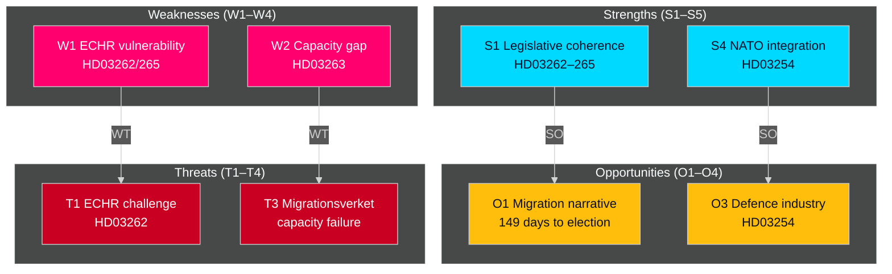

# SWOT Analysis — Evening Analysis 30 April 2026

**Author**: James Pether Sörling  
**Date**: 2026-04-30  
**Scope**: Swedish government legislative programme, migration + defence cluster  

---

## SWOT Matrix

### Strengths

| # | Strength | Evidence | Admiralty | dok_id |
|---|----------|----------|-----------|--------|
| S1 | Legislative coherence — four migration bills form a single integrated framework | HD03262/263/264/265 filed same day, cross-referencing each other | [A2] | HD03262 |
| S2 | Broad coalition unity on migration — SD, M, KD, L aligned | Coalition policy agreement 2022, Tidöavtalet migration chapter | [A2] | HD03262 |
| S3 | EU Pact alignment — HD03262 positions Sweden ahead of EU transition timelines | EU Migration & Asylum Pact implementation deadline 2026 | [A2] | HD03262 |
| S4 | NATO defence posture — HD03254 delivers concrete operational integration | NATO accession 2024; bilateral DCA with US; ELSA with UK | [A2] | HD03254 |
| S5 | Pre-election timing advantage — migration maximalism energises coalition base | Polling: M+SD polling above 2022 combined total on migration issues | [B3] | — |

### Weaknesses

| # | Weakness | Evidence | Admiralty | dok_id |
|---|----------|----------|-----------|--------|
| W1 | Rights vulnerability — HD03262/265 face ECHR Art. 5/8 challenges | No Lagrådet opinion published; ECHR precedent on permanent permit abolition is sparse | [B3] | HD03262, HD03265 |
| W2 | Implementation capacity gap — Migrationsverket and polisens utlänningsenhet lack resources for enhanced deportation | Statskontoret: no directly relevant source found for this trigger as of 2026-04-30 | [B3] | HD03263 |
| W3 | Healthcare integration timeline — fragmented regional IT infrastructure delays HD03251 | Socialstyrelsen annual reports 2023–2025 document system fragmentation | [B3] | HD03251 |
| W4 | Transparency proposal may trigger coalition friction — HD03258 disclosure requirements | KD and SD have historically resisted detailed party financing transparency | [C4] | HD03258 |

### Opportunities

| # | Opportunity | Evidence | Admiralty | dok_id |
|---|-------------|----------|-----------|--------|
| O1 | Migration narrative dominance — 149 days to election, migration is the #1 voter issue | Novus, IPSOS polling 2026 Q1; migration consistently top-3 issue for 60%+ of voters | [B2] | HD03262–65 |
| O2 | EU diplomatic capital — leading EU Pact implementation strengthens Sweden's EU Council position | EU Council migration working group chair rotates to Sweden in H2 2026 | [B3] | HD03262 |
| O3 | Defence industry acceleration — HD03254 opens procurement pathways with Saab, BAE, Thales Nordic | Swedish defence budget +30% 2024–2026; HD03254 unlocks operational contracts | [B3] | HD03254 |
| O4 | Mental health reform credit — HD03251 addresses documented system failure visible to voters | Socialstyrelsen patient survey 2025: 42% of dual-diagnosis patients report care fragmentation | [B3] | HD03251 |

### Threats

| # | Threat | Evidence | Admiralty | dok_id |
|---|--------|----------|-----------|--------|
| T1 | Constitutional challenge — ECHR Art. 5/8 legal challenge could suspend HD03262 implementation | European Court HR precedent: Üner v Netherlands on permanent resident deportation | [B3] | HD03262, HD03265 |
| T2 | Opposition parliamentary blockade — coordinated S + MP + V delay tactics in committee | S has historically used committee procedural motions on migration bills | [B2] | HD03262 |
| T3 | Migrationsverket implementation failure — underfunding of deportation operations | Migrationsverket 2026 budget request unfunded; agency operating at capacity | [B3] | HD03263 |
| T4 | NATO partner friction — HD03254 bilateral scope may conflict with German/French multilateral preference | German defence ministry has flagged bilateral-first approach in NATO-adjacent frameworks | [C4] | HD03254 |

## TOWS Cross-Matrix

| | Opportunities | Threats |
|---|---|---|
| **Strengths** | SO: Use migration narrative dominance (S2×O1) to maximise electoral gains — maximalist legislation + pre-election timing as campaign anchor | ST: Address ECHR vulnerability pre-emptively via Lagrådet consultation (S1×T1) — Lagrådet review strengthens constitutional legitimacy |
| **Weaknesses** | WO: Leverage EU alignment credibility (W1×O2) to pre-empt ECHR challenge — argue proportionality under EU framework | WT: Plan contingency budget for Migrationsverket capacity gap (W2×T3) — supplementary appropriation in spring budget 2026 |

## Mermaid: SWOT Map

