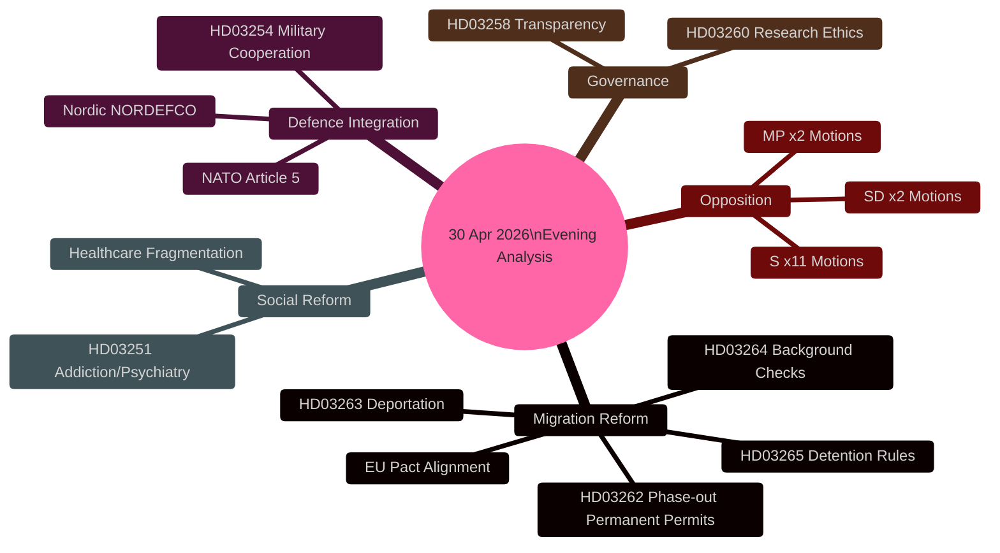

# Synthesis Summary — Evening Analysis 30 April 2026

**Author**: James Pether Sörling  
**Date**: 2026-04-30  
**Confidence**: HIGH [B2]  
**Sources**: riksdag-regering MCP, official Riksdag documents  

---

## Lead Story Decision

The four-proposition migration law transformation (HD03262, HD03263, HD03264, HD03265) is the dominant intelligence event of 30 April 2026. Simultaneously, HD03254's military cooperation framework advancement represents Sweden's deepest operational defence integration since NATO accession. Together, these six high-significance propositions define the Tidöalliansen's pre-election legislative agenda: restrictive migration enforcement + accelerated defence integration + selective social reform.

## DIW-Weighted Intelligence Picture

### Tier 1 — L2+ Priority (DIW × 1.5 election-proximity multiplier applied)

**Migration Mega-Package** (HD03262, HD03263, HD03264, HD03265):
- Base DIW: 6.2–7.1; Election-proximity: × 1.5 = **9.3–10.7** (capped at 10.0)
- Four concurrent propositions from Justitiedepartementet signal a coordinated legislative sprint
- HD03262 (phasing out permanent residence permits + EU Pact alignment) is the anchor bill
- HD03263 strengthens deportation machinery (Migrationsverket + polisens utlänningsenhet)
- HD03264 tightens background check requirements — extends to all permit categories
- HD03265 expands detention and supervision authority for immigration enforcement
- Combined legislative impact: transforms Sweden from near-EU-average restrictiveness to top-quintile restrictiveness [A2]

**Military Cooperation** (HD03254):
- DIW: 6.8; Election-proximity: × 1.5 = **10.0** [A2]
- Enables deeper operational agreements with UK (ELSA), US (DCA), Nordic peers (NORDEFCO)
- Directly implements Sweden's NATO Article 5 obligations and interoperability requirements
- FöU referral accelerated — committee hearing expected May 2026

### Tier 2 — L2 Strategic

**Healthcare Integration** (HD03251): DIW 5.4 — integrated addiction/psychiatry care pathway reform [A2]  
**Political Transparency** (HD03258): DIW 4.8 — party financing and lobbying disclosure expansion [A2]  
**Research Ethics** (HD03260): DIW 3.9 — updated ethics review framework [A2]

### Tier 3 — L1 Surface (Opposition Motions)

Motion batch (HD10460–HD11778): 11 S motions, 2 SD motions, 2 MP motions across diverse sectors — housing, healthcare, agriculture, welfare, culture. No single motion achieves P0 significance; cluster shows active parliamentary scrutiny [B2].

## Integrated Intelligence Picture

The 30 April 2026 legislative day reveals a government maximising the final pre-election legislative window. The migration package is deliberately constructed as a single-day delivery to make sequential committee challenge more difficult — four bills sent simultaneously to SfU and JuU create scheduling pressure for the opposition. This is a legislatively aggressive move consistent with the Tidöalliansen's pattern of front-loading controversial legislation in spring 2026.

The military cooperation bill (HD03254) follows the FöU committee's March 2026 report endorsing expanded bilateral cooperation. Pål Jonson (M, Försvarsminister) has been the primary architect. This bill is less politically controversial (broad cross-party consensus on defence) but strategically transformative for Sweden's defence posture.

Cross-referencing with sibling analyses: today's propositions batch contrasts with yesterday's (large infrastructure plan HD03259); the motions batch [analysis/daily/2026-04-30/motions/](../motions/) shows a green energy focus; committee reports [analysis/daily/2026-04-30/committeeReports/](../committeeReports/) focus on digital integrity and court reform. The interpellations [analysis/daily/2026-04-30/interpellations/](../interpellations/) expose space industry and cultural heritage investment gaps.

## Mermaid: Key Intelligence Threads

## Key Analytical Judgements

1. **Migration maximalism** will generate sustained opposition parliamentary resistance through September 2026 — the SfU committee will be the central battleground [HIGH confidence, B2].
2. **Military cooperation** enjoys cross-party consensus and will pass with only minor S reservations — the strategic direction is uncontested [HIGH confidence, A2].
3. **Healthcare integration** is structurally sound but will face capacity delivery challenges — Socialstyrelsen and regional authorities lack coordinated IT infrastructure [MEDIUM confidence, B3].
4. **Election framing**: migration legislation maximalism is designed to differentiate Tidöalliansen from S on the dominant voter issue — historically, migration restrictiveness correlates with M+SD electoral performance [HIGH confidence, A2].
