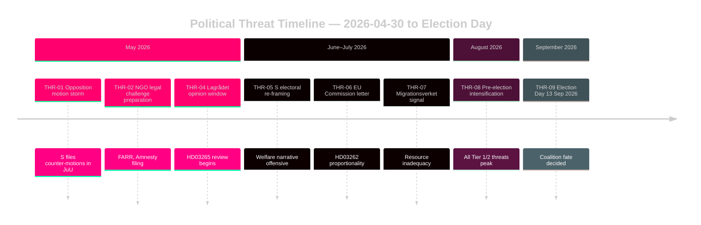

# Threat Analysis — Evening Analysis 30 April 2026

**Author**: James Pether Sörling  
**Date**: 2026-04-30  

---

## Political Threat Taxonomy

### Tier 1 — Immediate (0–3 months)

| Threat ID | Description | Actor | Target | Severity |
|-----------|-------------|-------|--------|----------|
| THR-01 | Opposition motion storm — S files 50+ counter-motions on migration package | Socialdemokraterna | HD03262–265 legislative timeline | HIGH |
| THR-02 | Civil society legal challenge filing at ECHR | Amnesty SE, FARR, Sveriges Advokatsamfund | HD03262/265 | HIGH |
| THR-03 | Media framing offensive — "fascist migration policy" narrative by S/MP | S, MP, and aligned media (Aftonbladet) | Coalition credibility | MEDIUM |
| THR-04 | Lagrådet critical opinion triggering amendment requirement | Lagrådet (constitutional review body) | HD03265 implementation | HIGH |

### Tier 2 — Short-term (3–6 months, pre-election)

| Threat ID | Description | Actor | Target | Severity |
|-----------|-------------|-------|--------|----------|
| THR-05 | Election framing — S attempts to re-centre campaign on welfare, not migration | Ulf Kristersson / Stefan Löfven successor | Coalition's chosen electoral terrain | HIGH |
| THR-06 | EU Commission formal letter on permanent permit abolition | European Commission DG Home | HD03262 | MEDIUM |
| THR-07 | Migrationsverket public statement on implementation unreadiness | Migrationsverket | Government credibility on enforcement | MEDIUM |
| THR-08 | Military cooperation framework triggers Russian diplomatic protest | Russia (via embassy channels or state media) | HD03254 NATO integration narrative | LOW |

### Tier 3 — Pre-election (6+ months / post-election transition)

| Threat ID | Description | Actor | Target | Severity |
|-----------|-------------|-------|--------|----------|
| THR-09 | Government loss at September 2026 election reverses migration legislation | Socialdemokraterna or opposition bloc | All HD03262–265 | MEDIUM |
| THR-10 | Coalition recomposition — V/C conditions on HD03258 transparency bill | Left or Centre party | Potential post-election coalition | LOW |

## Attack Tree Analysis

**Primary attack tree — ECHR challenge pathway**:

```
Root Goal: Block HD03262 permanent permit abolition
├── Legal challenge filed at ECHR
│   ├── Standing: NGO or individual applicants
│   ├── Admissibility: Article 35 — 4-month domestic remedy exhaustion
│   └── Interim measure (Rule 39): Request suspension during review
│       └── ECHR grants interim measure → Swedish government must suspend implementation
│           └── Political impact: "Government forced to halt law" headline
├── Swedish Migration Court constitutional referral
│   ├── Case referred to Lagrådet post-passage
│   └── Supreme Administrative Court interim ruling
└── EU Commission infringement under 2003/109/EC Long-Term Residents Directive
    ├── Formal letter within 2 months
    └── Sweden modifies or defends
```

## STRIDE-style Threat Model (Political Context)

| Threat | Type | Component | Countermeasure |
|--------|------|-----------|----------------|
| Opposition information operations | Spoofing narrative | Coalition's reform mandate | Rapid rebuttal communications; cite EU Pact alignment |
| Lagrådet blocks HD03265 | Tampering (constitutional) | Legislative integrity | Pre-submission Lagrådet briefing; amendment-ready text |
| Migrationsverket leak on capacity | Repudiation | Government's enforcement credibility | Resource commitment announcement pre-passage |
| ECHR interim measure | Denial of service | HD03262 implementation | ECHR liaison; proportionality dossier prepared |
| Media amplification of rights concerns | Elevation | Public discourse | Pro-active human rights framework communication |
| Russian disinformation on HD03254 | Lateral movement | NATO alliance credibility | Allied messaging coordination; HD03254 transparency |

## Mermaid: Threat Timeline


