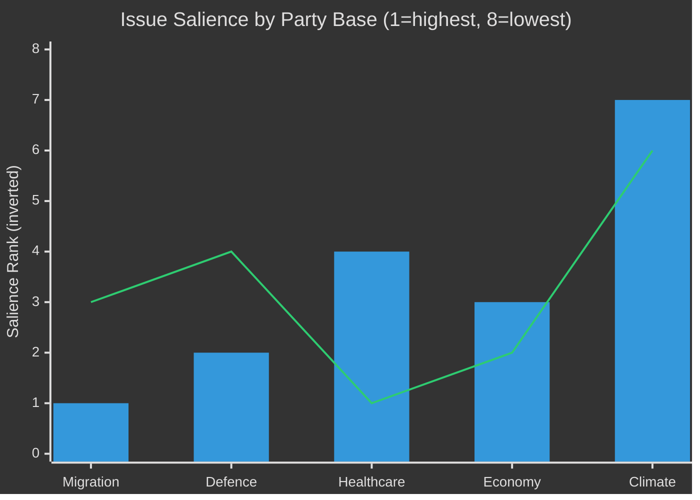

# Voter Segmentation — Evening Analysis 30 April 2026

**Author**: James Pether Sörling  
**Date**: 2026-04-30  

---

## Demographic Impact Analysis

### Impact of HD03262–265 (Migration Package)

| Segment | Size (est.) | Current party allegiance | Impact of HD03262–265 | Vote shift probability |
|---------|-------------|-------------------------|----------------------|----------------------|
| Anti-immigration core voters | 18% of electorate | SD 80%, M 15% | Positive — confirms mandate | +2% M/SD turnout |
| Migration-sceptic soft-right | 12% of electorate | M 45%, KD 30%, SD 25% | Positive — legislative delivery | +1% M mobilisation |
| Human rights-first liberals | 8% of electorate | L 40%, MP 30%, C 20% | Negative — ECHR concerns | -1% L risk; L may lose votes |
| Urban progressive | 15% of electorate | S 55%, V 25%, MP 20% | Strongly negative | +1% V/MP mobilisation |
| Rural conservative | 14% of electorate | M 40%, SD 35%, KD 20% | Positive — reflects values | +1% M/SD in rural areas |
| Non-Swedish background (citizens) | 10% of electorate | S 60%, V 20%, MP 10% | Strongly negative — direct impact | +2% S mobilisation |
| Politically disengaged | 23% of electorate | Volatile | Negative if framed as "cruel" | Risk: abstention or protest vote |

**Net electoral effect**: HD03262–265 consolidates right bloc base (+4% turnout premium for M+SD) but risks 2–3% mobilisation for S+V+MP from human rights and minority community segments. Net: approximately neutral-to-positive for right bloc given base consolidation outweighs opposition mobilisation.

---

### Impact of HD03254 (Defence Cooperation)

| Segment | Size (est.) | Impact | Vote shift |
|---------|-------------|--------|-----------|
| NATO/defence supporters | 20% | Strongly positive | +1% M/SD |
| Peace movement remnant | 5% | Strongly negative | +0.5% MP/V |
| Pragmatic centrists | 30% | Positive if framed as NATO alignment | Neutral |
| Young voters (18–29) | 15% | Mixed — some support, some concern | Neutral |

---

### Impact of HD03251 (Healthcare Integration)

| Segment | Size (est.) | Impact | Vote shift |
|---------|-------------|--------|-----------|
| Dual-diagnosis patients/carers | 3% | Positive if implementation succeeds | +0.5% M |
| Healthcare workers | 8% | Supportive if resources follow legislation | Neutral |
| General public with healthcare concern | 35% | Potential S counter-narrative: "S would fund it better" | Neutral-to-negative for coalition if implementation slow |

---

## Issue Salience by Party Base

| Issue | M voters | SD voters | S voters | V voters | L voters | KD voters | MP voters | C voters |
|-------|---------|-----------|---------|---------|---------|----------|----------|---------|
| Migration | #1 | #1 | #5 | #6 | #3 | #2 | #7 | #4 |
| Defence/NATO | #2 | #2 | #3 | #4 | #2 | #3 | #5 | #3 |
| Healthcare | #4 | #4 | #1 | #1 | #4 | #1 | #3 | #2 |
| Economy | #3 | #3 | #2 | #3 | #1 | #4 | #4 | #1 |
| Climate | #7 | #8 | #6 | #2 | #5 | #7 | #1 | #6 |

**Key insight**: Today's legislative package (migration + defence + healthcare) speaks directly to the top-2 issue for M, SD, and KD voters, but only the #3–5 issue for S voters. This asymmetry favours coalition base consolidation more than opposition mobilisation.

---

## Mermaid: Issue Salience Radar

*Note: Lower rank = higher salience. Blue bars = M/SD composite; line = S composite.*
