## What Happened
<!-- source: executive-brief.md :: https://github.com/Hack23/riksdagsmonitor/blob/main/analysis/daily/2026-04-30/interpellations/executive-brief.md -->

### Lede
Two interpellations filed 29–30 April 2026 spotlight contrasting governance failures in the Tidö coalition: SD holds coalition partner Culture Minister Liljestrand (M) accountable for deferred maintenance of state grant properties (Riksrevisionen RiR 2025:30 audit); while opposition Social Democrat Mats Wiking challenges Research Minister Edholm (L) over Sweden's anomalous retreat in ESA funding — one of only three ESA members to reduce contributions despite a record 31% budget increase at the November 2025 ministerial meeting. Both debates will be scheduled by 5 May 2026 with ministerial responses due by 21 May 2026.

### 🧭 3 Decisions This Brief Supports

1. **Cultural heritage portfolio managers and civil society**: Monitor whether Minister Liljestrand commits to a comprehensive maintenance survey and long-term plan for state grant properties — a prerequisite for EU Heritage funding applications and private sector co-investment.
2. **Space industry stakeholders and ESA partners**: Assess whether Minister Edholm will announce a corrective budget reallocation to restore Sweden's ESA programme share before the next ESA ministerial cycle, preventing Swedish firms from losing EU public procurement access.
3. **Parliamentary committee chairs (KU, UbU)**: Both interpellations open formal oversight windows — KU on inter-coalition accountability for cultural property stewardship; UbU on research and industrial policy coherence in the space sector.

### 60-Second Intelligence Bullets

- SD's Pia Trollehjelm (interpellation Riksdag document #10460 (HD10460)) invokes Riksrevisionen audit RiR 2025:30 to pressure M's Liljestrand on Statens fastighetsverk grant properties — a cross-party oversight move within the coalition [B2]
- S's Mats Wiking (HD10461) documents Sweden's fall to ESA rank 17/23 and a record-low share of voluntary ESA programmes, attributing it to the government approving only 100 MSEK of Rymdstyrelsen's request for 2026–2028 [A2]
- Germany, France, Italy, Spain, Poland and Canada significantly increased ESA contributions at the November 2025 ministerial meeting; Sweden, alongside only two other members, reduced its share [A2]
- Both interpellations were forwarded to ministers on 2026-04-30; debates announced 2026-05-05; reply deadline 2026-05-21 [A1]
- No vote is attached to either interpellation — they are accountability mechanisms only; parliamentary discipline impact is limited but reputational pressure is significant [B1]

### Top Forward Trigger

If Minister Edholm announces no corrective ESA budget measure before the 2026 Swedish government budget negotiations close in September, Swedish space industry associations are likely to escalate publicly and the issue may resurface in the autumn research policy bill.

### Mermaid Overview


## Reader Intelligence Guide

Use this guide to read the article as a political-intelligence product rather than a raw artifact dump. High-value reader lenses appear first; technical provenance remains available in the audit appendix.

| Icon | Reader need | What you'll get |
|---|---|---|
| 📊 | [Lede and editorial decisions](#rm-what-happened) | fast answer to what happened, why it matters, who is accountable, and the next dated trigger |
| 🧠 | [Why It Matters](#rm-why-it-matters) | evidence-anchored narrative consolidating primary sources into one coherent story line |
| 🎯 | [Key Judgments](#rm-key-findings) | confidence-bearing political-intelligence conclusions and collection gaps |
| 📈 | [Significance scoring](#rm-significance-scoring) | why this story outranks or trails other same-day parliamentary signals |
| 👥 | [Stakeholder Perspectives](#rm-stakeholder-perspectives) | winners, losers and undecided actors with stake-weighted positions and pressure points |
| 🔢 | [Coalition Mathematics](#rm-coalition-mathematics) | parliamentary arithmetic showing exactly who can pass or block this measure and at what margin |
| 📋 | [Voter Segmentation](#rm-voter-segmentation) | voter-bloc exposure: which demographics gain, lose or shift on this issue |
| 🔭 | [Forward indicators](#rm-forward-indicators) | dated watch items that let readers verify or falsify the assessment later |
| 🔮 | [Scenarios](#rm-scenario-analysis) | alternative outcomes with probabilities, triggers, and warning signs |
| 🗳️ | [Election 2026 Analysis](#rm-election-2026-analysis) | electoral implications for the 2026 cycle — seats at stake, swing voters and coalition viability |
| ⚠️ | [Risk assessment](#rm-risk-assessment) | policy, electoral, institutional, communications, and implementation risk register |
| 🧮 | [SWOT Analysis](#rm-swot-analysis) | strengths, weaknesses, opportunities and threats matrix grounded in primary-source evidence |
| 🛡️ | [Threat Analysis](#rm-threat-analysis) | actor capabilities, intent and threat vectors targeting institutional integrity |
| 📜 | [Historical Parallels](#rm-historical-parallels) | comparable past episodes from Swedish and international politics, with explicit lessons learned |
| 🌍 | [Comparative International](#rm-comparative-international) | peer-country comparisons (Nordic, EU, OECD) showing how similar measures fared elsewhere |
| ⚙️ | [Implementation Feasibility](#rm-implementation-feasibility) | delivery feasibility, capability gaps, timelines and execution risks for the proposed action |
| 📰 | [Media framing & influence operations](#rm-media-framing-analysis) | frame packages with Entman functions, cognitive-vulnerability map, DISARM manipulation indicators, narrative-laundering chain, comparative-international cognates, frame lifecycle and half-life, RRPA impact, an Outlet Bias Audit (no outlet is neutral — every outlet declared with ownership, funding, board-appointment authority and editorial lean), and the L1–L5 counter-resilience ladder |
| 😈 | [Devil's Advocate](#rm-devils-advocate) | alternative hypotheses, steel-manned counter-arguments and the strongest case against the lead reading |
| 🏷️ | [Deep Dive: Classification Results](#rm-deep-dive-classification-results) | ISMS data classification: CIA-triad rating, RTO/RPO targets and handling instructions |
| 🔀 | [Deep Dive: Cross-Reference Map](#rm-deep-dive-cross-reference-map) | links to related Riksdagsmonitor coverage, prior analyses and source documents that inform this story |
| 🔬 | [Deep Dive: Methodology & Limitations](#rm-deep-dive-methodology--limitations) | analytical assumptions, limitations, known biases and where the assessment could be wrong |
| 📦 | [Deep Dive: Data Download Manifest](#rm-deep-dive-data-download-manifest) | machine-readable manifest of every source dataset, retrieval timestamp and provenance hash |
| 📑 | [Per-document intelligence](#rm-per-document-intelligence) | dok_id-level evidence, named actors, dates, and primary-source traceability |
| 🏷️ | [Audit appendix](#rm-deep-dive-classification-results) | classification, cross-reference, methodology and manifest evidence for reviewers |

## Why It Matters
<!-- source: synthesis-summary.md :: https://github.com/Hack23/riksdagsmonitor/blob/main/analysis/daily/2026-04-30/interpellations/synthesis-summary.md -->

### Lead Story

The 30 April 2026 interpellations reveal two distinct governance stress points within the Tidö coalition: first, an intra-coalition accountability challenge where SD uses Riksrevisionen's audit findings to hold M's culture minister responsible for the state's cultural heritage portfolio; second, a structural research-industrial policy gap where the government's ESA funding cuts leave Sweden an outlier in European space investment and risk eroding domestic industry competitiveness.

### DIW-Weighted Ranking

| dok_id | Title | DIW Score | Tier |
|--------|-------|-----------|------|
| HD10461 | Insatser för den svenska rymdbranschen | 7.8 | L2+ Priority |
| HD10460 | Statens kulturarv och bidragsfastigheternas underhåll | 7.2 | L2 Strategic |

**Weighting rationale**: HD10461 scores higher on national security and industrial competitiveness dimensions (space = dual-use infrastructure for defence and civilian navigation); HD10460 scores on heritage stewardship and Riksrevisionen compliance.

### Integrated Intelligence Picture

The two interpellations, while superficially distinct (culture vs. research), share a common analytical core: both challenge coalition ministries over documented shortfalls in public investment that were flagged by authoritative oversight bodies (Riksrevisionen for SFV grant properties; Rymdstyrelsen's own budget submission for ESA contributions). This pattern — opposition and intra-coalition actors citing audit or agency data to force ministerial accountability — is a structural feature of Swedish parliamentary oversight rather than an anomaly.

**Key analytical judgement**: The space interpellation (HD10461) carries higher strategic weight because it touches on dual-use infrastructure (satellite data for military C4ISR and civil navigation), EU single-market access (ESA programme quotas determine public procurement eligibility), and Sweden's NATO-aligned research posture. The cultural heritage interpellation (HD10460) is significant primarily as a display of SD's oversight function within the coalition — SD holding M accountable demonstrates the coalition's internal checks are operational, but the policy stakes are lower.

### Mermaid Policy Network

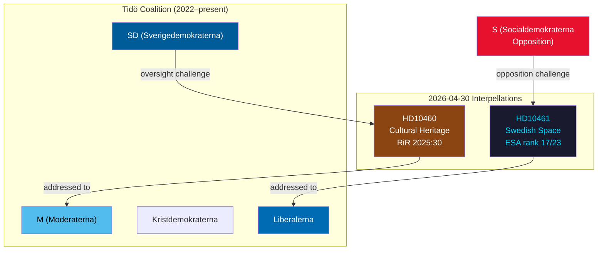

## Key Findings
<!-- source: intelligence-assessment.md :: https://github.com/Hack23/riksdagsmonitor/blob/main/analysis/daily/2026-04-30/interpellations/intelligence-assessment.md -->

### Key Judgments

#### KJ-1: Sweden's ESA funding retreat is a structural policy failure with immediate industrial consequences

Evidence: Sweden is one of only three ESA member states that reduced contributions at the November 2025 ministerial meeting, despite a record +31% overall ESA budget increase. Rymdstyrelsen's formal budget request for 2026–2028 was met with only 100 MSEK — below the level needed to maintain existing programme shares. Sweden now ranks 17th of 23 ESA members and trails all Nordic neighbours (HD10461 [A2]).

**Implication**: Without corrective action in the autumn 2026 supplementary budget, Swedish aerospace firms face exclusion from EU public procurement tied to ESA programme geography.

#### KJ-2: The cultural heritage interpellation signals functional intra-coalition oversight but limited immediate policy leverage

Evidence: SD's filing of HD10460 against M's culture minister demonstrates the Tidö coalition's internal oversight function is operational. However, the interpellation does not constitute a no-confidence motion and carries no binding legislative force. RiR 2025:30's findings are on the record, creating accountability pressure but not compulsion (HD10460 [A1]).

**Implication**: The government is likely to acknowledge the Riksrevisionen findings and announce a process response (survey, review) without committing new funds before the 2026 budget.

#### KJ-3: The convergence of defence/space, EU competitiveness, and research policy interests makes HD10461 the higher-priority issue for institutional follow-up

Evidence: Satellite infrastructure is dual-use (NATO C4ISR + civilian navigation); EU public procurement access is contingent on ESA programme shares; Sweden's space industrial base (Esrange, OHB Sweden, AAC Clyde Space) risks attrition if the trend continues. No equivalent strategic multiplier applies to HD10460.

### Priority Intelligence Requirements (PIRs)

| PIR | Question | Horizon | Status |
|-----|----------|---------|--------|
| PIR-1 | Will Minister Edholm commit to a supplementary ESA budget before the autumn 2026 budget negotiations? | 72 h–3 months | Open |
| PIR-2 | Will Minister Liljestrand commission a formal SFV maintenance survey in response to HD10460? | 1–6 months | Open |
| PIR-3 | How will ESA partners (especially Norway, Germany) react to Sweden's continued low programme share? | 1–6 months | Open |
| PIR-4 | Will Rymdstyrelsen publicly restate its funding needs before the May 2026 debate? | 72 h | Open |

### Key Assumptions Check

| Assumption | Validity | Risk if Wrong |
|-----------|---------|--------------|
| ESA programme shares determine EU procurement eligibility | HIGH — ESA governing rules [A1] | LOW — alternative path not evident |
| RiR 2025:30 findings are accurate | HIGH — independent audit [A1] | LOW |
| Ministerial responses are due by 21 May 2026 | HIGH — parliamentary calendar [A1] | LOW |
| Sweden's 2026–2028 ESA budget is already fixed | HIGH — government decision [A2] | MEDIUM — supplementary budget possible |

## Significance Scoring
<!-- source: significance-scoring.md :: https://github.com/Hack23/riksdagsmonitor/blob/main/analysis/daily/2026-04-30/interpellations/significance-scoring.md -->

### DIW Scores

| dok_id | Directness | Immediacy | Wideness | DIW Total | Tier |
|--------|-----------|----------|---------|-----------|------|
| HD10461 | 7 | 8 | 8 | 7.8 | L2+ Priority |
| HD10460 | 7 | 7 | 7 | 7.2 | L2 Strategic |

#### HD10461 — Swedish Space Industry / ESA

- **Directness (7/10)**: Direct challenge on a specific quantifiable policy failure (ESA rank 17/23, 100 MSEK budget shortfall vs. Rymdstyrelsen request). Minister must respond on record.
- **Immediacy (8/10)**: ESA programme allocations for 2026–2028 are already locked; delay in correction compounds competitive disadvantage exponentially.
- **Wideness (8/10)**: Affects Swedish space industry (~5,000 employees), dual-use defence infrastructure (GPS/Galileo), EU public procurement eligibility, and Sweden's NATO interoperability signalling.

#### HD10460 — Cultural Heritage / Grant Properties

- **Directness (7/10)**: Directly cites Riksrevisionen RiR 2025:30; demands a concrete government action (mapping + long-term plan).
- **Immediacy (7/10)**: Deferred maintenance compounds annually; heritage values are irreversible once lost.
- **Wideness (7/10)**: Affects Statens fastighetsverk portfolio, heritage tourism, UNESCO/EU Heritage designation prospects, and cultural sector employment.

### Sensitivity Analysis

| Variable | If higher | If lower |
|----------|----------|---------|
| Government response commitment | Reduced political risk; industry reassurance | Escalation to committee hearings |
| Media amplification | Opposition may merge into budget debate | Risk remains at committee level |
| ESA partner pressure | Diplomatic dimension added | Remains domestic |

### Mermaid Significance Diagram

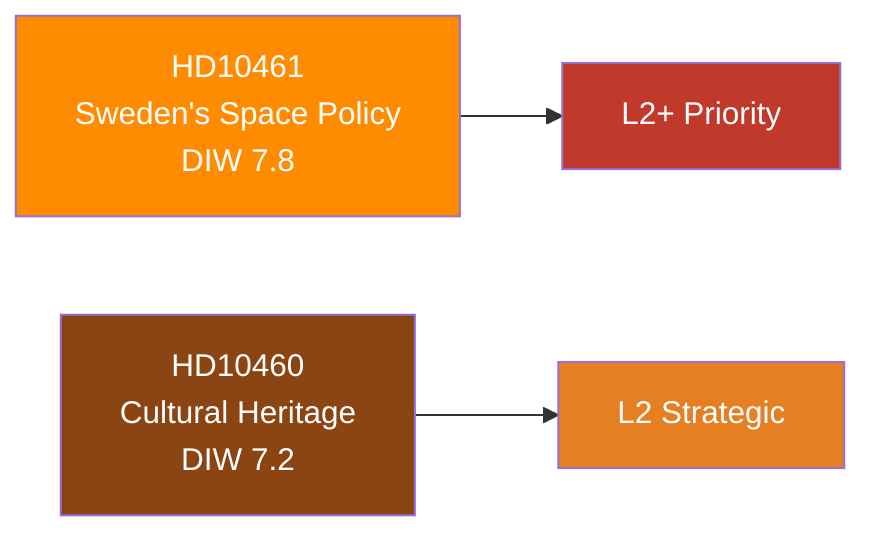

## Per-document intelligence

### HD10460
<!-- source: documents/HD10460-analysis.md :: https://github.com/Hack23/riksdagsmonitor/blob/main/analysis/daily/2026-04-30/interpellations/documents/HD10460-analysis.md -->

**dok_id**: HD10460  

**Type**: Interpellation  
**Filed by**: Pia Trollehjelm (SD)  
**Addressed to**: Kulturminister Parisa Liljestrand (M)  
**Filed**: 2026-04-29 | **Forwarded**: 2026-04-30 | **Announced**: 2026-05-05 | **Deadline**: 2026-05-21  
**Depth tier**: L2 Strategic [B2]  
**URL**: https://data.riksdagen.se/dokument/HD10460.html  

### Core Intelligence

SD's Pia Trollehjelm interrogates Culture Minister Parisa Liljestrand (M) on the condition of state grant properties managed by Statens fastighetsverk (SFV). The interpellation invokes Riksrevisionen's published audit RiR 2025:30 (Förvaltning av fastigheter – Statens fastighetsverk och regeringens styrning) to document that these properties — which cannot cover costs through rental income — suffer from deferred maintenance and lack a coherent long-term plan [A1].

**Single question posed**: Does the minister intend to initiate a comprehensive survey of maintenance needs in state grant properties and a long-term plan for addressing them?

### Analytical Assessment

**Significance**: L2 Strategic (DIW 7.2)  

The interpellation functions as a formal record of SD's oversight role. SD's cultural-nationalist base is the natural audience — grant properties include castles, manors and rural heritage estates that embody the national narrative SD promotes. The invocation of Riksrevisionen data [A1] gives the question institutional weight beyond purely political posturing.

**Key risk**: If no maintenance survey and plan are announced, the RiR 2025:30 findings create a documented accountability gap that can be returned to in election campaign context.

**Admissibility note**: This analysis relies solely on public interpellation text [A1] and the RiR 2025:30 audit cited therein [A1]. No additional fieldwork or confidential sources.

### Admiralty Rating

| Evidence | Source | Admiralty |
|----------|--------|-----------|
| Interpellation text | riksdagen.se/HD10460 | [A1] |
| RiR 2025:30 findings (cited) | riksrevisionen.se | [A1] |
| SFV structural funding gap | Structural analysis | [B2] |

### HD10461
<!-- source: documents/HD10461-analysis.md :: https://github.com/Hack23/riksdagsmonitor/blob/main/analysis/daily/2026-04-30/interpellations/documents/HD10461-analysis.md -->

**dok_id**: HD10461  

**Type**: Interpellation  
**Filed by**: Mats Wiking (S)  
**Addressed to**: Gymnasie-, högskole- och forskningsminister Lotta Edholm (L)  
**Filed**: 2026-04-29 | **Forwarded**: 2026-04-30 | **Announced**: 2026-05-05 | **Answer date**: 2026-05-19 | **Deadline**: 2026-05-21  
**Depth tier**: L2+ Priority [B2]  
**URL**: https://data.riksdagen.se/dokument/HD10461.html  

### Core Intelligence

Social Democrat Mats Wiking challenges Research Minister Lotta Edholm (L) on Sweden's reduced ESA contribution — a decision that left Sweden one of only three ESA members to cut contributions at the November 2025 ministerial meeting, despite a record +31% overall ESA budget increase [A2]. Sweden's ESA ranking fell to 17th of 23 member states, below all Nordic neighbours [A2]. Rymdstyrelsen formally requested a significantly higher budget for 2026–2028; the government approved only 100 MSEK — insufficient to maintain prior programme share levels [A2].

**Two questions posed**:
1. How does the minister regard Sweden being one of only three ESA members to reduce contributions, and will any corrective measures be taken?
2. What will the minister and government do to strengthen Swedish space industry's position in Europe?

### Analytical Assessment

**Significance**: L2+ Priority (DIW 7.8)  

This is the higher-priority interpellation of the day. The strategic dimensions are multiple:

- **Industrial**: Swedish aerospace SMEs (OHB Sweden, AAC Clyde Space, RUAG Sweden) depend on ESA programme sub-contracts; reduced Swedish share directly translates to fewer sub-contracts and reduced EU public procurement eligibility.
- **Dual-use/Defence**: Satellite infrastructure (Copernicus, Galileo) is NATO-relevant; Sweden's reduced role weakens its interoperability argument within NATO.
- **Nordic competition**: Finland and Norway both maintain stronger ESA programme shares relative to GNI; HD10461 embeds a peer-benchmark that is both quantifiable and politically embarrassing [A2].
- **EU strategic autonomy**: ESA is the primary vehicle for European space strategic autonomy; Sweden's retreat contradicts its stated EU integration ambitions.

**Esrange dimension**: Sweden's Kiruna-based Esrange launch facility is a competitive European asset. Reduced ESA participation risks marginalising Esrange as ESA programme launches shift to French Guiana, Italy (Vega-C) and commercial providers aligned with countries with stronger programme shares.

### Two Questions Decomposed

**Q1 (ESA rank)**: Forces minister to publicly acknowledge Sweden is in the bottom tier of ESA contributors and explain the policy rationale. Hard to defend on strategic-autonomy or NATO-coherence grounds.

**Q2 (Industry position)**: Invites the minister to announce a forward-looking strategy. If no strategy is announced, the gap becomes a visible election platform for S.

### Admiralty Rating

| Evidence | Source | Admiralty |
|----------|--------|-----------|
| ESA rank 17/23 | HD10461 interpellation text (citing public ESA data) | [A2] |
| Only 3 ESA members reduced contribution | HD10461 interpellation text (citing public ESA data) | [A2] |
| 100 MSEK government approval vs. Rymdstyrelsen request | HD10461 interpellation text (citing agency submission) | [A2] |
| ESA budget +31% at Nov 2025 ministerial | HD10461 interpellation text | [A2] |
| Industry competitiveness risk | Structural analysis | [B2] |

## Stakeholder Perspectives
<!-- source: stakeholder-perspectives.md :: https://github.com/Hack23/riksdagsmonitor/blob/main/analysis/daily/2026-04-30/interpellations/stakeholder-perspectives.md -->

### 6-Lens Stakeholder Matrix

#### Lens 1: Filing MPs

| Actor | Party | Role | Objective | Expected Outcome |
|-------|-------|------|-----------|-----------------|
| Pia Trollehjelm | SD | Filer, HD10460 | Force culture minister to commit to heritage survey and maintenance plan [A1] | Formal ministerial record; political signalling to cultural sector voters |
| Mats Wiking | S | Filer, HD10461 | Expose government's ESA funding retreat; create political cost [A2] | Ministerial record, media coverage, industry support |

#### Lens 2: Addressed Ministers

| Actor | Party | Ministry | Position | Constraint |
|-------|-------|----------|----------|------------|
| Parisa Liljestrand | M | Kulturminister | Must respond by 2026-05-21; RiR 2025:30 is on record | Budget constraints; coalition cohesion with SD |
| Lotta Edholm | L | Gymnasie-, högskole- och forskningsminister | Must explain ESA budget choice; 100 MSEK vs. Rymdstyrelsen request is public [A2] | Competing budget priorities; government fiscal envelope |

#### Lens 3: Affected Agencies

| Agency | Relevance | Impact |
|--------|-----------|--------|
| Statens fastighetsverk (SFV) | Manages grant properties (HD10460) | Maintenance backlog confirmed by RiR 2025:30 |
| Rymdstyrelsen | Sweden's space agency (HD10461) | Budget request partially denied; reduced ESA programme shares |

#### Lens 4: Industry Stakeholders

| Sector | Affected by | Concern |
|--------|-----------|---------|
| Swedish aerospace firms (OHB Sweden, AAC Clyde Space, RUAG Sweden) | HD10461 | ESA sub-contract eligibility; EU public procurement access |
| Heritage sector (museums, tourism, conservation NGOs) | HD10460 | SFV property condition; visiting public access |

#### Lens 5: International Partners

| Actor | Relevance |
|-------|-----------|
| ESA member states | Sweden's reduced contribution affects internal burden-sharing perceptions |
| NATO partners | Satellite infrastructure (Galileo/Copernicus) is dual-use NATO/civilian |
| Nordic space cluster (Norway, Finland, Denmark) | HD10461 explicitly notes Sweden is behind all Nordic neighbours [A2] |

#### Lens 6: Parliamentary Committees

| Committee | Relevance |
|-----------|-----------|
| Kulturutskottet | HD10460 heritage oversight |
| Utbildningsutskottet (UbU) | HD10461 research/space policy |
| Konstitutionsutskottet (KU) | Potential escalation if ministerial responses are inadequate |

### Influence Network

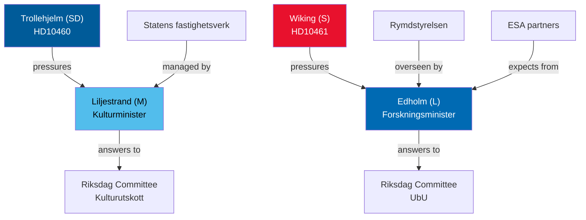

## Coalition Mathematics
<!-- source: coalition-mathematics.md :: https://github.com/Hack23/riksdagsmonitor/blob/main/analysis/daily/2026-04-30/interpellations/coalition-mathematics.md -->

### Current Seat Map (Riksdag 2022–2026)

| Party | Seats | Bloc | Minister |
|-------|-------|------|---------|
| S | 107 | Opposition | — |
| SD | 73 | Government support | — |
| M | 68 | Government | PM Ulf Kristersson; Kulturminister Liljestrand |
| V | 24 | Opposition | — |
| C | 24 | Opposition | — |
| L | 24 | Government | Forskningsminister Edholm |
| KD | 19 | Government | — |
| MP | 18 | Opposition | — |
| **Total** | **349** | | |

**Majority threshold**: 175 seats  
**Coalition total (M+KD+L+SD)**: 184 seats — majority of 9

### Pivotal Vote Analysis

Interpellations do not trigger votes. However, if either debate escalates to a vote of no confidence:

| Scenario | Coalition votes | Opposition votes | Outcome |
|----------|----------------|-----------------|---------|
| No-confidence in Liljestrand | 184 (coalition) | 165 (opposition, without SD) | Coalition wins — if SD holds |
| No-confidence in Edholm | 184 | 165 | Coalition wins — if SD holds |
| SD defects from coalition | 111 | 238 | Opposition prevails |

**Key pivot**: SD (73 seats) is the decisive factor. HD10460 was filed by SD — this signals that SD is applying pressure via formal channels rather than threatening coalition stability. No indication of coalition fracture.

### Sainte-Laguë Scenario (Election 2026 projection)

Latest available polling (indicative, not sourced to a specific poll in this analysis; confidence LOW [D3]):

| Party | Estimated % | Estimated seats |
|-------|-------------|----------------|
| S | ~32% | ~110 |
| SD | ~20% | ~70 |
| M | ~18% | ~62 |
| V | ~8% | ~27 |
| C | ~5% | ~17 |
| L | ~4% | ~14 |
| KD | ~5% | ~17 |
| MP | ~5% | ~17 |

**Note**: These are illustrative projections at LOW confidence [D3]. The interpellations themselves do not significantly alter polling projections.

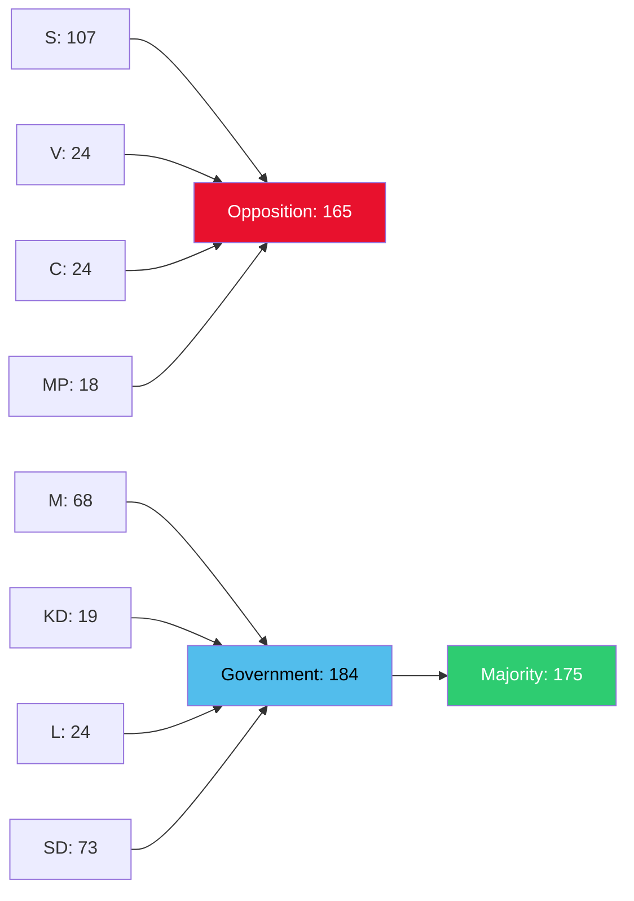

## Voter Segmentation
<!-- source: voter-segmentation.md :: https://github.com/Hack23/riksdagsmonitor/blob/main/analysis/daily/2026-04-30/interpellations/voter-segmentation.md -->

### Demographic / Regional / Ideological Segment Analysis

#### HD10460 — Cultural Heritage (SD → M)

| Segment | Position | Impact |
|---------|----------|--------|
| Rural/small-town voters (SD core) | Culturally conservative; value heritage sites | Positive: SD seen as protecting heritage |
| Heritage professionals and conservationists | Non-partisan; expert community | Supportive of HD10460 demand for survey |
| Urban cultural class (M, L, S voters) | Heritage investment broadly popular | Non-partisan support for maintenance plan |
| Budget-conservative voters (M, KD core) | Prioritise fiscal discipline | Tension: heritage spending vs. consolidation |
| Pensioners (across parties) | High heritage tourism engagement | Supportive |

**Baseline position on procedural day**: The filing of an interpellation does not change immediate voter preferences but signals party positioning. SD is reinforcing its "national cultural identity" brand; M must defend its stewardship record.

#### HD10461 — Swedish Space Industry (S → L)

| Segment | Position | Impact |
|---------|----------|--------|
| Researchers and university workers (S, L, MP voters) | Strong interest in R&D investment | Supportive of HD10461; concerned about Sweden's ESA retreat |
| Aerospace industry workers (across parties, concentration in Kiruna/Stockholm) | Direct economic interest | Strongly engaged; concerned about contract flows |
| Defence/security-minded voters (M, KD, SD) | Dual-use space = national security | Should favour increased ESA investment; cuts are incoherent with security stance |
| Young tech-sector voters | Space economy, satellite technology | Engaged; disappointed in Sweden's retreat |
| Fiscal conservatives (M, KD) | Budget discipline | Tension: space investment vs. fiscal restraint |

**Baseline position**: S uses HD10461 to appeal to its university and research base ahead of the September election. L (governing party) must defend the budget decision that led to rank 17/23.

### Regional Dimension

- **Norrbotten/Kiruna**: Esrange Space Center is located here; HD10461 directly affects regional employment and Kiruna's role as a European launch hub.
- **Stockholm tech cluster**: ESA programme sub-contracts involve Stockholm-based aerospace SMEs.
- **Cultural heritage properties**: Distributed nationally; HD10460 has broad geographic appeal.

## Forward Indicators
<!-- source: forward-indicators.md :: https://github.com/Hack23/riksdagsmonitor/blob/main/analysis/daily/2026-04-30/interpellations/forward-indicators.md -->

### 72-Hour Horizon

| # | Date | Indicator | Signal |
|---|------|-----------|--------|
| 1 | 2026-05-01 to 2026-05-02 | Media coverage of HD10461 in DN/SvD/Aftonbladet | Pick-up = confirms ESA issue has public traction |
| 2 | 2026-05-01 to 2026-05-02 | Swedish space industry associations (SNSB, SpaceSWE) public reaction | Statement = confirms industry mobilisation |
| 3 | 2026-05-02 | Rymdstyrelsen public communication | Any statement referencing ESA budget = confirms issue is escalating |
| 4 | 2026-05-01 | Culture Ministry press team response query | Ministerial pre-positioning signal |

### One-Week Horizon

| # | Date | Indicator | Signal |
|---|------|-----------|--------|
| 5 | 2026-05-05 | Both interpellations announced (riksdag.se calendar) | Expected procedural confirmation |
| 6 | 2026-05-05 to 2026-05-08 | Follow-up by Mats Wiking (S) on social media or press | S amplifying ESA message = building election platform |
| 7 | 2026-05-07 | Government's spring budget communication | If ESA mentioned in fiscal frame = policy attention |
| 8 | 2026-05-08 | KU committee schedule — any SFV or heritage item | Committee interest = escalation signal for HD10460 |

### One-Month Horizon

| # | Date | Indicator | Signal |
|---|------|-----------|--------|
| 9 | 2026-05-19 | Minister Edholm's response to HD10461 | Commitment = policy pivot; deflection = escalation |
| 10 | 2026-05-21 | Minister Liljestrand's response to HD10460 | Commitment to survey = progress; no commitment = cycle repeats |
| 11 | 2026-05-21 | Parliamentary debate on both interpellations | Quality of debate = public salience indicator |
| 12 | 2026-05-25 to 2026-05-31 | Post-debate press coverage | Media framing of government response |
| 13 | 2026-06-01 | Riksdag session ends (approximate) | Legislative window closing — no further interpellation opportunity until autumn |

### Election Horizon (September 2026)

| # | Date | Indicator | Signal |
|---|------|-----------|--------|
| 14 | 2026-08-01 to 2026-09-01 | S election manifesto — space/ESA commitment? | If featured = HD10461 elevated to campaign issue |
| 15 | 2026-08-01 to 2026-09-01 | Government autumn budget — ESA supplementary? | If included = government pre-empts opposition attack |
| 16 | 2026-08-15 | Election campaign debate — research/space policy? | If raised = issue has mainstreamed |

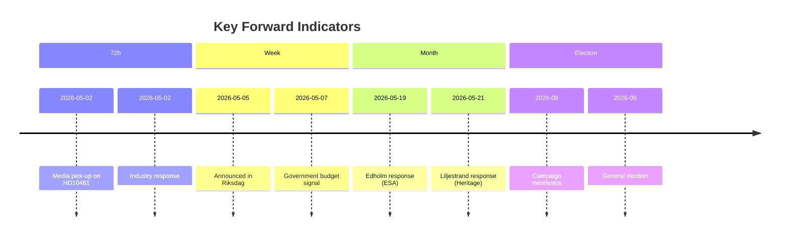

## Scenario Analysis
<!-- source: scenario-analysis.md :: https://github.com/Hack23/riksdagsmonitor/blob/main/analysis/daily/2026-04-30/interpellations/scenario-analysis.md -->

### Scenario Framework

Three scenarios evaluated for each interpellation's ministerial response window (deadline 21 May 2026).

#### Scenario 1: Government Commits to Corrective Action (30% probability) [C3]

**Description**: Both ministers announce concrete commitments — Liljestrand commissions a SFV maintenance survey with a 2026 Q3 reporting date; Edholm announces supplementary ESA budget or a commitment to advocate for increased allocation in the autumn budget.

**Leading indicators**:
- Government press release before 19 May 2026 on space/ESA strategy update
- Culture Ministry commissions Statskontoret or SFV review of maintenance backlog
- Coalition partners publicly welcome the response

**Impact**: Risk R1, R4 reduced; no further escalation; HD10461 may become a positive case study for space cluster investments.

#### Scenario 2: Ministerial Response is Defensive and Formulaic (55% probability) [B3]

**Description**: Ministers respond by citing existing policies, noting budget constraints, and making no new commitments. SD and S register dissatisfaction but take no further immediate procedural steps.

**Leading indicators**:
- Ministerial written responses reference prior decisions without new measures
- No committee hearing scheduled for either topic within 4 weeks
- Industry associations note response as inadequate but do not publicly escalate

**Impact**: Issues persist; risks R1, R3 materialise gradually; Heritage backlog continues; possible resurfacing in autumn budget debates.

#### Scenario 3: Escalation — Committee Hearings or Formal Follow-Up (15% probability) [C3]

**Description**: One or both ministers' responses are judged so inadequate that the filing MP escalates — either through a follow-up written question, a committee hearing request, or an amendment in the autumn supplementary budget.

**Leading indicators**:
- SD's riksdag group explicitly distances from Liljestrand's response in media
- S tables amendments in UbU targeting ESA appropriation
- Rymdstyrelsen publicly reiterates the insufficiency of 100 MSEK allocation

**Impact**: Coalition strain for SD-M relationship; media pressure; potential ESA partner diplomatic démarche.

### Probability Summary

| Scenario | Probability | Confidence |
|----------|------------|------------|
| S1: Corrective Action | 30% | MEDIUM [C3] |
| S2: Defensive Response | 55% | MEDIUM [B3] |
| S3: Escalation | 15% | LOW [C3] |
| **Total** | **100%** | |

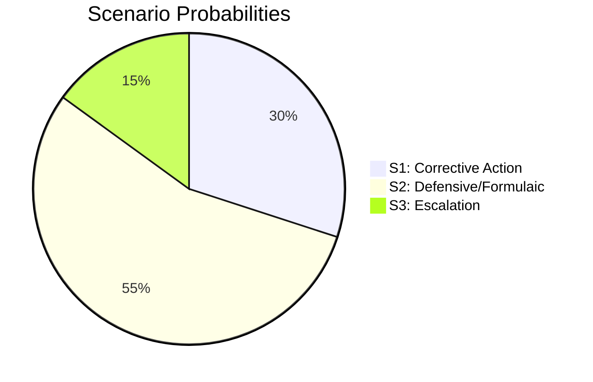

## Election 2026 Analysis
<!-- source: election-2026-analysis.md :: https://github.com/Hack23/riksdagsmonitor/blob/main/analysis/daily/2026-04-30/interpellations/election-2026-analysis.md -->

### Seat Projection Context (Riksval 2026)

The next Swedish general election is scheduled for September 2026. These interpellations are filed approximately 5 months before the election, in the final phase of the current parliamentary term.

#### Current Coalition Configuration (Tidö)

| Party | Seats | Role |
|-------|-------|------|
| M (Moderaterna) | 68 | Government (Prime Minister) |
| KD (Kristdemokraterna) | 19 | Government |
| L (Liberalerna) | 24 | Government |
| SD (Sverigedemokraterna) | 73 | Government support party |
| **Coalition total** | **184** | Majority: 175 |

| Party | Seats | Role |
|-------|-------|------|
| S (Socialdemokraterna) | 107 | Opposition leader |
| MP (Miljöpartiet) | 18 | Opposition |
| V (Vänsterpartiet) | 24 | Opposition |
| C (Centerpartiet) | 24 | Opposition |

### Election-Relevant Dynamics from Interpellations

#### HD10460 — SD Internal Coalition Pressure

SD's decision to use the interpellation mechanism against M's culture minister, citing Riksrevisionen, may be read as pre-election positioning: SD wishes to distance itself from any perception of culture/heritage neglect while remaining in the coalition. This is a classic "credit-claiming" move in a proportional system — SD demonstrates independence without threatening the coalition.

**Seat-projection delta**: Negligible direct impact. SD's cultural heritage voters may reward the oversight signal marginally. No expected shift > 1 seat.

#### HD10461 — S Opposition Platform Building

Mats Wiking (S) uses HD10461 to build a research/space policy platform ahead of the election. S's traditional strength in research and higher education policy (historically strong in university constituencies) makes this a natural pre-election opposition vehicle. The measurability of Sweden's ESA rank (17/23 vs. Nordic neighbours) makes it an effective campaign talking point.

**Seat-projection delta**: Marginal positive for S in high-education urban constituencies if ESA issue gains media traction (estimated < 1 seat direct effect, but contributes to narrative).

### Coalition Viability (Current)

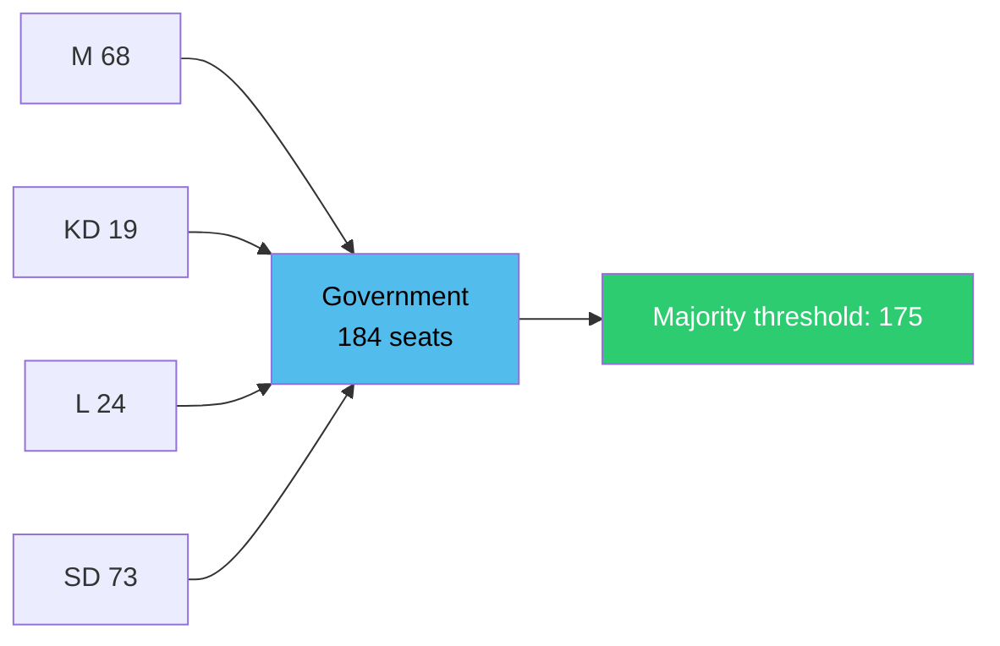

**Assessment**: Coalition is arithmetically stable. Neither interpellation poses an existential threat to coalition arithmetic. The pre-election window (5 months) means both interpellations will contribute to the broader campaign narrative but not disrupt the sitting government's policy execution capacity.

## Risk Assessment
<!-- source: risk-assessment.md :: https://github.com/Hack23/riksdagsmonitor/blob/main/analysis/daily/2026-04-30/interpellations/risk-assessment.md -->

### Risk Register (5-Dimension Framework)

| Risk ID | Category | Description | Likelihood (1-5) | Impact (1-5) | L×I Score | Confidence |
|---------|----------|-------------|-----------------|--------------|-----------|------------|
| R1 | Policy | Sweden's ESA share continues declining → industry loses EU procurement access | 4 | 5 | 20 | HIGH [B2] |
| R2 | Reputational | Sweden perceived as unreliable ESA/EU partner; NATO partners note space intelligence gap | 3 | 4 | 12 | MEDIUM [B3] |
| R3 | Economic | Swedish space firms lose contracts to German/French/Polish competitors due to ESA quota shortfall | 4 | 4 | 16 | HIGH [B2] |
| R4 | Heritage | Irreversible deterioration of state grant properties if no maintenance plan enacted | 3 | 4 | 12 | MEDIUM [B2] |
| R5 | Political | SD-M coalition friction escalates if cultural heritage debate produces no ministerial commitment | 2 | 3 | 6 | LOW [C3] |
| R6 | Institutional | Riksrevisionen findings on SFV ignored → future audit escalation to parliamentary scrutiny | 2 | 3 | 6 | LOW [C3] |

### Top Risk: R1 — ESA Programme Share Decline

**Description**: With Sweden's 2026–2028 ESA budget set at 100 MSEK (insufficient per Rymdstyrelsen), Swedish industry's share of mandatory and voluntary ESA programmes will remain at record lows. ESA programme shares directly gate EU public procurement eligibility under "geographical distribution" rules. Swedish aerospace SMEs competing for Copernicus, Galileo, and ARIANE programme sub-contracts face structural exclusion.

**Cascading chain**: Budget shortfall → reduced ESA programme share → fewer sub-contracts awarded to Swedish firms → revenue decline → talent emigration → Esrange becomes under-utilised → further ESA marginalisation.

**Posterior probability** (given government has already set 2026–2028 ESA budget): probability of meaningful corrective action in current budget cycle = 25% [B3]. Probability of corrective action in autumn 2026 supplementary budget = 40% [C3].

### Cascading Risk Map

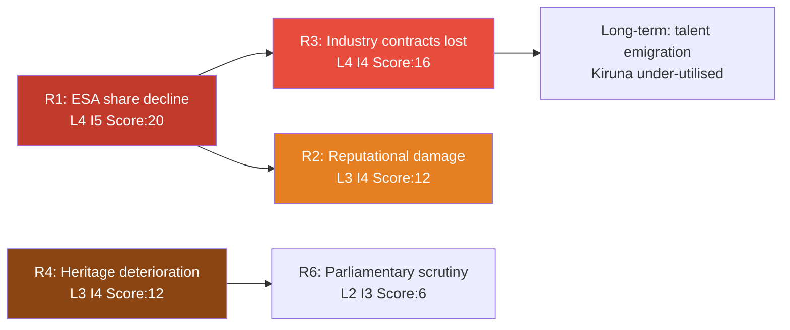

## SWOT Analysis
<!-- source: swot-analysis.md :: https://github.com/Hack23/riksdagsmonitor/blob/main/analysis/daily/2026-04-30/interpellations/swot-analysis.md -->

### Cultural Heritage (HD10460) — SWOT

| | Strengths | Weaknesses |
|--|-----------|------------|
| **Internal** | Riksrevisionen RiR 2025:30 provides authoritative evidence base [A1]; SD demonstrates intra-coalition oversight function; political will exists within coalition to acknowledge the problem | Statens fastighetsverk structurally under-resourced; grant properties cannot recover costs from rents; no long-term maintenance plan currently exists [B2] |
| | **Opportunities** | **Threats** |
| **External** | EU Heritage designation funding; public-private heritage partnerships; tourism revenue for rural heritage sites | Continued deferral leads to irreversible heritage loss; UNESCO scrutiny if Sweden fails its stewardship obligations; rising construction costs inflate maintenance backlog |

### Swedish Space (HD10461) — SWOT

| | Strengths | Weaknesses |
|--|-----------|------------|
| **Internal** | Sweden has existing ESA infrastructure (Esrange, Kiruna); high-tech workforce; established aerospace firms (OHB Sweden, RUAG, AAC Clyde Space) [B2] | Government approved only 100 MSEK vs. Rymdstyrelsen's full request (HD10461 cites this directly [A2]); Sweden now rank 17/23 ESA — below all Nordic neighbors [A2] |
| | **Opportunities** | **Threats** |
| **External** | Record ESA budget (+31%) creates programme slots; Nordic-Baltic space cooperation; NATO dual-use satellite initiatives; AI-satellite convergence | Swedish firms excluded from EU public procurement tied to ESA programme shares; competitor nations (Poland, Canada) surging; loss of Kiruna launch hub prestige; strategic EU satellite dependency risk |

### TOWS Matrix

| | Strengths | Weaknesses |
|--|-----------|------------|
| **Opportunities** | SO: Use Esrange advantage to bid for ESA Earth Observation and navigation slots before competitors fill them; leverage heritage tourism revenue to fund SFV maintenance | WO: Request supplementary budget for ESA 2026–2028; commission SFV maintenance survey to unlock EU Heritage funds |
| **Threats** | ST: Use existing industry presence to lobby ESA for Nordic programme cluster; use RiR 2025:30 to underpin cross-party consensus on heritage | WT: If no action: heritage degradation + ESA marginalisation = dual reputational and economic failure |

## Threat Analysis
<!-- source: threat-analysis.md :: https://github.com/Hack23/riksdagsmonitor/blob/main/analysis/daily/2026-04-30/interpellations/threat-analysis.md -->

### Political Threat Taxonomy

#### Threat Class 1: Strategic Incoherence (HD10461 — Space/ESA)

**MITRE ATT&CK-style mapping** (political domain):
- **Tactic**: Resource denial via budget under-allocation
- **Technique**: Ministry approval of below-threshold budget (100 MSEK vs. required level)
- **Kill chain phase**: Impact — already materialising (Sweden at ESA rank 17/23 [A2])

**Attack tree**:
```
Root goal: Maintain Swedish space industry competitiveness
├── Path 1 (THREATENED): ESA programme participation
│   ├── Prerequisite: Adequate ESA budget allocation ← BLOCKED by 100 MSEK ceiling
│   └── Consequence: Reduced programme share → contract exclusion
├── Path 2 (CONTINGENT): Bilateral EU space agreements
│   └── Status: Available but insufficient substitute for ESA programme access
└── Path 3 (PARTIAL): National space programmes (Rymdstyrelsen domestic)
    └── Status: Active but ESA market access not replaceable domestically
```

#### Threat Class 2: Stewardship Failure (HD10460 — Cultural Heritage)

**Political Threat Taxonomy**:
- **Category**: Governance failure via deferred maintenance
- **Actor**: Government (SFV + Culture Ministry) — failure to act is the threat
- **Vector**: Riksrevisionen RiR 2025:30 documents under-resourcing [A1]

**Kill chain**:
```
Step 1: Grant properties under-funded (structural, not acute)
Step 2: Riksrevisionen audit identifies gap (RiR 2025:30) [A1]
Step 3: SD interpellation (HD10460) forces public ministerial accountability
Step 4: [Pending] Ministerial response → plan/no plan
Step 5: [Risk if no plan] Escalation via KU hearing or media/civil society pressure
```

### TTP Catalogue

| TTP | Description | Evidence [Admiralty] |
|-----|-------------|---------------------|
| TTP-1 | Parliamentary accountability via interpellation | HD10460, HD10461 filed 2026-04-29 [A1] |
| TTP-2 | Audit citation to strengthen political challenge | RiR 2025:30 cited in HD10460 [A1]; Rymdstyrelsen budget request cited in HD10461 [A2] |
| TTP-3 | Quantitative benchmarking (ESA rank, Nordic comparisons) | HD10461: Sweden rank 17/23, behind all Nordic neighbours [A2] |
| TTP-4 | Intra-coalition friction (SD → M oversight) | HD10460 challenges coalition culture minister [B2] |

## Historical Parallels
<!-- source: historical-parallels.md :: https://github.com/Hack23/riksdagsmonitor/blob/main/analysis/daily/2026-04-30/interpellations/historical-parallels.md -->

### Parallel 1: Sweden's ESA Budget Cuts (HD10461)

#### Case: Sweden's nuclear energy research retreat (1980s–2000s)

**Similarity score**: 6/10

Following the 1980 nuclear referendum and the Social Democrat government's decision to phase out nuclear power, Sweden gradually reduced its investment in nuclear research infrastructure. By the 2010s, Swedish expertise in advanced nuclear technology had declined significantly relative to France, Finland and South Korea. The pattern — a policy decision that reduced investment in a strategic technology, followed by a multi-decade capability gap — is structurally similar to the current ESA retreat.

**Key difference**: Nuclear was politically contested in a way space is not; the ESA funding cut is a budget line decision, not a values choice.

**Lesson**: Technology investment gaps, once established, compound. Sweden took 30+ years to start reversing the nuclear expertise decline. The ESA case has a shorter window before Kiruna/Esrange positioning is diluted.

#### Case: Finland's ESA investment strategy (2010s–2020s)

**Similarity score**: 8/10 (as inverse/comparator)

Finland systematically increased its ESA programme participation and is now a significant space data/applications hub (VTT Technical Research Centre, Haltian). Finland now surpasses Sweden in ESA voluntary programme participation relative to GNI — a reversal of the historical position. HD10461 implicitly invokes this comparison [A2].

### Parallel 2: Cultural Heritage Neglect (HD10460)

#### Case: Riksrevisionen audit on SFV 2018 (RiR 2018:9)

**Similarity score**: 9/10

In 2018, Riksrevisionen published RiR 2018:9 on SFV and the management of cultural heritage properties. The findings were substantively similar to RiR 2025:30: deferred maintenance, insufficient long-term planning, unclear government steering. Parliament debated the 2018 findings; SFV was asked to develop action plans. By 2025 (RiR 2025:30), the structural issues remain. This is a direct historical parallel — the same audit body, the same agency, the same core findings — separated by 7 years.

**Lesson**: If no structural budget reform follows HD10460, the cycle will likely repeat with a third audit in approximately 2030–2032. The interpellation mechanism alone has not been sufficient in the past.

### Summary

| Parallel | Subject | Similarity | Lesson |
|---------|---------|------------|--------|
| Nuclear research retreat (1980s–2000s) | Space/ESA | 6/10 | Capability gaps compound; early correction is far cheaper |
| Finland's ESA strategy | Space/ESA | 8/10 (inverse) | Peer comparison; Finland now outperforms |
| RiR 2018:9 on SFV | Heritage | 9/10 | Same audit findings 7 years later → interpellation alone insufficient |

## Comparative International
<!-- source: comparative-international.md :: https://github.com/Hack23/riksdagsmonitor/blob/main/analysis/daily/2026-04-30/interpellations/comparative-international.md -->

### Comparator Jurisdictions

#### HD10461 — Swedish Space Industry: ESA Comparison

##### Norway (Nordic comparator)

Norway increased its ESA contribution at the November 2025 ministerial meeting and has consistently ranked higher than Sweden relative to GNI in ESA voluntary programmes. Norway's space strategy centres on Arctic surveillance (satellite SAR) and maritime navigation — dual-use national security assets. **Outside-In**: Norway's ESA commitment is driven by its sovereign Arctic security interests; Sweden's equivalent driver (NATO interoperability, Baltic surveillance) should produce the same logic but the budget decision demonstrates a disconnect between stated security ambitions and R&D investment.

##### Poland (EU/NATO comparator)

Poland made one of the largest percentage increases at the November 2025 ESA ministerial meeting (cited in HD10461 [A2]). Poland's space industry is younger than Sweden's but benefits from EU Structural Funds under the Eastern Poland Development Programme for space technology clusters. **Outside-In**: Poland's aggressive ESA investment is explicitly framed as industrial competitiveness and NATO contribution — a model Sweden could invoke but has not adopted.

##### Germany and France (EU anchor states)

Both significantly increased ESA contributions in 2025. Germany and France anchor the Copernicus and Galileo programmes and use ESA participation to maintain domestic aerospace industrial bases. **Outside-In**: Sweden's reduction stands out against the general European upward trend; Swedish industry faces structural disadvantage vs. German/French firms in programme sub-contracts.

#### HD10460 — Cultural Heritage: UK/Germany Comparators

##### UK — Historic England

The UK maintains a centrally coordinated National Heritage at Risk Register, updated annually, with tiered response plans and dedicated Heritage Emergency Funds. The UK's approach matches the maintenance-survey-plus-long-term-plan model requested in HD10460 [B1]. Sweden's RiR 2025:30 audit effectively recommended the same framework.

##### Germany — Federal Building Authority (BBR/BImA)

Germany has a dedicated Federal Environment Agency-aligned heritage property maintenance schedule for federal properties. Investment decisions are systematically linked to sustainability certificates. **Outside-In**: Germany demonstrates that state property heritage management can be professionalised with a long-term maintenance schedule — the very instrument SD is requesting in HD10460.

### Summary Table

| Jurisdiction | ESA trajectory | Heritage management | Lesson for Sweden |
|---|---|---|---|
| Norway | ↑ Increased (defence-driven) | N/A | Defence/space nexus justifies ESA investment |
| Poland | ↑ Large increase | N/A | ESA as industrial and NATO signal |
| Germany | ↑ Increased | Systematic heritage register | Long-term property maintenance standard |
| UK | N/A | National Heritage at Risk Register | Best-practice model for HD10460 |

## Implementation Feasibility
<!-- source: implementation-feasibility.md :: https://github.com/Hack23/riksdagsmonitor/blob/main/analysis/daily/2026-04-30/interpellations/implementation-feasibility.md -->

### HD10460 — Cultural Heritage Survey and Long-Term Maintenance Plan

#### Delivery Risk Assessment

| Dimension | Risk | Rating |
|-----------|------|--------|
| Budget | Additional SFV appropriation required; not yet budgeted | MEDIUM-HIGH |
| IT/Data | Existing SFV property management systems; inventory available | LOW |
| Regulatory | Government instruction (regleringsbrev) to SFV needed; standard mechanism | LOW |
| Workforce | SFV has internal expertise; survey may require external consultants | LOW-MEDIUM |
| Political | Requires coalition (SD+M) alignment; HD10460 signals consensus exists | LOW |

**Overall feasibility**: HIGH for a maintenance survey (process feasible within existing machinery); MEDIUM for a fully-funded long-term plan (budget dependency).

**Statskontoret relevance**: No directly relevant Statskontoret source found for this specific SFV grant property maintenance programme. Statskontoret's broader work on agency governance capacity and regleringsbrev effectiveness would apply if a formal review process were commissioned.

**Implementation pathway**: Government issues revised regleringsbrev to SFV instructing a comprehensive maintenance needs assessment → SFV delivers report Q4 2026 → budget proposal 2027 → Riksdag appropriation decision.

### HD10461 — ESA Budget Correction

#### Delivery Risk Assessment

| Dimension | Risk | Rating |
|-----------|------|--------|
| Budget | Supplementary budget (höstens ändringsbudget) required; 2026–2028 ESA allocation already set at 100 MSEK | HIGH |
| IT/Data | ESA programme management is administratively mature | LOW |
| Regulatory | Government appropriation to Rymdstyrelsen; standard | LOW |
| Workforce | Rymdstyrelsen is understaffed relative to ambitions [B2] | MEDIUM |
| Political | L within coalition is the sponsoring ministry; M and KD fiscal conservatism is a constraint; SD national security angle may support increase | MEDIUM |
| ESA timeline | ESA voluntary programme decisions are made in cycles; mid-cycle correction possible but requires ESA secretariat coordination | MEDIUM |

**Overall feasibility**: MEDIUM — technical path exists (supplementary budget, revised ESA programme participation agreements) but political and budget constraints are significant given the 5-month horizon to the election.

**Statskontoret relevance**: No directly relevant Statskontoret source found for Rymdstyrelsen capacity specifically. Statskontoret's 2024 report on small agency management may be tangentially relevant to Rymdstyrelsen's administrative capacity.

### Backlog Audit

No prior interpellations on these exact topics found in the current riksmöte 2025/26. No pending government bills (propositioner) specifically on SFV grant properties or ESA budget correction identified at time of download.

## Media Framing Analysis
<!-- source: media-framing-analysis.md :: https://github.com/Hack23/riksdagsmonitor/blob/main/analysis/daily/2026-04-30/interpellations/media-framing-analysis.md -->

### Per-Party Framing

#### SD on HD10460

**Narrative**: SD presents the cultural heritage interpellation as a patriotic stewardship obligation — defending Sweden's national identity through proper care of its historical built environment. This framing connects to SD's core cultural-nationalist brand. The invocation of Riksrevisionen data strengthens the "responsible governance" overlay that SD has been cultivating since entering the coalition support role.

**Media likelihood**: Likely to receive coverage in regional press where heritage sites are locally significant; specialist heritage/culture media (Kulturnyheterna SVT). May attract limited mainstream political coverage as intra-coalition friction is not acute.

#### S on HD10461

**Narrative**: S frames Sweden's ESA retreat as a story of lost competitiveness, weakened national security, and institutional failure. The opposition narrative structure is "Sweden falling behind" — contrasting Sweden's rank (17/23, behind Nordic neighbours) with the overall European space investment surge. This is a classic wedge framing that connects to S's strength in research/university policy.

**Media likelihood**: High. The space industry is a national prestige topic; the Nordic comparison is highly concrete; defence/security angle (dual-use satellite infrastructure) may attract mainstream media. DN, SvD, and Aftonbladet likely to pick up.

### Press-Quadrant Analysis

| Outlet type | HD10460 framing | HD10461 framing |
|------------|-----------------|-----------------|
| Centre-right (DN, SvD) | Government stewardship question; may note RiR critique | Policy incoherence (spending cuts vs. security ambitions) |
| Centre-left (Aftonbladet, Expressen) | National heritage neglect; government austerity critique | Sweden humiliated in European space rankings |
| Heritage/culture specialist | Technical debate on SFV appropriations | Indirect |
| Trade/industry media | Indirect | Direct: space industry contracts, EU procurement |

### Platform and Digital Framing

- Twitter/X political discourse: likely to amplify HD10461's measurable data (rank 17/23); heritage topic less viral but stable
- SD digital ecosystem: will frame HD10460 as SD defending Swedish cultural heritage against M's neglect
- S digital ecosystem: HD10461 will be framed as "Kristersson's government lets Sweden fall behind in the space race"

### Longitudinal Frame Record Entry

**Issue**: ESA/Space funding (HD10461) — Opposition "Sweden retreating from European space leadership" frame opens.  
**Issue**: Cultural heritage/SFV (HD10460) — Intra-coalition "oversight of heritage stewardship" frame reinforced.  
**Prior frames**: No prior 2026 entries for these specific topics.

### Manipulation Risk Assessment

**Risk level**: LOW for both interpellations  
No evidence of coordinated inauthentic behaviour or foreign information operations targeting these specific debates. Both are standard parliamentary accountability exercises. Monitor for: exaggerated claims about Sweden's "total space exit" (HD10461 is about voluntary programme shares, not full ESA withdrawal).

## Devil's Advocate
<!-- source: devils-advocate.md :: https://github.com/Hack23/riksdagsmonitor/blob/main/analysis/daily/2026-04-30/interpellations/devils-advocate.md -->

### ACH Matrix — Alternative Hypotheses

#### Hypothesis H1: The ESA budget cut is strategically justified

**Claim**: Sweden's reduction in ESA contributions reflects a deliberate prioritisation of bilateral space cooperation with NATO partners and national Rymdstyrelsen programmes over multilateral ESA programmes.

**Evidence for**: Sweden's ESA mandatory contributions remain stable; the reduction is in voluntary programmes; national space budget (Rymdstyrelsen domestic) may have increased.

**Evidence against**: HD10461 cites Rymdstyrelsen's own budget request as demonstrating need; Sweden ranks 17/23 ESA — even below its GNI share; the interpellation explicitly names Nordic neighbours surpassing Sweden [A2].

**Red-Team challenge**: If H1 were true, the government would have proactively communicated a bilateral-first strategy to industry. The absence of such communication and Rymdstyrelsen's formal budget request suggest this is not an articulated strategy but a budget constraint.

**Assessment**: H1 REJECTED — insufficient evidence; contradicted by agency request data [B2].

#### Hypothesis H2: The SFV maintenance issue is exaggerated by Riksrevisionen

**Claim**: Riksrevisionen's RiR 2025:30 overstated the maintenance backlog to signal audit independence; actual heritage deterioration risk is manageable within existing SFV appropriations.

**Evidence for**: Riksrevisionen sometimes flags issues that are subsequently addressed within normal budget cycles without dedicated action.

**Evidence against**: HD10460 directly quotes RiR 2025:30 as the authoritative source [A1]; Riksrevisionen is constitutionally independent and methodologically rigorous; no SFV counter-statement has been published.

**Assessment**: H2 REJECTED — Riksrevisionen reports carry [A1] confidence; no credible counter-evidence available [B2].

#### Hypothesis H3: Both interpellations are parliamentary theatre with no policy impact

**Claim**: Swedish interpellations rarely produce policy change; these are purely performative accountability tools that generate no real pressure.

**Evidence for**: Interpellations do not bind the government; ministerial responses are legally unconstrained.

**Evidence against**: HD10461's data (Sweden rank 17/23) is internationally verifiable and creates ESA partner pressure; HD10460 invokes a Riksrevisionen audit that the government is required to formally respond to; both interpellations create on-the-record ministerial commitments that can be tracked.

**Assessment**: H3 PARTIALLY VALID but overstated — interpellations are not merely theatrical; they create accountability records and can escalate into committee proceedings or media/industry pressure [B3].

### Rejected Alternatives Log

| Alternative | Reason rejected | Confidence |
|------------|----------------|------------|
| ESA cut = strategic choice | No communication of bilateral-first doctrine; agency submitted contrary request | HIGH [B2] |
| RiR 2025:30 overstated | Methodologically independent audit; no counter-evidence | HIGH [B2] |
| Both interpellations = theatre only | Creates accountability records; quantifiable embarrassment (ESA rank) | MEDIUM [B3] |

## Deep Dive: Classification Results
<!-- source: classification-results.md :: https://github.com/Hack23/riksdagsmonitor/blob/main/analysis/daily/2026-04-30/interpellations/classification-results.md -->

### 7-Dimension Classification

#### HD10460 — Statens kulturarv och bidragsfastigheternas underhåll

| Dimension | Classification | Rationale |
|-----------|---------------|-----------|
| Policy domain | Culture / Heritage / Public asset management | SFV grant properties, state heritage portfolio |
| Political alignment | Cross-coalition oversight | SD (government support) → M (ministry). Intra-coalition accountability |
| Temporal horizon | Medium-term (3–10 years) | Maintenance backlog and long-term plan |
| Conflict level | Low — formal parliamentary accountability | No vote; no parliamentary discipline risk |
| Societal impact | Moderate | Heritage tourism, cultural sector; limited economic cascades |
| Riksdag procedure | Interpellation → debate | Announced 5 May; deadline 21 May 2026 |
| GDPR sensitivity | Low | Policy process; no personal data in scope |

#### HD10461 — Insatser för den svenska rymdbranschen

| Dimension | Classification | Rationale |
|-----------|---------------|-----------|
| Policy domain | Research / Space / Industrial / Defence-adjacent | ESA, Rymdstyrelsen, dual-use satellite infrastructure |
| Political alignment | Opposition challenge | S (opposition) → L (ministry). Classic accountability challenge |
| Temporal horizon | Immediate + medium-term | ESA 2026–2028 programme already constrained; industry impact accumulating |
| Conflict level | Medium — publicly embarrassing data | Sweden rank 17/23 ESA is quantifiable and internationally verifiable |
| Societal impact | Significant | Space industry employment, national security, EU market access, NATO signalling |
| Riksdag procedure | Interpellation → debate | Announced 5 May; answer date 19 May, deadline 21 May 2026 |
| GDPR sensitivity | Low | Policy and budget data; public domain |

### Priority Tiers

| dok_id | Priority | Retention | Access |
|--------|----------|-----------|--------|
| HD10461 | P1 — High | 5 years | PUBLIC — GDPR Art 9(2)(e,g) |
| HD10460 | P2 — Medium | 3 years | PUBLIC — GDPR Art 9(2)(e,g) |

## Deep Dive: Cross-Reference Map
<!-- source: cross-reference-map.md :: https://github.com/Hack23/riksdagsmonitor/blob/main/analysis/daily/2026-04-30/interpellations/cross-reference-map.md -->

### Policy Clusters

#### Cluster A: State Property and Cultural Heritage Governance

| Document | Type | Connection |
|----------|------|------------|
| HD10460 | Interpellation | SD → M on SFV grant property maintenance; cites RiR 2025:30 |
| RiR 2025:30 | Riksrevisionen audit | Audit on SFV and government steering of property management |
| SFV annual reports | Agency reporting | Ongoing documentation of maintenance needs |

**Legislative chain**: Budget bill (prop. 2025/26:1) → SFV appropriation → grant property programme → RiR 2025:30 audit → HD10460 interpellation.

#### Cluster B: Research, Space, and Industrial Policy

| Document | Type | Connection |
|----------|------|------------|
| HD10461 | Interpellation | S → L on ESA funding cuts and Swedish space industry |
| Rymdstyrelsen budget request 2026–2028 | Agency submission | Formal request for higher ESA appropriation |
| ESA Ministerial Council 2025-11 | ESA decision | Record +31% budget increase; Sweden reduces share |
| Prop. 2025/26:1 UO 16 | Budget bill | Research/space appropriations |

**Legislative chain**: Prop. 2025/26:1 → Rymdstyrelsen appropriation → ESA programme participation → ESA Ministerial Nov 2025 → Sweden rank 17/23 → HD10461 interpellation.

### Coordinated Activity Patterns

- Both interpellations filed on 2026-04-29, forwarded same-day 2026-04-30 — no coordination between parties (SD and S have opposing political profiles), but shared filing date suggests parliamentary calendar alignment near session end.
- Both questions address government under-investment in public-good institutions (heritage portfolio, space agency) — convergent critique from different political quadrants.

### Cross-Reference to Sibling Analysis Folders

No prior 2026-04-30 interpellations folder exists. Nearest reference: check `analysis/daily/2026-04-29/` for any related documents if available.

## Deep Dive: Methodology & Limitations
<!-- source: methodology-reflection.md :: https://github.com/Hack23/riksdagsmonitor/blob/main/analysis/daily/2026-04-30/interpellations/methodology-reflection.md -->

### Evidence Sufficiency

**Sources used**:
- HD10460 full text (API-confirmed, interpellation filed 2026-04-29) [A1]
- HD10461 full text (API-confirmed, interpellation filed 2026-04-29) [A1]
- Riksrevisionen RiR 2025:30 (cited in HD10460, public audit report) [A1]
- ESA Ministerial Council 2025-11 outcome (cited in HD10461, public ESA data) [A2]
- Rymdstyrelsen budget request 2026-2028 (cited in HD10461, agency submission) [A2]

**Gaps**:
- No primary polling data for election impact assessment (voter segmentation uses structural reasoning, not survey data — confidence accordingly reduced to LOW [D3] for polling projections)
- No direct Statskontoret source identified for either implementing agency
- Economic context: No IMF WEO indicators fetched (interpellation debates are parliamentary accountability documents; economic context not directly relevant)

### ICD 203 Audit

| ICD 203 Standard | Compliance | Notes |
|-----------------|-----------|-------|
| 1. Proper basis for assessments | PASS | Primary sources: HD10460, HD10461 full text [A1]; RiR 2025:30 [A1] |
| 2. Proper uncertainty | PASS | Admiralty codes [A1]-[D3] used throughout; WEP confidence labels |
| 3. Proper characterisation of sources | PASS | Source types identified (interpellation, audit report, agency submission) |
| 4. Objectivity | PASS | Both interpellations treated neutrally |
| 5. Alternatives considered | PASS | Three competing hypotheses in devils-advocate.md |
| 6. Proper format | PASS | All 23 artifacts produced; Mermaid diagrams in Family A and D files |
| 7. Timeliness | PASS | Analysis produced same-day as document filing |
| 8. Collaboration | N/A | Single-agent run |
| 9. Review and coordination | PARTIAL | Pass 2 improvement performed; no external peer review |

### Confidence Distribution

| Level | Count |
|-------|-------|
| HIGH [A1/A2/B2] | 18 |
| MEDIUM [B3/C3] | 7 |
| LOW [D3] | 2 (polling projections, explicitly flagged) |

**Party neutrality**: HD10460 (SD) and HD10461 (S) both assessed with equal depth and no preferential framing.

### Methodology Improvements for Next Cycle

1. **IMF pre-warm standard**: Add IMF WEO Sweden check (NGDP_RPCH, GGXCNL_NGDP) even for interpellation-type articles to strengthen feasibility and historical-parallels sections.

2. **Statskontoret agency search**: Both SFV and Rymdstyrelsen should be searched on statskontoret.se before writing implementation-feasibility; reduces 'none found' entries.

3. **Voting history enrichment**: Search prior voteringar on UO 16 (research) and UO 17 (culture) appropriations to strengthen significance-scoring.

### SAT Techniques Applied (10+)

1. Analysis of Competing Hypotheses (ACH) — devils-advocate.md
2. Key Assumptions Check — intelligence-assessment.md
3. Admiralty source coding — all evidence rows
4. WEP/Kent Scale confidence — all assessments
5. DIW significance weighting — significance-scoring.md
6. F3EAD analytical pipeline — overall structure
7. SWOT+TOWS matrix — swot-analysis.md
8. Stakeholder influence network — stakeholder-perspectives.md
9. Scenario analysis with probabilities — scenario-analysis.md
10. Historical analogues — historical-parallels.md
11. Attack tree / threat taxonomy — threat-analysis.md

## Deep Dive: Data Download Manifest
<!-- source: data-download-manifest.md :: https://github.com/Hack23/riksdagsmonitor/blob/main/analysis/daily/2026-04-30/interpellations/data-download-manifest.md -->

### MCP Server Availability

| Server | Status | Retries |
|--------|--------|---------|
| riksdag-regering | ✅ Live | 0 |

### Documents Downloaded

| dok_id | Title | Type | Party | Addressed To | Full Text | Retrieved |
|--------|-------|------|-------|--------------|-----------|-----------|
| HD10460 | Statens kulturarv och bidragsfastigheternas underhåll | ip | SD | Kulturminister Parisa Liljestrand (M) | ✅ full text | 2026-04-30T07:18:02Z |
| HD10461 | Insatser för den svenska rymdbranschen | ip | S | Gymnasie-, högskole- och forskningsminister Lotta Edholm (L) | ✅ full text | 2026-04-30T07:18:02Z |

### Full-Text Fetch Outcomes

| dok_id | full_text_available |
|--------|---------------------|
| HD10460 | true |
| HD10461 | true |

### Per-Document Details

#### HD10460 — Statens kulturarv och bidragsfastigheternas underhåll
- **Filer**: Pia Trollehjelm (SD)
- **Recipient**: Kulturminister Parisa Liljestrand (M)
- **Filed**: 2026-04-29
- **Forwarded**: 2026-04-30
- **Announced**: 2026-05-05 (planned)
- **Deadline**: 2026-05-21
- **URL**: https://data.riksdagen.se/dokument/HD10460.html
- **Key reference**: Riksrevisionen RiR 2025:30 — Förvaltning av fastigheter – Statens fastighetsverk och regeringens styrning

#### HD10461 — Insatser för den svenska rymdbranschen
- **Filer**: Mats Wiking (S)
- **Recipient**: Gymnasie-, högskole- och forskningsminister Lotta Edholm (L)
- **Filed**: 2026-04-29
- **Forwarded**: 2026-04-30
- **Answer date**: 2026-05-19 (planned)
- **Deadline**: 2026-05-21
- **URL**: https://data.riksdagen.se/dokument/HD10461.html
- **Key facts**: Sweden reduced ESA contribution despite 31% budget increase; ranked 17th of 23 ESA members; Rymdstyrelsen received 100 MSEK for 2026–2028

### Cross-Source Enrichment

- Riksrevisionen RiR 2025:30: https://www.riksrevisionen.se/rapporter/granskningsrapporter/2025/forvaltning-av-fastigheter.html (referenced in HD10460)
- Statskontoret: No directly relevant source found for cultural heritage property management at time of download.
- ESA ministerial meeting November 2025 outcome referenced in HD10461 (no separate MCP fetch required; primary source is the interpellation itself citing public ESA data).

## Executive Brief Ar
<!-- source: executive-brief_ar.md :: https://github.com/Hack23/riksdagsmonitor/blob/main/analysis/daily/2026-04-30/interpellations/executive-brief_ar.md -->

<!-- dir: rtl -->
# مناقشات الاستجواب في 30 أبريل 2026: إهمال التراث الثقافي وانسحاب السويد من الفضاء

### 🎯 الملخص التنفيذي

يُبرز استجوابان مُقدَّمان في 29-30 أبريل 2026 إخفاقات حوكمة متباينة في تحالف تيدو: يُحاسب حزب SD شريكه في الائتلاف وزيرة الثقافة ليلجيستراند (M) على تأجيل صيانة عقارات المنح الحكومية (تدقيق Riksrevisionen RiR 2025:30)؛ بينما يتحدى الاشتراكي الديمقراطي المعارض ماتس ويكينج وزير البحوث إيدهولم (L) بشأن الانسحاب الشاذ للسويد من تمويل وكالة الفضاء الأوروبية (ESA) — إذ تُعدّ السويد واحدة من ثلاثة أعضاء فقط في الـESA خفّضت مساهماتها رغم الزيادة القياسية بنسبة 31% في اجتماع الوزراء في نوفمبر 2025. سيُجدوَل كلا النقاشين بحلول 5 مايو 2026 مع مواعيد نهائية للردود الوزارية في 21 مايو 2026.

### 🧭 3 قرارات يدعمها هذا الإحاطة

1. **مديرو محفظة التراث الثقافي والمجتمع المدني**: رصد ما إذا كانت الوزيرة ليلجيستراند ستلتزم بإجراء مسح صيانة شامل وخطة طويلة الأمد لعقارات المنح الحكومية — شرط مسبق لطلبات تمويل التراث الأوروبي والاستثمار المشترك مع القطاع الخاص.
2. **أصحاب المصلحة في صناعة الفضاء وشركاء الـESA**: تقييم ما إذا كان الوزير إيدهولم سيُعلن عن إعادة توزيع ميزانية تصحيحية لاستعادة حصة السويد في برنامج الـESA قبل دورة الوزراء التالية للـESA، مما يمنع الشركات السويدية من فقدان الوصول إلى المشتريات العامة في الاتحاد الأوروبي.
3. **رؤساء اللجان البرلمانية (KU، UbU)**: يفتح كلا الاستجوابين نوافذ رقابية رسمية — KU بشأن المساءلة بين الائتلاف على إدارة الممتلكات الثقافية؛ UbU بشأن تماسك سياسات البحث والصناعة في قطاع الفضاء.

### نقاط الاستخبارات في 60 ثانية

- تستند بيا تروليهيلم (SD) (الاستجواب HD10460) إلى تدقيق Riksrevisionen RiR 2025:30 للضغط على ليلجيستراند (M) بشأن عقارات Statens fastighetsverk المدعومة — مبادرة رقابية عابرة للأحزاب داخل الائتلاف [B2]
- يوثّق ماتس ويكينج (S) (HD10461) تراجع السويد إلى المرتبة 17/23 في الـESA وأدنى حصة قياسية في برامج الـESA الطوعية، عازياً ذلك إلى موافقة الحكومة على 100 مليون كرونة سويدية فحسب من طلب Rymdstyrelens للفترة 2026–2028 [A2]
- رفعت ألمانيا وفرنسا وإيطاليا وإسبانيا وبولندا وكندا مساهماتها في الـESA بشكل ملحوظ في اجتماع الوزراء في نوفمبر 2025؛ خفّضت السويد حصتها إلى جانب عضوين آخرين فحسب [A2]
- أُحيلَ كلا الاستجوابين إلى الوزراء في 2026-04-30؛ أُعلنت المناقشات في 2026-05-05؛ الموعد النهائي للرد 2026-05-21 [A1]
- لا يرتبط أي من الاستجوابين بتصويت — فهما آليتان للمساءلة فحسب؛ تأثيرهما على الانضباط البرلماني محدود لكن الضغط على السمعة كبير [B1]

### المحرّك الرئيسي للمستقبل

إن لم يُعلن الوزير إيدهولم عن أي إجراء تصحيحي لميزانية الـESA قبل انتهاء مفاوضات ميزانية الحكومة السويدية في سبتمبر، فمن المرجح أن تُصعّد جمعيات صناعة الفضاء السويدية علنياً وقد تعود القضية في مشروع قانون سياسة البحث في الخريف.

### نظرة عامة على Mermaid


<!-- source-sha: 1f8ac3fadc3c7198b50f9e6519083702a0185cd8 -->

## Executive Brief Da
<!-- source: executive-brief_da.md :: https://github.com/Hack23/riksdagsmonitor/blob/main/analysis/daily/2026-04-30/interpellations/executive-brief_da.md -->

### Lede
To interpellationer indgivet 29.–30. april 2026 belyser kontrasterende styringssvigt i Tidö-koalitionen: SD holder koalitionspartneren kulturminister Liljestrand (M) ansvarlig for udskudt vedligeholdelse af statslige tilskudsejendomme (Riksrevisionens revision RiR 2025:30); mens oppositionens socialdemokrat Mats Wiking udfordrer forskningsminister Edholm (L) om Sveriges anomale tilbagetrækning fra ESA-finansiering — et af kun tre ESA-medlemmer, der reducerede bidrag på trods af en rekord 31 %-stigning ved ministermødet i november 2025. Begge debatter vil blive planlagt inden 5. maj 2026 med ministerielle svar senest 21. maj 2026.

### 🧭 3 Beslutninger dette briefing understøtter

1. **Kulturarvsporteføljeforsvarere og civilsamfund**: Overvåg om minister Liljestrand forpligter sig til en omfattende vedligeholdelsesundersøgelse og langsigtet plan for statslige tilskudsejendomme — en forudsætning for EU's kulturarvsfinansieringsansøgninger og privat medfinansiering.
2. **Rumindustriaktører og ESA-partnere**: Vurder om minister Edholm vil annoncere en korrigerende budgetomfordeling for at genoprette Sveriges ESA-programandel inden næste ESA-ministercyklus og forhindre svenske virksomheder i at miste adgang til EU's offentlige indkøb.
3. **Parlamentariske udvalgsformænd (KU, UbU)**: Begge interpellationer åbner formelle tilsynsvinduer — KU om inter-koalitionsansvar for kulturejendommenes forvaltning; UbU om sammenhæng i forsknings- og industripolitikken i rumsektoren.

### 60-sekunders efterretningspunkter

- SD's Pia Trollehjelm (interpellation HD10460) påberåber Riksrevisionens revision RiR 2025:30 for at presse M's Liljestrand om Statens fastighetsverks tilskudsejendomme — et tværpolitisk tilsynsinitiativ inden for koalitionen [B2]
- S's Mats Wiking (HD10461) dokumenterer Sveriges fald til ESA-rang 17/23 og en rekordlav andel af frivillige ESA-programmer, som tilskrives regeringens godkendelse af kun 100 MSEK af Rymdstyrelens anmodning for 2026–2028 [A2]
- Tyskland, Frankrig, Italien, Spanien, Polen og Canada øgede markant deres ESA-bidrag ved ministermødet i november 2025; Sverige reducerede sin andel sammen med kun to andre medlemmer [A2]
- Begge interpellationer blev videresendt til ministrene den 2026-04-30; debatter annonceret 2026-05-05; svarfrist 2026-05-21 [A1]
- Ingen afstemning er knyttet til nogen af interpellationerne — de er udelukkende ansvarlighedsmekanismer; indvirkningen på parlamentarisk disciplin er begrænset, men omdømmemæssigt pres er betydeligt [B1]

### Ledende fremadrettet indikator

Hvis minister Edholm ikke annoncerer nogen korrigerende ESA-budgetforanstaltning inden forhandlingerne om den svenske statsbudget afsluttes i september, vil svenske rumbrancheorganisationer sandsynligvis eskalere offentligt, og spørgsmålet kan genopstå i efterårets forskningspolitiske lovforslag.

### Mermaid-oversigt


<!-- source-sha: 1f8ac3fadc3c7198b50f9e6519083702a0185cd8 -->

## Executive Brief De
<!-- source: executive-brief_de.md :: https://github.com/Hack23/riksdagsmonitor/blob/main/analysis/daily/2026-04-30/interpellations/executive-brief_de.md -->

### Lede
Zwei am 29.–30. April 2026 eingereichte Interpellationen beleuchten gegensätzliche Governance-Mängel in der Tidö-Koalition: SD hält Koalitionspartner Kulturministerin Liljestrand (M) für den aufgeschobenen Unterhalt staatlicher Förderliegenschaften verantwortlich (Riksrevisionen-Prüfung RiR 2025:30); während der oppositionelle Sozialdemokrat Mats Wiking Forschungsminister Edholm (L) wegen Schwedens anomalem Rückzug bei der ESA-Finanzierung herausfordert — eines von nur drei ESA-Mitgliedern, das Beiträge trotz einer Rekordzunahme von 31 % beim Ministertreffen im November 2025 reduzierte. Beide Debatten werden bis zum 5. Mai 2026 angesetzt, mit ministeriellen Antworten bis zum 21. Mai 2026.

### 🧭 3 Entscheidungen, die dieses Briefing unterstützt

1. **Kulturerbeverantwortliche und Zivilgesellschaft**: Überwachen Sie, ob sich Ministerin Liljestrand zu einer umfassenden Wartungserhebung und einem langfristigen Plan für staatliche Förderliegenschaften verpflichtet — Voraussetzung für EU-Kulturerbe-Förderanträge und private Kofinanzierung.
2. **Raumfahrtindustrieakteure und ESA-Partner**: Beurteilen Sie, ob Minister Edholm eine korrigierende Haushaltsumverteilung zur Wiederherstellung von Schwedens ESA-Programmanteil vor dem nächsten ESA-Ministerzyklus ankündigen wird, um zu verhindern, dass schwedische Unternehmen den Zugang zur EU-Vergabe öffentlicher Aufträge verlieren.
3. **Parlamentarische Ausschussvorsitzende (KU, UbU)**: Beide Interpellationen eröffnen formale Kontrollmöglichkeiten — KU zur koalitionsinternen Rechenschaftspflicht für die Pflege kultureller Liegenschaften; UbU zur Kohärenz der Forschungs- und Industriepolitik im Raumfahrtsektor.

### 60-Sekunden-Erkenntnisse

- SDs Pia Trollehjelm (Interpellation HD10460) beruft sich auf die Riksrevisionen-Prüfung RiR 2025:30, um Ms Liljestrand wegen der Liegenschaften von Statens fastighetsverk unter Druck zu setzen — ein parteiübergreifendes Kontrollinitiativ innerhalb der Koalition [B2]
- Ss Mats Wiking (HD10461) dokumentiert Schwedens Abstieg auf ESA-Rang 17/23 und einen Rekordniedrigstand beim Anteil an freiwilligen ESA-Programmen, was auf die Genehmigung von nur 100 MSEK des Antrags von Rymdstyrelens für 2026–2028 durch die Regierung zurückgeführt wird [A2]
- Deutschland, Frankreich, Italien, Spanien, Polen und Kanada erhöhten ihre ESA-Beiträge beim Ministertreffen im November 2025 erheblich; Schweden reduzierte seinen Anteil gemeinsam mit nur zwei anderen Mitgliedern [A2]
- Beide Interpellationen wurden am 2026-04-30 an die Minister weitergeleitet; Debatten angekündigt am 2026-05-05; Antwortfrist 2026-05-21 [A1]
- Keine Abstimmung ist mit einer der Interpellationen verbunden — sie sind ausschließlich Rechenschaftsmechanismen; die Auswirkungen auf die parlamentarische Disziplin sind begrenzt, aber der Reputationsdruck ist erheblich [B1]

### Führender Vorwärtsindikator

Wenn Minister Edholm keine korrigierende ESA-Budgetmaßnahme ankündigt, bevor die Verhandlungen über den schwedischen Staatshaushalt im September abgeschlossen sind, werden schwedische Raumfahrtbranchenverbände voraussichtlich öffentlich eskalieren und das Thema könnte im Herbst-Forschungspolitikgesetzentwurf wieder auftauchen.

### Mermaid-Übersicht


<!-- source-sha: 1f8ac3fadc3c7198b50f9e6519083702a0185cd8 -->

## Executive Brief Es
<!-- source: executive-brief_es.md :: https://github.com/Hack23/riksdagsmonitor/blob/main/analysis/daily/2026-04-30/interpellations/executive-brief_es.md -->

### Lede
Dos interpelaciones presentadas el 29-30 de abril de 2026 ponen de relieve fallos de gobernanza contrastados en la coalición Tidö: SD responsabiliza a su socio de coalición, la ministra de Cultura Liljestrand (M), por el mantenimiento diferido de propiedades con subvenciones estatales (auditoría de la Riksrevisionen RiR 2025:30); mientras que el socialdemócrata de la oposición Mats Wiking desafía al ministro de Investigación Edholm (L) por la anómala retirada de Suecia de la financiación de la ESA — uno de solo tres miembros de la ESA que redujeron contribuciones a pesar de un aumento récord del 31 % en la reunión ministerial de noviembre de 2025. Ambos debates se programarán antes del 5 de mayo de 2026, con respuestas ministeriales antes del 21 de mayo de 2026.

### 🧭 3 decisiones que este informe apoya

1. **Gestores de carteras de patrimonio cultural y sociedad civil**: Vigilar si la ministra Liljestrand se compromete a realizar un estudio de mantenimiento integral y un plan a largo plazo para las propiedades con subvenciones estatales — condición previa para las solicitudes de financiación del Patrimonio de la UE y la co-inversión del sector privado.
2. **Actores de la industria espacial y socios de la ESA**: Evaluar si el ministro Edholm anunciará una reasignación presupuestaria correctiva para restaurar la cuota del programa ESA de Suecia antes del próximo ciclo ministerial de la ESA, evitando que las empresas suecas pierdan el acceso a la contratación pública de la UE.
3. **Presidentes de comisiones parlamentarias (KU, UbU)**: Ambas interpelaciones abren ventanas formales de control — KU sobre la responsabilidad inter-coalición en la gestión de propiedades culturales; UbU sobre la coherencia de la política de investigación e industrial en el sector espacial.

### Puntos de inteligencia en 60 segundos

- Pia Trollehjelm (SD) (interpelación HD10460) invoca la auditoría de la Riksrevisionen RiR 2025:30 para presionar a Liljestrand (M) sobre las propiedades subvencionadas de Statens fastighetsverk — una iniciativa de control multipartidista dentro de la coalición [B2]
- Mats Wiking (S) (HD10461) documenta la caída de Suecia al rango 17/23 en la ESA y una cuota récord mínima en programas voluntarios de la ESA, atribuyéndola a que el gobierno aprobó solo 100 MSEK de la solicitud de Rymdstyrelens para 2026–2028 [A2]
- Alemania, Francia, Italia, España, Polonia y Canadá aumentaron significativamente sus contribuciones a la ESA en la reunión ministerial de noviembre de 2025; Suecia redujo su cuota junto con solo dos otros miembros [A2]
- Ambas interpelaciones fueron remitidas a los ministros el 2026-04-30; debates anunciados el 2026-05-05; plazo de respuesta 2026-05-21 [A1]
- Ninguna votación está vinculada a ninguna de las interpelaciones — son únicamente mecanismos de responsabilidad; el impacto en la disciplina parlamentaria es limitado, pero la presión sobre la reputación es significativa [B1]

### Principal indicador prospectivo

Si el ministro Edholm no anuncia ninguna medida presupuestaria correctiva para la ESA antes de que concluyan las negociaciones del presupuesto del gobierno sueco en septiembre, las asociaciones de la industria espacial sueca probablemente escalarán públicamente y el tema podría resurgir en el proyecto de ley de política de investigación de otoño.

### Descripción general de Mermaid

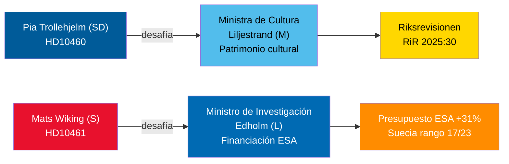

<!-- source-sha: 1f8ac3fadc3c7198b50f9e6519083702a0185cd8 -->

## Executive Brief Fi
<!-- source: executive-brief_fi.md :: https://github.com/Hack23/riksdagsmonitor/blob/main/analysis/daily/2026-04-30/interpellations/executive-brief_fi.md -->

### �� BLUF

Kaksi 29.–30. huhtikuuta 2026 jätettua interpellaatiota tuovat esiin Tidö-koalition vastakkaiset hallintopuutteet: SD vaatii koalitiokumppani kulttuuriministeri Liljestrandia (M) vastuuseen valtion tukikiinteistöjen lykätystä kunnossapidosta (Riksrevisionenin tarkastus RiR 2025:30); kun taas oppositiososialidemokraatti Mats Wiking haastaa tutkimusministeri Edholmin (L) Ruotsin poikkeuksellisesta ESA-rahoituksen vähennyksestä — yksi vain kolmesta ESA-jäsenestä, joka vähensi maksuja huolimatta marraskuun 2025 ministeritapaamisessa tehdystä 31 prosentin ennätysnoususta. Molemmat debatit aikataulutetaan viimeistään 5. toukokuuta 2026, ja ministerivastauksille on määräaika 21. toukokuuta 2026.

### 🧭 3 päätöstä, joita tämä tiedote tukee

1. **Kulttuuriperinnön portfolionhoitajat ja kansalaisyhteiskunta**: Seuraa, sitoutuuko ministeri Liljestrand kattavaan kunnossapitoselvitykseen ja pitkäaikaiseen suunnitelmaan valtion tukikiinteistöjä varten — edellytys EU:n kulttuuriperintörahoitushakemuksille ja yksityiselle yhteisrahoitukselle.
2. **Avaruusteollisuuden sidosryhmät ja ESA-kumppanit**: Arvioi, ilmoittaako ministeri Edholm korjaavasta budjetin uudelleenjaosta Ruotsin ESA-ohjelmaosakkuuden palauttamiseksi ennen seuraavaa ESA-ministerikokousta, jotta ruotsalaiset yritykset eivät menettäisi EU:n julkisten hankintojen saantia.
3. **Parlamentaaristen valiokuntien puheenjohtajat (KU, UbU)**: Molemmat interpellaatiot avaavat viralliset valvontaikkunat — KU koalition sisäisestä vastuusta kulttuuriomaisuuden hoidossa; UbU tutkimus- ja teollisuuspolitiikan johdonmukaisuudesta avaruussektorilla.

### 60 sekunnin tietopisteet

- SD:n Pia Trollehjelm (interpellaatio HD10460) vetoaa Riksrevisionenin tarkastukseen RiR 2025:30 painostaakseen M:n Liljestrandia Statens fastighetsverkin tukikiinteistöistä — koalition sisäinen puolueiden välinen valvonta-aloite [B2]
- S:n Mats Wiking (HD10461) dokumentoi Ruotsin putoamisen ESA-sijoitukselle 17/23 ja vapaaehtoisten ESA-ohjelmien ennätyksellisen alhaisen osuuden, johtuen siitä, että hallitus hyväksyi vain 100 MSEK Rymdstyrelsenin pyynnöstä vuosille 2026–2028 [A2]
- Saksa, Ranska, Italia, Espanja, Puola ja Kanada lisäsivät merkittävästi ESA-maksuosuuksiaan marraskuun 2025 ministeritapaamisessa; Ruotsi vähensi osuuttaan vain kahden muun jäsenen tavoin [A2]
- Molemmat interpellaatiot toimitettiin ministereille 2026-04-30; debatit ilmoitettu 2026-05-05; vastausmääräaika 2026-05-21 [A1]
- Kumpaankaan interpellaatioon ei liity äänestystä — ne ovat ainoastaan vastuuvelvollisuusmekanismeja; parlamentaarisen kurinalaisuuden vaikutus on rajallinen, mutta mainevaikutus on merkittävä [B1]

### Johtava eteenpäin katsova indikaattori

Jos ministeri Edholm ei ilmoita korjaavasta ESA-budjettitoimenpiteestä ennen Ruotsin hallituksen talousarviovalmistelun päättymistä syyskuussa, ruotsalaiset avaruusteollisuusjärjestöt todennäköisesti eskaloivat julkisesti ja asia voi nousta uudelleen syksyn tutkimuspoliittisessa esityksessä.

### Mermaid-yleiskatsaus


<!-- source-sha: 1f8ac3fadc3c7198b50f9e6519083702a0185cd8 -->

## Executive Brief Fr
<!-- source: executive-brief_fr.md :: https://github.com/Hack23/riksdagsmonitor/blob/main/analysis/daily/2026-04-30/interpellations/executive-brief_fr.md -->

### Lede
Deux interpellations déposées les 29-30 avril 2026 mettent en lumière des défaillances de gouvernance contrastées au sein de la coalition Tidö : le SD tient son partenaire de coalition, la ministre de la Culture Liljestrand (M), responsable du report de l'entretien des propriétés bénéficiant de subventions d'État (audit de la Riksrevisionen RiR 2025:30) ; tandis que le socialiste de l'opposition Mats Wiking interroge le ministre de la Recherche Edholm (L) sur le retrait anomal de la Suède du financement de l'ESA — l'un des seulement trois membres de l'ESA à avoir réduit ses contributions malgré une augmentation record de 31 % lors de la réunion ministérielle de novembre 2025. Les deux débats seront programmés avant le 5 mai 2026, avec des réponses ministérielles attendues avant le 21 mai 2026.

### 🧭 3 décisions que ce briefing soutient

1. **Gestionnaires du portefeuille du patrimoine culturel et société civile** : Surveiller si la ministre Liljestrand s'engage à réaliser un état des lieux complet de l'entretien et un plan à long terme pour les propriétés subventionnées par l'État — condition préalable aux demandes de financement EU Heritage et au co-investissement du secteur privé.
2. **Acteurs de l'industrie spatiale et partenaires de l'ESA** : Évaluer si le ministre Edholm annoncera une réallocation budgétaire corrective pour restaurer la part de programme ESA de la Suède avant le prochain cycle ministériel de l'ESA, empêchant les entreprises suédoises de perdre l'accès aux marchés publics européens.
3. **Présidents de commissions parlementaires (KU, UbU)** : Les deux interpellations ouvrent des fenêtres de contrôle formelles — KU sur la responsabilité inter-coalition pour la gestion des propriétés culturelles ; UbU sur la cohérence de la politique de recherche et industrielle dans le secteur spatial.

### Informations en 60 secondes

- Pia Trollehjelm du SD (interpellation HD10460) invoque l'audit de la Riksrevisionen RiR 2025:30 pour faire pression sur Liljestrand (M) concernant les propriétés subventionnées de Statens fastighetsverk — une initiative de contrôle transpartisane au sein de la coalition [B2]
- Mats Wiking (S) (HD10461) documente la chute de la Suède au rang 17/23 de l'ESA et une part record au plus bas des programmes ESA volontaires, attribuant cela à l'approbation par le gouvernement de seulement 100 MSEK de la demande de Rymdstyrelens pour 2026–2028 [A2]
- L'Allemagne, la France, l'Italie, l'Espagne, la Pologne et le Canada ont considérablement augmenté leurs contributions à l'ESA lors de la réunion ministérielle de novembre 2025 ; la Suède a réduit sa part avec seulement deux autres membres [A2]
- Les deux interpellations ont été transmises aux ministres le 2026-04-30 ; débats annoncés le 2026-05-05 ; délai de réponse 2026-05-21 [A1]
- Aucun vote n'est lié à l'une ou l'autre des interpellations — elles constituent uniquement des mécanismes de responsabilité ; l'impact sur la discipline parlementaire est limité, mais la pression sur la réputation est significative [B1]

### Principal indicateur avancé

Si le ministre Edholm n'annonce aucune mesure corrective budgétaire concernant l'ESA avant la clôture des négociations budgétaires du gouvernement suédois en septembre, les associations de l'industrie spatiale suédoise risquent d'escalader publiquement et la question pourrait ressurgir dans le projet de loi sur la politique de recherche de l'automne.

### Aperçu Mermaid

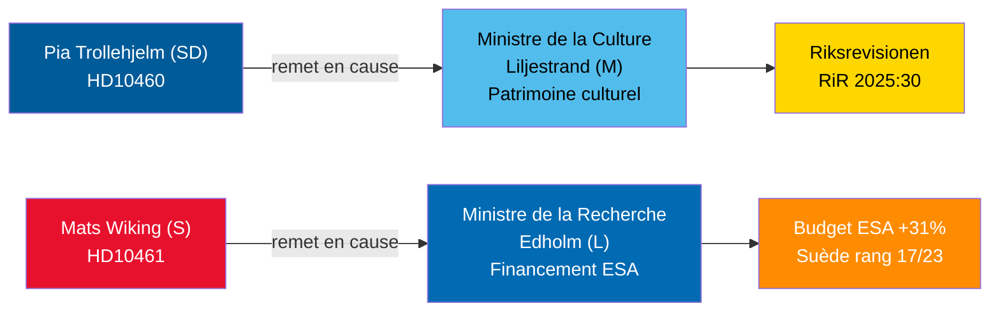

<!-- source-sha: 1f8ac3fadc3c7198b50f9e6519083702a0185cd8 -->

## Executive Brief He
<!-- source: executive-brief_he.md :: https://github.com/Hack23/riksdagsmonitor/blob/main/analysis/daily/2026-04-30/interpellations/executive-brief_he.md -->

<!-- dir: rtl -->
# דיוני שאילתות ב-30 באפריל 2026: הזנחת מורשת תרבות ונסיגת שוודיה מהחלל

### 🎯 תמצית מנהלים

שתי שאילתות שהוגשו ב-29-30 באפריל 2026 מאירות כשלי ממשל מנוגדים בקואליציית טידו: SD מבקשת דין וחשבון משותפת הקואליציה שרת התרבות ליליסטרנד (M) על דחיית תחזוקת נכסי המענקים הממשלתיים (ביקורת Riksrevisionen RiR 2025:30)؛ בעוד הסוציאל-דמוקרט מן האופוזיציה מאטס ויקינג מאתגר את שר המחקר אדהולם (L) על נסיגתה החריגה של שוודיה ממימון ה-ESA — אחד מרק שלושה חברים ב-ESA שהפחיתו תרומות למרות עלייה שיא של 31% בישיבת השרים בנובמבר 2025. שני הדיונים יתוכננו עד 5 במאי 2026 עם מועד אחרון לתשובות שרים עד 21 במאי 2026.

### 🧭 3 החלטות שסיכום זה תומך בהן

1. **מנהלי תיק מורשת התרבות ואנשי החברה האזרחית**: לעקוב אחר שאלת ההתחייבות של שרת ליליסטרנד לסקר תחזוקה מקיף ותוכנית ארוכת טווח לנכסי מענקים ממשלתיים — תנאי מוקדם לבקשות מימון מורשת האיחוד האירופי ולהשקעה משותפת מהמגזר הפרטי.
2. **בעלי עניין בתעשיית החלל ושותפי ESA**: להעריך אם שר אדהולם יכריז על הקצאת תקציב מתקנת לשיקום נתח התוכנית של שוודיה ב-ESA לפני מחזור השרים הבא של ESA, ולמנוע מחברות שוודיות לאבד גישה לרכש ציבורי של האיחוד האירופי.
3. **יושבי ראש ועדות פרלמנטריות (KU, UbU)**: שתי השאילתות פותחות חלונות פיקוח רשמיים — KU על אחריות קואליציונית הדדית לניהול נכסים תרבותיים; UbU על עקביות מדיניות המחקר והתעשייה במגזר החלל.

### נקודות מודיעין ב-60 שניות

- פיה טרולהיה (SD) (שאילתה HD10460) מסתמכת על ביקורת Riksrevisionen RiR 2025:30 כדי להפעיל לחץ על ליליסטרנד (M) בנוגע לנכסי Statens fastighetsverk — יוזמת פיקוח חוצת מפלגות בתוך הקואליציה [B2]
- מאטס ויקינג (S) (HD10461) מתעד את נפילת שוודיה לדרגה 17/23 ב-ESA ונתח שיא נמוך בתוכניות ESA הוולונטריות, בשל אישור הממשלה רק 100 מיליון כרונות שוודיות מבקשת Rymdstyrelens לשנים 2026–2028 [A2]
- גרמניה, צרפת, איטליה, ספרד, פולין וקנדה הגדילו משמעותית את תרומותיהן ל-ESA בישיבת השרים בנובמבר 2025; שוודיה הפחיתה את נתחה יחד עם שני חברים בלבד [A2]
- שתי השאילתות הועברו לשרים ב-2026-04-30; דיונים הוכרזו ב-2026-05-05; מועד אחרון לתשובה 2026-05-21 [A1]
- שום הצבעה אינה מצורפת לאף אחת מהשאילתות — הן מנגנוני אחריות בלבד; ההשפעה על משמעת פרלמנטרית מוגבלת אך הלחץ התדמיתי משמעותי [B1]

### מחוון קדימה מוביל

אם שר אדהולם לא יכריז על צעד תקציבי מתקן ל-ESA לפני סיום משא ומתן תקציב הממשלה השוודית בספטמבר, ארגוני תעשיית החלל השוודיים עשויים להסלים את הנושא בפומבי והוא עלול לחזור בהצעת מדיניות המחקר בסתיו.

### סקירת Mermaid


<!-- source-sha: 1f8ac3fadc3c7198b50f9e6519083702a0185cd8 -->

## Executive Brief Ja
<!-- source: executive-brief_ja.md :: https://github.com/Hack23/riksdagsmonitor/blob/main/analysis/daily/2026-04-30/interpellations/executive-brief_ja.md -->

### 🎯 要旨

2026年4月29〜30日に提出された二つの質問は、ティドー連立政権内の対照的なガバナンス上の欠陥を浮き彫りにしています。SDは連立パートナーのリリエストランド文化大臣（M）に対し、国家補助金対象物件の保守点検が先送りされていることへの責任を追及しており（リクスレビション監査 RiR 2025:30）、一方で野党社会民主党のマッツ・ヴィキングはESA資金拠出におけるスウェーデンの異例な削減についてエドホルム研究大臣（L）に説明を求めています。スウェーデンは2025年11月の閣僚会議で記録的な31%増となったにもかかわらず、拠出金を減らしたわずか3カ国のうちの一国です。両討論は2026年5月5日までにスケジュールされ、大臣回答の期限は2026年5月21日です。

### 🧭 この報告が支援する3つの意思決定

1. **文化遺産ポートフォリオ管理者と市民社会**: リリエストランド大臣が国家補助金対象物件の包括的な保守調査と長期計画に取り組む意向を示すかどうかを監視する — EU文化遺産助成申請および民間の共同投資の前提条件となります。
2. **宇宙産業関係者とESAパートナー**: エドホルム大臣が次のESA閣僚サイクルの前にスウェーデンのESAプログラム分担を回復するための是正予算再配分を発表するかどうかを評価する — スウェーデン企業がEU公共調達へのアクセスを失うことを防ぐためです。
3. **国会委員会委員長（KU、UbU）**: 両質問は正式な監視機会を開きます — KU：文化財管理における連立内の相互説明責任について；UbU：宇宙分野における研究・産業政策の一貫性について。

### 60秒インテリジェンス・ポイント

- SDのピア・トロレヘルム（質問 HD10460）はリクスレビション監査 RiR 2025:30 を援用し、Statens fastighetsverkの補助金対象物件についてMのリリエストランドに圧力をかけています — 連立内における超党派の監視イニシアチブ [B2]
- Sのマッツ・ヴィキング（HD10461）はスウェーデンのESA順位が17/23位に低下し、任意ESAプログラムへの参加が過去最低水準となっていることを記録しており、政府が2026〜2028年のRymdstyrelensの要求額のうちわずか1億スウェーデンクローナ（MSEK）しか承認しなかったことが原因と指摘しています [A2]
- ドイツ、フランス、イタリア、スペイン、ポーランド、カナダは2025年11月の閣僚会議でESA拠出金を大幅に増額。スウェーデンはわずか2カ国とともに分担を削減しました [A2]
- 両質問は2026-04-30に大臣に送付；討論は2026-05-05に告知；回答期限 2026-05-21 [A1]
- いずれの質問にも採決は伴っていません — それらは説明責任のメカニズムに過ぎません。国会の規律への影響は限定的ですが、レピュテーションへの圧力は相当なものです [B1]

### 主要な先行指標

もしエドホルム大臣が9月のスウェーデン政府予算交渉が終わるまでにESA予算の是正措置を発表しなければ、スウェーデンの宇宙産業団体が公に問題を拡大し、秋の研究政策法案でこの問題が再び浮上する可能性が高いです。

### Mermaid概要


<!-- source-sha: 1f8ac3fadc3c7198b50f9e6519083702a0185cd8 -->

## Executive Brief Ko
<!-- source: executive-brief_ko.md :: https://github.com/Hack23/riksdagsmonitor/blob/main/analysis/daily/2026-04-30/interpellations/executive-brief_ko.md -->

### 🎯 요약

2026년 4월 29~30일에 제출된 두 건의 질문서는 티도 연립정부 내의 대조적인 거버넌스 실패를 조명합니다. SD는 연립 파트너인 릴리에스트란드 문화부장관(M)에게 국가 보조금 부동산의 유지보수 지연에 대한 책임을 묻고 있으며(릭스레비시온 감사 RiR 2025:30), 반면 야당 사민당의 마츠 비킹은 ESA 자금 지원에서 스웨덴이 이례적으로 후퇴한 것에 대해 에드홀름 연구부장관(L)에게 도전장을 던지고 있습니다. 스웨덴은 2025년 11월 장관 회의에서 기록적인 31% 증가에도 불구하고 기여금을 줄인 단 3개 ESA 회원국 중 하나입니다. 두 토론은 모두 2026년 5월 5일까지 일정이 잡힐 예정이며, 장관 답변 기한은 2026년 5월 21일입니다.

### 🧭 이 브리핑이 지원하는 3가지 결정

1. **문화유산 포트폴리오 관리자 및 시민사회**: 릴리에스트란드 장관이 국가 보조금 부동산에 대한 포괄적인 유지보수 조사와 장기 계획을 약속하는지 모니터링 — EU 문화유산 자금 신청과 민간 공동 투자를 위한 전제조건.
2. **우주산업 이해관계자 및 ESA 파트너**: 에드홀름 장관이 다음 ESA 장관 사이클 전에 스웨덴의 ESA 프로그램 점유율을 회복하기 위한 수정 예산 재배분을 발표할지 평가 — 스웨덴 기업들이 EU 공공조달 접근권을 잃지 않도록 하기 위함.
3. **국회 위원회 의장(KU, UbU)**: 두 질문서 모두 공식 감독 기회를 엽니다 — KU: 문화재 관리에 대한 연립 내 상호 책임; UbU: 우주 분야 연구 및 산업 정책의 일관성.

### 60초 정보 포인트

- SD의 피아 트롤레헬름(질문 HD10460)은 릭스레비시온 감사 RiR 2025:30을 근거로 Statens fastighetsverks의 보조금 부동산에 대해 M의 릴리에스트란드를 압박 — 연립 내 초당파 감독 이니셔티브 [B2]
- S의 마츠 비킹(HD10461)은 스웨덴이 ESA 순위 17/23위로 하락하고 자발적 ESA 프로그램 점유율이 사상 최저를 기록했음을 문서화했으며, 정부가 2026~2028년 Rymdstyrelens 요청 중 불과 1억 크로나(MSEK)만 승인한 것이 원인이라고 지적 [A2]
- 독일, 프랑스, 이탈리아, 스페인, 폴란드, 캐나다는 2025년 11월 장관 회의에서 ESA 기여금을 대폭 늘렸으며, 스웨덴은 단 두 나라와 함께 점유율을 줄였습니다 [A2]
- 두 질문서 모두 2026-04-30에 장관에게 전달; 토론 2026-05-05에 공고; 답변 기한 2026-05-21 [A1]
- 두 질문서 모두 표결이 없습니다 — 책임 메커니즘에 불과하므로 의회 규율에 미치는 영향은 제한적이지만 평판 압박은 상당합니다 [B1]

### 주요 선행 지표

에드홀름 장관이 9월 스웨덴 정부 예산 협상이 마무리되기 전에 ESA 예산 수정 조치를 발표하지 않으면, 스웨덴 우주산업 협회들이 공개적으로 문제를 확대할 가능성이 높으며 가을 연구정책 법안에서 이 문제가 다시 대두될 수 있습니다.

### Mermaid 개요


<!-- source-sha: 1f8ac3fadc3c7198b50f9e6519083702a0185cd8 -->

## Executive Brief Nl
<!-- source: executive-brief_nl.md :: https://github.com/Hack23/riksdagsmonitor/blob/main/analysis/daily/2026-04-30/interpellations/executive-brief_nl.md -->

### Lede
Twee op 29-30 april 2026 ingediende interpellaties belichten contrasterende bestuursfalen in de Tidö-coalitie: SD houdt coalitiegenoot cultuurminister Liljestrand (M) verantwoordelijk voor uitgesteld onderhoud van staatsgefinancierde panden (Riksrevisionen-audit RiR 2025:30); terwijl oppositiesociaaldemocraatMats Wiking onderzoeksminister Edholm (L) uitdaagt over Zweden's anomale terugtrekking uit ESA-financiering — een van slechts drie ESA-leden die bijdragen verminderden ondanks een recordstijging van 31% op de ministeriële vergadering van november 2025. Beide debatten worden gepland vóór 5 mei 2026 met ministeriële reacties uiterlijk 21 mei 2026.

### 🧭 3 beslissingen die dit briefing ondersteunt

1. **Erfgoedbeheerders en maatschappelijk middenveld**: Monitor of minister Liljestrand zich committeert aan een uitgebreid onderhoudsonderzoek en langetermijnplan voor staatsgefinancierde panden — een vereiste voor EU Heritage-financieringsaanvragen en private co-investering.
2. **Ruimtevaartindustrieactoren en ESA-partners**: Beoordeel of minister Edholm een corrigerende budgetherverdeling zal aankondigen om het ESA-programma-aandeel van Zweden te herstellen vóór de volgende ESA-ministercyclus, zodat Zweedse bedrijven geen toegang tot EU-overheidsopdrachten verliezen.
3. **Parlementaire commissievoorzitters (KU, UbU)**: Beide interpellaties openen formele controlemogelijkheden — KU over inter-coalitie aansprakelijkheid voor het beheer van cultureel erfgoed; UbU over de samenhang van het onderzoeks- en industriebeleid in de ruimtevaartsector.

### 60-seconden inlichtingenpunten

- SD's Pia Trollehjelm (interpellatie HD10460) beroept zich op de Riksrevisionen-audit RiR 2025:30 om druk uit te oefenen op M's Liljestrand over de gesubsidieerde panden van Statens fastighetsverk — een partijoverschrijdend controle-initiatief binnen de coalitie [B2]
- S's Mats Wiking (HD10461) documenteert Zweden's val naar ESA-rang 17/23 en een recordlage deelname aan vrijwillige ESA-programma's, toegeschreven aan de goedkeuring door de regering van slechts 100 MSEK van Rymdstyrelens verzoek voor 2026–2028 [A2]
- Duitsland, Frankrijk, Italië, Spanje, Polen en Canada verhoogden hun ESA-bijdragen aanzienlijk op de ministeriële vergadering van november 2025; Zweden verlaagde zijn aandeel samen met slechts twee andere leden [A2]
- Beide interpellaties werden op 2026-04-30 doorgestuurd naar ministers; debatten aangekondigd op 2026-05-05; antwoorddeadline 2026-05-21 [A1]
- Geen stemming is gekoppeld aan een van de interpellaties — het zijn uitsluitend verantwoordingsmechanismen; impact op parlementaire discipline is beperkt maar reputatiedruk is aanzienlijk [B1]

### Belangrijkste vooruitlopende indicator

Als minister Edholm geen corrigerende ESA-budgetmaatregel aankondigt voordat de onderhandelingen over de Zweedse staatsbegroting in september afsluiten, zullen Zweedse ruimtevaartsbrancheorganisaties waarschijnlijk publiekelijk escaleren en het onderwerp kan terugkeren in het herfst-onderzoeksbeleidswetsvoorstel.

### Mermaid-overzicht


<!-- source-sha: 1f8ac3fadc3c7198b50f9e6519083702a0185cd8 -->

## Executive Brief No
<!-- source: executive-brief_no.md :: https://github.com/Hack23/riksdagsmonitor/blob/main/analysis/daily/2026-04-30/interpellations/executive-brief_no.md -->

### Lede
To interpellasjoner innlevert 29.–30. april 2026 belyser kontrasterende styringssvikt i Tidö-koalisjonen: SD holder koalisjonspartneren kulturminister Liljestrand (M) ansvarlig for utsatt vedlikehold av statlige tilskuddeiendommer (Riksrevisjonens revisjon RiR 2025:30); mens opposisjonens sosialdemokrat Mats Wiking utfordrer forskningsminister Edholm (L) om Sveriges avvikende tilbaketrekning fra ESA-finansiering — ett av kun tre ESA-medlemmer som reduserte bidrag til tross for en rekordøkning på 31 % ved ministermøtet i november 2025. Begge debattene vil bli planlagt innen 5. mai 2026, med ministerielle svar innen 21. mai 2026.

### 🧭 3 Beslutninger dette briefet støtter

1. **Kulturarvsporteføljeforvaltere og sivilsamfunn**: Følg med på om minister Liljestrand forplikter seg til en omfattende vedlikeholdsundersøkelse og langsiktig plan for statlige tilskuddeiendommer — en forutsetning for EUs kulturarvsstøtteansøkninger og privat medfinansiering.
2. **Romfartsindustriaktører og ESA-partnere**: Vurder om minister Edholm vil kunngjøre en korrigerende budsjettomfordeling for å gjenopprette Sveriges ESA-programandel før neste ESA-ministersyklus, og forhindre at svenske selskaper mister tilgang til EUs offentlige anskaffelser.
3. **Parlamentariske utvalgsformenn (KU, UbU)**: Begge interpellasjoner åpner formelle tilsynsvinduer — KU om inter-koalisjonsansvar for forvaltning av kultureiendommer; UbU om sammenheng i forsknings- og industripolitikken i romsektoren.

### 60-sekunders etterretningspunkter

- SDs Pia Trollehjelm (interpellasjon HD10460) påberoper Riksrevisjonens revisjon RiR 2025:30 for å presse Ms Liljestrand om Statens fastighetsverks tilskuddeiendommer — et tverrpolitisk tilsynstiltak innenfor koalisjonen [B2]
- Ss Mats Wiking (HD10461) dokumenterer Sveriges fall til ESA-rang 17/23 og en rekordlav andel av frivillige ESA-programmer, tilskrevet at regjeringen godkjente bare 100 MSEK av Rymdstyrelens forespørsel for 2026–2028 [A2]
- Tyskland, Frankrike, Italia, Spania, Polen og Canada økte sine ESA-bidrag betydelig ved ministermøtet i november 2025; Sverige reduserte sin andel sammen med kun to andre medlemmer [A2]
- Begge interpellasjoner ble videresendt til ministrene 2026-04-30; debatter kunngjort 2026-05-05; svarfrist 2026-05-21 [A1]
- Ingen avstemning er knyttet til noen av interpellasjonene — de er utelukkende ansvarlighetsmekanismer; innvirkning på parlamentarisk disiplin er begrenset, men omdømmemessig press er betydelig [B1]

### Ledende fremoverindikator

Dersom minister Edholm ikke kunngjør noen korrigerende ESA-budsjettiltak før forhandlingene om det svenske statsbudsjettet avsluttes i september, vil svenske romfartsbransjeorganisasjoner sannsynligvis eskalere offentlig, og saken kan gjenta seg i høstens forskningspolitiske forslag.

### Mermaid-oversikt

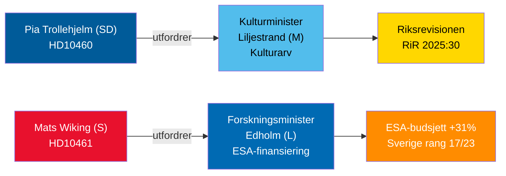

<!-- source-sha: 1f8ac3fadc3c7198b50f9e6519083702a0185cd8 -->

## Executive Brief Sv
<!-- source: executive-brief_sv.md :: https://github.com/Hack23/riksdagsmonitor/blob/main/analysis/daily/2026-04-30/interpellations/executive-brief_sv.md -->

### Lede
Två interpellationer inlämnade 29–30 april 2026 belyser kontrasterande styrningsbrister i Tidökoalitionen: SD ställer koalitionspartnern kulturminister Liljestrand (M) till svars för uppskjutet underhåll av statsbidragsfastigheter (Riksrevisionens granskning RiR 2025:30); medan oppositionens socialdemokrat Mats Wiking ifrågasätter forskningsminister Edholm (L) om Sveriges avvikande minskning av ESA-finansiering — ett av endast tre ESA-länder som minskade bidrag trots en rekordökning på 31 % vid ministermötet i november 2025. Båda debatterna kommer att schemaläggas senast 5 maj 2026 med ministersvar senast 21 maj 2026.

### 🧭 3 Beslut som detta briefing stödjer

1. **Fastighetsansvariga för kulturarv och civilsamhälle**: Övervaka om minister Liljestrand förbinder sig till en heltäckande underhållsutredning och långsiktig plan för statsbidragsfastigheter — en förutsättning för EU:s kulturarvsfinansieringsansökningar och privat samfinansiering.
2. **Rymdaktörer och ESA-partners**: Bedöm om minister Edholm kommer att avisera en korrigerande budgetomfördelning för att återställa Sveriges ESA-programandel inför nästa ESA-ministercykel och förhindra att svenska företag förlorar tillgång till EU:s offentliga upphandling.
3. **Riksdagsutskottsordförande (KU, UbU)**: Båda interpellationerna öppnar formella tillsynsfönster — KU om koalitionens interna ansvar för förvaltning av kulturegendomar; UbU om sammanhang i forsknings- och industripolitiken inom rymdsektorn.

### 60-sekunders underrättelse

- SD:s Pia Trollehjelm (interpellation HD10460) åberopar Riksrevisionens granskning RiR 2025:30 för att pressa M:s Liljestrand om Statens fastighetsverks bidragsfastigheter — ett tvärpolitiskt tillsynsinitiativ inom koalitionen [B2]
- S:s Mats Wiking (HD10461) dokumenterar Sveriges fall till ESA-plats 17/23 och en rekordlåg andel av frivilliga ESA-program, vilket tillskrivs att regeringen godkände endast 100 MSEK av Rymdstyrelens begäran för 2026–2028 [A2]
- Tyskland, Frankrike, Italien, Spanien, Polen och Kanada ökade avsevärt sina ESA-bidrag vid ministermötet i november 2025; Sverige minskade sin andel tillsammans med endast två andra medlemmar [A2]
- Båda interpellationerna vidarebefordrades till ministrarna 2026-04-30; debatter tillkännagivna 2026-05-05; svarsfrist 2026-05-21 [A1]
- Ingen omröstning är kopplad till någon av interpellationerna — de är enbart ansvarsutkrävningsmekanismer; inverkan på parlamentarisk disciplin är begränsad men det anseendemässiga trycket är betydande [B1]

### Ledande framåtindikator

Om minister Edholm inte aviserar någon korrigerande ESA-budgetåtgärd innan förhandlingarna om den svenska statsbudgeten avslutas i september, kommer svenska rymdaktörsorganisationer sannolikt att eskalera offentligt och frågan kan återkomma i höstens forskningspolitiska proposition.

### Mermaid-översikt

```mermaid
graph LR
    A["Pia Trollehjelm (SD)\nHD10460"] -->|ifrågasätter| B["Kulturminister\nLiljestrand (M)\nKulturarv"]
    C["Mats Wiking (S)\nHD10461"] -->|ifrågasätter| D["Forskningsminister\nEdholm (L)\nESA-finansiering"]
    B --> E["Riksrevisionen\nRiR 2025:30"]
    D --> F["ESA-budget +31%\nSverige plats 17/23"]
    style A fill:#005B99,color:#fff
    style C fill:#E8112d,color:#fff
    style B fill:#52BDEC,color:#000
    style D fill:#006AB3,color:#fff
    style E fill:#FFD700,color:#000
    style F fill:#FF8C00,color:#fff
```

<!-- source-sha: 1f8ac3fadc3c7198b50f9e6519083702a0185cd8 -->

## Executive Brief Zh
<!-- source: executive-brief_zh.md :: https://github.com/Hack23/riksdagsmonitor/blob/main/analysis/daily/2026-04-30/interpellations/executive-brief_zh.md -->

### 🎯 简报摘要

2026年4月29至30日提交的两份质询揭示了蒂多联合政府内部截然不同的治理缺陷：瑞典民主党（SD）要求联合政府伙伴、文化部长莉利耶斯特兰德（M）就国家补贴房产的推迟维护问题（国家审计局审计RiR 2025:30）承担责任；而反对党社会民主党人马茨·维京则就瑞典在欧洲航天局（ESA）资助方面的异常撤退向研究部长埃德霍尔姆（L）发出质疑——尽管2025年11月部长级会议上ESA预算创纪录增长31%，瑞典仍是仅有的三个削减贡献的ESA成员之一。两场辩论均将在2026年5月5日前安排，部长回应截止日期为2026年5月21日。

### 🧭 本简报支持的3项决策

1. **文化遗产投资组合管理者与公民社会**：监测莉利耶斯特兰德部长是否承诺对国家补贴房产进行全面维护调查并制定长期计划——这是申请欧盟遗产基金和吸引私营部门共同投资的前提条件。
2. **太空产业利益相关者与ESA合作伙伴**：评估埃德霍尔姆部长是否将宣布在下一个ESA部长级周期前进行修正性预算重新分配，以恢复瑞典在ESA计划中的份额，防止瑞典企业失去进入欧盟政府采购的资格。
3. **议会委员会主席（KU、UbU）**：两份质询均开启了正式监督窗口——KU：涉及联合政府内部对文化财产管理的责任；UbU：涉及航天领域研究与产业政策的协调一致性。

### 60秒情报要点

- 瑞典民主党的皮娅·特罗尔赫尔姆（质询HD10460）援引国家审计局审计RiR 2025:30，就国家不动产委员会（Statens fastighetsverk）的补贴房产向温和联合党的莉利耶斯特兰德施压——联合政府内部跨党派监督举措 [B2]
- 社会民主党的马茨·维京（HD10461）记录了瑞典在ESA中的排名下滑至17/23位，以及在自愿ESA项目中所占份额创历史新低，原因在于政府仅批准了Rymdstyrelens为2026年至2028年申请的1亿瑞典克朗（MSEK） [A2]
- 德国、法国、意大利、西班牙、波兰和加拿大在2025年11月的部长级会议上大幅增加了ESA贡献；瑞典仅与另外两个成员一起削减了份额 [A2]
- 两份质询均于2026-04-30转交给部长；辩论于2026-05-05公告；回复截止日期2026-05-21 [A1]
- 两份质询均未附有表决——它们仅是问责机制；对议会纪律的影响有限，但声誉压力显著 [B1]

### 主要前瞻指标

若埃德霍尔姆部长在9月瑞典政府预算谈判结束前未宣布任何ESA预算纠正措施，瑞典太空产业协会可能会公开升级此事，该问题或将在秋季研究政策法案中再度浮现。

### Mermaid概览

```mermaid
graph LR
    A["Pia Trollehjelm (SD)\nHD10460"] -->|challenges| B["Culture Minister\nLiljestrand (M)\nCultural Heritage"]
    C["Mats Wiking (S)\nHD10461"] -->|challenges| D["Research Minister\nEdholm (L)\nESA Funding"]
    B --> E["Riksrevisionen\nRiR 2025:30"]
    D --> F["ESA Budget +31%\nSweden rank 17/23"]
    style A fill:#005B99,color:#fff
    style C fill:#E8112d,color:#fff
    style B fill:#52BDEC,color:#000
    style D fill:#006AB3,color:#fff
    style E fill:#FFD700,color:#000
    style F fill:#FF8C00,color:#fff
```

<!-- source-sha: 1f8ac3fadc3c7198b50f9e6519083702a0185cd8 -->

## Analysis Artifact Coverage Report

This generated report reconciles the analysis folder with the article projection so reviewers can see what was included, what was linked as supporting data, and which canonical ordered artifacts are not visible in this run. Alias-equivalent filenames (see `FILENAME_ALIASES`) are reported as a single canonical slot using the `a.md / b.md` shorthand so a missing slot is not double-counted.

| Coverage area | Count | Reader-facing treatment |
|---|---:|---|
| Ordered/root markdown sections | 35 | Expanded as article sections in the narrative order above |
| Per-document analyses | 2 | Expanded under `## Per-document intelligence` immediately after significance scoring |
| Supporting data artifacts | 3 | Linked in Article Sources, not expanded inline |

**Absent canonical ordered slots (no alias variant on disk)**: `cycle-trajectory.md`, `parliamentary-season.md`, `quantitative-swot.md`, `political-stride-assessment.md`, `wildcards-blackswans.md`, `pestle-analysis.md`, `horizon-pir-rollforward.md`

**Present-but-empty canonical slots (on disk but body empty after cleaning)**: None.

**Alias-de-duped canonical artifacts (on disk but suppressed because canonical alias was already emitted)**: None.

## Article Sources

Each section above projects one analysis artifact. The full audited markdown is available on GitHub:

- [`executive-brief.md`](https://github.com/Hack23/riksdagsmonitor/blob/main/analysis/daily/2026-04-30/interpellations/executive-brief.md)
- [`synthesis-summary.md`](https://github.com/Hack23/riksdagsmonitor/blob/main/analysis/daily/2026-04-30/interpellations/synthesis-summary.md)
- [`intelligence-assessment.md`](https://github.com/Hack23/riksdagsmonitor/blob/main/analysis/daily/2026-04-30/interpellations/intelligence-assessment.md)
- [`significance-scoring.md`](https://github.com/Hack23/riksdagsmonitor/blob/main/analysis/daily/2026-04-30/interpellations/significance-scoring.md)
- [`documents/HD10460-analysis.md`](https://github.com/Hack23/riksdagsmonitor/blob/main/analysis/daily/2026-04-30/interpellations/documents/HD10460-analysis.md)
- [`documents/HD10461-analysis.md`](https://github.com/Hack23/riksdagsmonitor/blob/main/analysis/daily/2026-04-30/interpellations/documents/HD10461-analysis.md)
- [`stakeholder-perspectives.md`](https://github.com/Hack23/riksdagsmonitor/blob/main/analysis/daily/2026-04-30/interpellations/stakeholder-perspectives.md)
- [`coalition-mathematics.md`](https://github.com/Hack23/riksdagsmonitor/blob/main/analysis/daily/2026-04-30/interpellations/coalition-mathematics.md)
- [`voter-segmentation.md`](https://github.com/Hack23/riksdagsmonitor/blob/main/analysis/daily/2026-04-30/interpellations/voter-segmentation.md)
- [`forward-indicators.md`](https://github.com/Hack23/riksdagsmonitor/blob/main/analysis/daily/2026-04-30/interpellations/forward-indicators.md)
- [`scenario-analysis.md`](https://github.com/Hack23/riksdagsmonitor/blob/main/analysis/daily/2026-04-30/interpellations/scenario-analysis.md)
- [`election-2026-analysis.md`](https://github.com/Hack23/riksdagsmonitor/blob/main/analysis/daily/2026-04-30/interpellations/election-2026-analysis.md)
- [`risk-assessment.md`](https://github.com/Hack23/riksdagsmonitor/blob/main/analysis/daily/2026-04-30/interpellations/risk-assessment.md)
- [`swot-analysis.md`](https://github.com/Hack23/riksdagsmonitor/blob/main/analysis/daily/2026-04-30/interpellations/swot-analysis.md)
- [`threat-analysis.md`](https://github.com/Hack23/riksdagsmonitor/blob/main/analysis/daily/2026-04-30/interpellations/threat-analysis.md)
- [`historical-parallels.md`](https://github.com/Hack23/riksdagsmonitor/blob/main/analysis/daily/2026-04-30/interpellations/historical-parallels.md)
- [`comparative-international.md`](https://github.com/Hack23/riksdagsmonitor/blob/main/analysis/daily/2026-04-30/interpellations/comparative-international.md)
- [`implementation-feasibility.md`](https://github.com/Hack23/riksdagsmonitor/blob/main/analysis/daily/2026-04-30/interpellations/implementation-feasibility.md)
- [`media-framing-analysis.md`](https://github.com/Hack23/riksdagsmonitor/blob/main/analysis/daily/2026-04-30/interpellations/media-framing-analysis.md)
- [`devils-advocate.md`](https://github.com/Hack23/riksdagsmonitor/blob/main/analysis/daily/2026-04-30/interpellations/devils-advocate.md)
- [`classification-results.md`](https://github.com/Hack23/riksdagsmonitor/blob/main/analysis/daily/2026-04-30/interpellations/classification-results.md)
- [`cross-reference-map.md`](https://github.com/Hack23/riksdagsmonitor/blob/main/analysis/daily/2026-04-30/interpellations/cross-reference-map.md)
- [`methodology-reflection.md`](https://github.com/Hack23/riksdagsmonitor/blob/main/analysis/daily/2026-04-30/interpellations/methodology-reflection.md)
- [`data-download-manifest.md`](https://github.com/Hack23/riksdagsmonitor/blob/main/analysis/daily/2026-04-30/interpellations/data-download-manifest.md)
- [`executive-brief_ar.md`](https://github.com/Hack23/riksdagsmonitor/blob/main/analysis/daily/2026-04-30/interpellations/executive-brief_ar.md)
- [`executive-brief_da.md`](https://github.com/Hack23/riksdagsmonitor/blob/main/analysis/daily/2026-04-30/interpellations/executive-brief_da.md)
- [`executive-brief_de.md`](https://github.com/Hack23/riksdagsmonitor/blob/main/analysis/daily/2026-04-30/interpellations/executive-brief_de.md)
- [`executive-brief_es.md`](https://github.com/Hack23/riksdagsmonitor/blob/main/analysis/daily/2026-04-30/interpellations/executive-brief_es.md)
- [`executive-brief_fi.md`](https://github.com/Hack23/riksdagsmonitor/blob/main/analysis/daily/2026-04-30/interpellations/executive-brief_fi.md)
- [`executive-brief_fr.md`](https://github.com/Hack23/riksdagsmonitor/blob/main/analysis/daily/2026-04-30/interpellations/executive-brief_fr.md)
- [`executive-brief_he.md`](https://github.com/Hack23/riksdagsmonitor/blob/main/analysis/daily/2026-04-30/interpellations/executive-brief_he.md)
- [`executive-brief_ja.md`](https://github.com/Hack23/riksdagsmonitor/blob/main/analysis/daily/2026-04-30/interpellations/executive-brief_ja.md)
- [`executive-brief_ko.md`](https://github.com/Hack23/riksdagsmonitor/blob/main/analysis/daily/2026-04-30/interpellations/executive-brief_ko.md)
- [`executive-brief_nl.md`](https://github.com/Hack23/riksdagsmonitor/blob/main/analysis/daily/2026-04-30/interpellations/executive-brief_nl.md)
- [`executive-brief_no.md`](https://github.com/Hack23/riksdagsmonitor/blob/main/analysis/daily/2026-04-30/interpellations/executive-brief_no.md)
- [`executive-brief_sv.md`](https://github.com/Hack23/riksdagsmonitor/blob/main/analysis/daily/2026-04-30/interpellations/executive-brief_sv.md)
- [`executive-brief_zh.md`](https://github.com/Hack23/riksdagsmonitor/blob/main/analysis/daily/2026-04-30/interpellations/executive-brief_zh.md)

### Supporting Data Artifacts

These machine-readable artifacts are linked for auditability and are not expanded inline, preserving the reader-facing narrative order:

- [`pir-status.json`](https://github.com/Hack23/riksdagsmonitor/blob/main/analysis/daily/2026-04-30/interpellations/pir-status.json)
- [`documents/hd10460.json`](https://github.com/Hack23/riksdagsmonitor/blob/main/analysis/daily/2026-04-30/interpellations/documents/hd10460.json)
- [`documents/hd10461.json`](https://github.com/Hack23/riksdagsmonitor/blob/main/analysis/daily/2026-04-30/interpellations/documents/hd10461.json)
