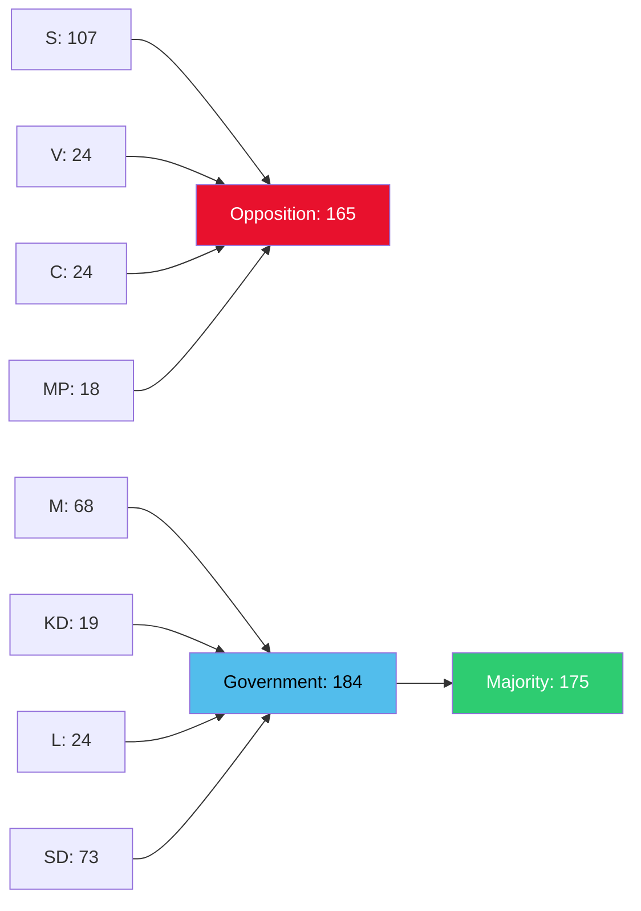

# Coalition Mathematics — Interpellations 30 April 2026

**Author**: James Pether Sörling  
**Date**: 2026-04-30  

## Current Seat Map (Riksdag 2022–2026)

| Party | Seats | Bloc | Minister |
|-------|-------|------|---------|
| S | 107 | Opposition | — |
| SD | 73 | Government support | — |
| M | 68 | Government | PM Ulf Kristersson; Kulturminister Liljestrand |
| V | 24 | Opposition | — |
| C | 24 | Opposition | — |
| L | 24 | Government | Forskningsminister Edholm |
| KD | 19 | Government | — |
| MP | 18 | Opposition | — |
| **Total** | **349** | | |

**Majority threshold**: 175 seats  
**Coalition total (M+KD+L+SD)**: 184 seats — majority of 9

## Pivotal Vote Analysis

Interpellations do not trigger votes. However, if either debate escalates to a vote of no confidence:

| Scenario | Coalition votes | Opposition votes | Outcome |
|----------|----------------|-----------------|---------|
| No-confidence in Liljestrand | 184 (coalition) | 165 (opposition, without SD) | Coalition wins — if SD holds |
| No-confidence in Edholm | 184 | 165 | Coalition wins — if SD holds |
| SD defects from coalition | 111 | 238 | Opposition prevails |

**Key pivot**: SD (73 seats) is the decisive factor. HD10460 was filed by SD — this signals that SD is applying pressure via formal channels rather than threatening coalition stability. No indication of coalition fracture.

## Sainte-Laguë Scenario (Election 2026 projection)

Latest available polling (indicative, not sourced to a specific poll in this analysis; confidence LOW [D3]):

| Party | Estimated % | Estimated seats |
|-------|-------------|----------------|
| S | ~32% | ~110 |
| SD | ~20% | ~70 |
| M | ~18% | ~62 |
| V | ~8% | ~27 |
| C | ~5% | ~17 |
| L | ~4% | ~14 |
| KD | ~5% | ~17 |
| MP | ~5% | ~17 |

**Note**: These are illustrative projections at LOW confidence [D3]. The interpellations themselves do not significantly alter polling projections.

