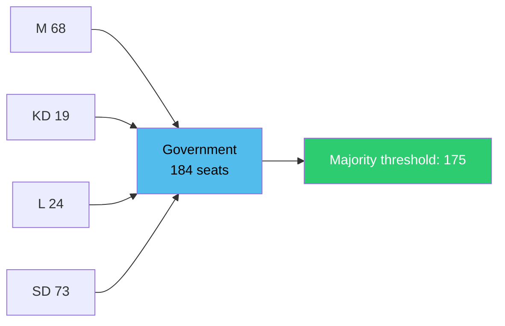

# Election 2026 Analysis — Interpellations 30 April 2026

**Author**: James Pether Sörling  
**Date**: 2026-04-30  

## Seat Projection Context (Riksval 2026)

The next Swedish general election is scheduled for September 2026. These interpellations are filed approximately 5 months before the election, in the final phase of the current parliamentary term.

### Current Coalition Configuration (Tidö)

| Party | Seats | Role |
|-------|-------|------|
| M (Moderaterna) | 68 | Government (Prime Minister) |
| KD (Kristdemokraterna) | 19 | Government |
| L (Liberalerna) | 24 | Government |
| SD (Sverigedemokraterna) | 73 | Government support party |
| **Coalition total** | **184** | Majority: 175 |

| Party | Seats | Role |
|-------|-------|------|
| S (Socialdemokraterna) | 107 | Opposition leader |
| MP (Miljöpartiet) | 18 | Opposition |
| V (Vänsterpartiet) | 24 | Opposition |
| C (Centerpartiet) | 24 | Opposition |

## Election-Relevant Dynamics from Interpellations

### HD10460 — SD Internal Coalition Pressure

SD's decision to use the interpellation mechanism against M's culture minister, citing Riksrevisionen, may be read as pre-election positioning: SD wishes to distance itself from any perception of culture/heritage neglect while remaining in the coalition. This is a classic "credit-claiming" move in a proportional system — SD demonstrates independence without threatening the coalition.

**Seat-projection delta**: Negligible direct impact. SD's cultural heritage voters may reward the oversight signal marginally. No expected shift > 1 seat.

### HD10461 — S Opposition Platform Building

Mats Wiking (S) uses HD10461 to build a research/space policy platform ahead of the election. S's traditional strength in research and higher education policy (historically strong in university constituencies) makes this a natural pre-election opposition vehicle. The measurability of Sweden's ESA rank (17/23 vs. Nordic neighbours) makes it an effective campaign talking point.

**Seat-projection delta**: Marginal positive for S in high-education urban constituencies if ESA issue gains media traction (estimated < 1 seat direct effect, but contributes to narrative).

## Coalition Viability (Current)

**Assessment**: Coalition is arithmetically stable. Neither interpellation poses an existential threat to coalition arithmetic. The pre-election window (5 months) means both interpellations will contribute to the broader campaign narrative but not disrupt the sitting government's policy execution capacity.
