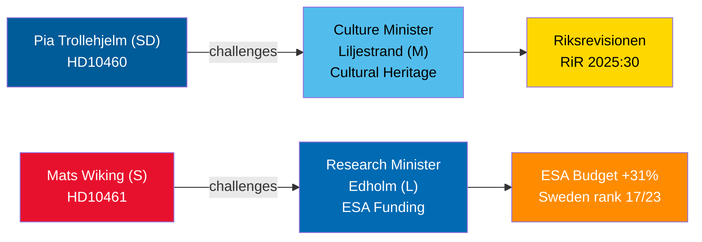

# Interpellation Debates 30 April 2026: Cultural Heritage Neglect and Sweden's Space Retreat

**Author**: James Pether Sörling  
**Date**: 2026-04-30  
**Classification**: PUBLIC — GDPR Art 9(2)(e,g)  
**Confidence**: MEDIUM [B2]  

## 🎯 BLUF

Two interpellations filed 29–30 April 2026 spotlight contrasting governance failures in the Tidö coalition: SD holds coalition partner Culture Minister Liljestrand (M) accountable for deferred maintenance of state grant properties (Riksrevisionen RiR 2025:30 audit); while opposition Social Democrat Mats Wiking challenges Research Minister Edholm (L) over Sweden's anomalous retreat in ESA funding — one of only three ESA members to reduce contributions despite a record 31% budget increase at the November 2025 ministerial meeting. Both debates will be scheduled by 5 May 2026 with ministerial responses due by 21 May 2026.

## 🧭 3 Decisions This Brief Supports

1. **Cultural heritage portfolio managers and civil society**: Monitor whether Minister Liljestrand commits to a comprehensive maintenance survey and long-term plan for state grant properties — a prerequisite for EU Heritage funding applications and private sector co-investment.
2. **Space industry stakeholders and ESA partners**: Assess whether Minister Edholm will announce a corrective budget reallocation to restore Sweden's ESA programme share before the next ESA ministerial cycle, preventing Swedish firms from losing EU public procurement access.
3. **Parliamentary committee chairs (KU, UbU)**: Both interpellations open formal oversight windows — KU on inter-coalition accountability for cultural property stewardship; UbU on research and industrial policy coherence in the space sector.

## 60-Second Intelligence Bullets

- SD's Pia Trollehjelm (interpellation HD10460) invokes Riksrevisionen audit RiR 2025:30 to pressure M's Liljestrand on Statens fastighetsverk grant properties — a cross-party oversight move within the coalition [B2]
- S's Mats Wiking (HD10461) documents Sweden's fall to ESA rank 17/23 and a record-low share of voluntary ESA programmes, attributing it to the government approving only 100 MSEK of Rymdstyrelsen's request for 2026–2028 [A2]
- Germany, France, Italy, Spain, Poland and Canada significantly increased ESA contributions at the November 2025 ministerial meeting; Sweden, alongside only two other members, reduced its share [A2]
- Both interpellations were forwarded to ministers on 2026-04-30; debates announced 2026-05-05; reply deadline 2026-05-21 [A1]
- No vote is attached to either interpellation — they are accountability mechanisms only; parliamentary discipline impact is limited but reputational pressure is significant [B1]

## Top Forward Trigger

If Minister Edholm announces no corrective ESA budget measure before the 2026 Swedish government budget negotiations close in September, Swedish space industry associations are likely to escalate publicly and the issue may resurface in the autumn research policy bill.

## Mermaid Overview

