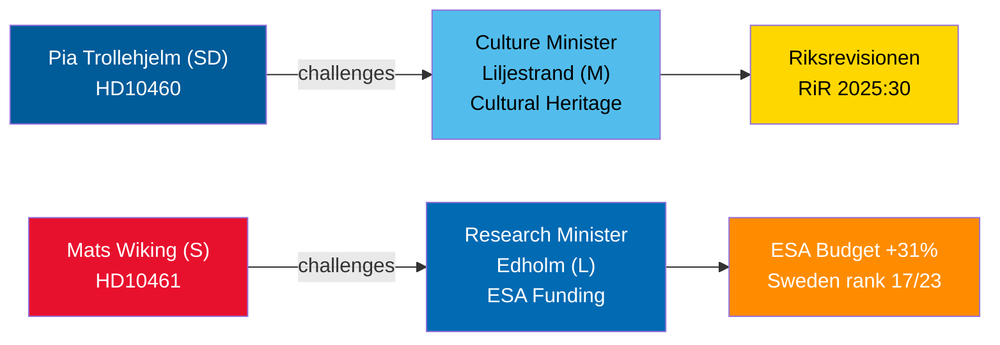

<!-- dir: rtl -->
# مناقشات الاستجواب في 30 أبريل 2026: إهمال التراث الثقافي وانسحاب السويد من الفضاء

**Author**: James Pether Sörling  
**Date**: 2026-04-30  
**Classification**: PUBLIC — GDPR Art 9(2)(e,g)  
**Confidence**: MEDIUM [B2]  

## 🎯 الملخص التنفيذي

يُبرز استجوابان مُقدَّمان في 29-30 أبريل 2026 إخفاقات حوكمة متباينة في تحالف تيدو: يُحاسب حزب SD شريكه في الائتلاف وزيرة الثقافة ليلجيستراند (M) على تأجيل صيانة عقارات المنح الحكومية (تدقيق Riksrevisionen RiR 2025:30)؛ بينما يتحدى الاشتراكي الديمقراطي المعارض ماتس ويكينج وزير البحوث إيدهولم (L) بشأن الانسحاب الشاذ للسويد من تمويل وكالة الفضاء الأوروبية (ESA) — إذ تُعدّ السويد واحدة من ثلاثة أعضاء فقط في الـESA خفّضت مساهماتها رغم الزيادة القياسية بنسبة 31% في اجتماع الوزراء في نوفمبر 2025. سيُجدوَل كلا النقاشين بحلول 5 مايو 2026 مع مواعيد نهائية للردود الوزارية في 21 مايو 2026.

## 🧭 3 قرارات يدعمها هذا الإحاطة

1. **مديرو محفظة التراث الثقافي والمجتمع المدني**: رصد ما إذا كانت الوزيرة ليلجيستراند ستلتزم بإجراء مسح صيانة شامل وخطة طويلة الأمد لعقارات المنح الحكومية — شرط مسبق لطلبات تمويل التراث الأوروبي والاستثمار المشترك مع القطاع الخاص.
2. **أصحاب المصلحة في صناعة الفضاء وشركاء الـESA**: تقييم ما إذا كان الوزير إيدهولم سيُعلن عن إعادة توزيع ميزانية تصحيحية لاستعادة حصة السويد في برنامج الـESA قبل دورة الوزراء التالية للـESA، مما يمنع الشركات السويدية من فقدان الوصول إلى المشتريات العامة في الاتحاد الأوروبي.
3. **رؤساء اللجان البرلمانية (KU، UbU)**: يفتح كلا الاستجوابين نوافذ رقابية رسمية — KU بشأن المساءلة بين الائتلاف على إدارة الممتلكات الثقافية؛ UbU بشأن تماسك سياسات البحث والصناعة في قطاع الفضاء.

## نقاط الاستخبارات في 60 ثانية

- تستند بيا تروليهيلم (SD) (الاستجواب HD10460) إلى تدقيق Riksrevisionen RiR 2025:30 للضغط على ليلجيستراند (M) بشأن عقارات Statens fastighetsverk المدعومة — مبادرة رقابية عابرة للأحزاب داخل الائتلاف [B2]
- يوثّق ماتس ويكينج (S) (HD10461) تراجع السويد إلى المرتبة 17/23 في الـESA وأدنى حصة قياسية في برامج الـESA الطوعية، عازياً ذلك إلى موافقة الحكومة على 100 مليون كرونة سويدية فحسب من طلب Rymdstyrelens للفترة 2026–2028 [A2]
- رفعت ألمانيا وفرنسا وإيطاليا وإسبانيا وبولندا وكندا مساهماتها في الـESA بشكل ملحوظ في اجتماع الوزراء في نوفمبر 2025؛ خفّضت السويد حصتها إلى جانب عضوين آخرين فحسب [A2]
- أُحيلَ كلا الاستجوابين إلى الوزراء في 2026-04-30؛ أُعلنت المناقشات في 2026-05-05؛ الموعد النهائي للرد 2026-05-21 [A1]
- لا يرتبط أي من الاستجوابين بتصويت — فهما آليتان للمساءلة فحسب؛ تأثيرهما على الانضباط البرلماني محدود لكن الضغط على السمعة كبير [B1]

## المحرّك الرئيسي للمستقبل

إن لم يُعلن الوزير إيدهولم عن أي إجراء تصحيحي لميزانية الـESA قبل انتهاء مفاوضات ميزانية الحكومة السويدية في سبتمبر، فمن المرجح أن تُصعّد جمعيات صناعة الفضاء السويدية علنياً وقد تعود القضية في مشروع قانون سياسة البحث في الخريف.

## نظرة عامة على Mermaid

<!-- source-sha: 1f8ac3fadc3c7198b50f9e6519083702a0185cd8 -->
