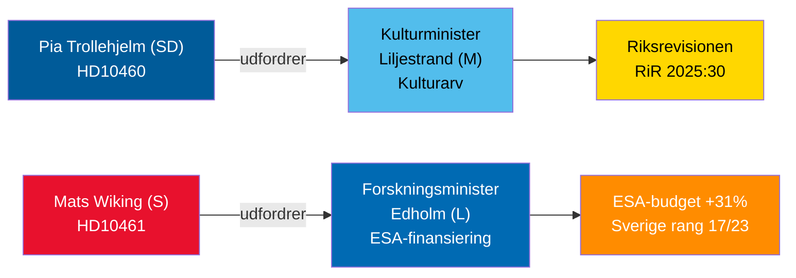

# Interpellationsdebatter 30. april 2026: Forsømmelse af kulturarv og Sveriges rumretræt

**Author**: James Pether Sörling  
**Date**: 2026-04-30  
**Classification**: PUBLIC — GDPR Art 9(2)(e,g)  
**Confidence**: MEDIUM [B2]  

## 🎯 BLUF

To interpellationer indgivet 29.–30. april 2026 belyser kontrasterende styringssvigt i Tidö-koalitionen: SD holder koalitionspartneren kulturminister Liljestrand (M) ansvarlig for udskudt vedligeholdelse af statslige tilskudsejendomme (Riksrevisionens revision RiR 2025:30); mens oppositionens socialdemokrat Mats Wiking udfordrer forskningsminister Edholm (L) om Sveriges anomale tilbagetrækning fra ESA-finansiering — et af kun tre ESA-medlemmer, der reducerede bidrag på trods af en rekord 31 %-stigning ved ministermødet i november 2025. Begge debatter vil blive planlagt inden 5. maj 2026 med ministerielle svar senest 21. maj 2026.

## 🧭 3 Beslutninger dette briefing understøtter

1. **Kulturarvsporteføljeforsvarere og civilsamfund**: Overvåg om minister Liljestrand forpligter sig til en omfattende vedligeholdelsesundersøgelse og langsigtet plan for statslige tilskudsejendomme — en forudsætning for EU's kulturarvsfinansieringsansøgninger og privat medfinansiering.
2. **Rumindustriaktører og ESA-partnere**: Vurder om minister Edholm vil annoncere en korrigerende budgetomfordeling for at genoprette Sveriges ESA-programandel inden næste ESA-ministercyklus og forhindre svenske virksomheder i at miste adgang til EU's offentlige indkøb.
3. **Parlamentariske udvalgsformænd (KU, UbU)**: Begge interpellationer åbner formelle tilsynsvinduer — KU om inter-koalitionsansvar for kulturejendommenes forvaltning; UbU om sammenhæng i forsknings- og industripolitikken i rumsektoren.

## 60-sekunders efterretningspunkter

- SD's Pia Trollehjelm (interpellation HD10460) påberåber Riksrevisionens revision RiR 2025:30 for at presse M's Liljestrand om Statens fastighetsverks tilskudsejendomme — et tværpolitisk tilsynsinitiativ inden for koalitionen [B2]
- S's Mats Wiking (HD10461) dokumenterer Sveriges fald til ESA-rang 17/23 og en rekordlav andel af frivillige ESA-programmer, som tilskrives regeringens godkendelse af kun 100 MSEK af Rymdstyrelens anmodning for 2026–2028 [A2]
- Tyskland, Frankrig, Italien, Spanien, Polen og Canada øgede markant deres ESA-bidrag ved ministermødet i november 2025; Sverige reducerede sin andel sammen med kun to andre medlemmer [A2]
- Begge interpellationer blev videresendt til ministrene den 2026-04-30; debatter annonceret 2026-05-05; svarfrist 2026-05-21 [A1]
- Ingen afstemning er knyttet til nogen af interpellationerne — de er udelukkende ansvarlighedsmekanismer; indvirkningen på parlamentarisk disciplin er begrænset, men omdømmemæssigt pres er betydeligt [B1]

## Ledende fremadrettet indikator

Hvis minister Edholm ikke annoncerer nogen korrigerende ESA-budgetforanstaltning inden forhandlingerne om den svenske statsbudget afsluttes i september, vil svenske rumbrancheorganisationer sandsynligvis eskalere offentligt, og spørgsmålet kan genopstå i efterårets forskningspolitiske lovforslag.

## Mermaid-oversigt

<!-- source-sha: 1f8ac3fadc3c7198b50f9e6519083702a0185cd8 -->
