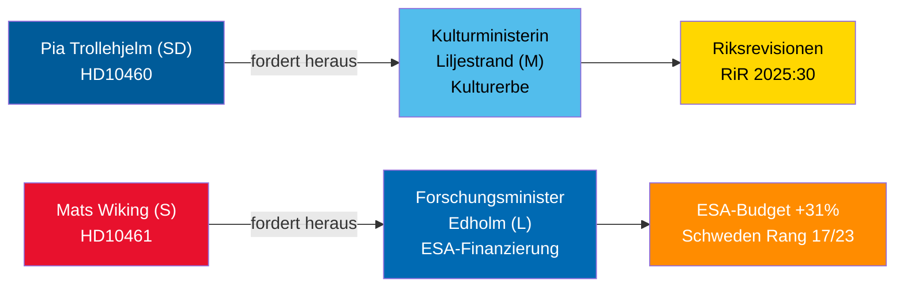

# Interpellationsdebatten 30. April 2026: Vernachlässigung des Kulturerbes und Schwedens Rückzug aus dem Raumfahrtprogramm

**Author**: James Pether Sörling  
**Date**: 2026-04-30  
**Classification**: PUBLIC — GDPR Art 9(2)(e,g)  
**Confidence**: MEDIUM [B2]  

## 🎯 BLUF

Zwei am 29.–30. April 2026 eingereichte Interpellationen beleuchten gegensätzliche Governance-Mängel in der Tidö-Koalition: SD hält Koalitionspartner Kulturministerin Liljestrand (M) für den aufgeschobenen Unterhalt staatlicher Förderliegenschaften verantwortlich (Riksrevisionen-Prüfung RiR 2025:30); während der oppositionelle Sozialdemokrat Mats Wiking Forschungsminister Edholm (L) wegen Schwedens anomalem Rückzug bei der ESA-Finanzierung herausfordert — eines von nur drei ESA-Mitgliedern, das Beiträge trotz einer Rekordzunahme von 31 % beim Ministertreffen im November 2025 reduzierte. Beide Debatten werden bis zum 5. Mai 2026 angesetzt, mit ministeriellen Antworten bis zum 21. Mai 2026.

## 🧭 3 Entscheidungen, die dieses Briefing unterstützt

1. **Kulturerbeverantwortliche und Zivilgesellschaft**: Überwachen Sie, ob sich Ministerin Liljestrand zu einer umfassenden Wartungserhebung und einem langfristigen Plan für staatliche Förderliegenschaften verpflichtet — Voraussetzung für EU-Kulturerbe-Förderanträge und private Kofinanzierung.
2. **Raumfahrtindustrieakteure und ESA-Partner**: Beurteilen Sie, ob Minister Edholm eine korrigierende Haushaltsumverteilung zur Wiederherstellung von Schwedens ESA-Programmanteil vor dem nächsten ESA-Ministerzyklus ankündigen wird, um zu verhindern, dass schwedische Unternehmen den Zugang zur EU-Vergabe öffentlicher Aufträge verlieren.
3. **Parlamentarische Ausschussvorsitzende (KU, UbU)**: Beide Interpellationen eröffnen formale Kontrollmöglichkeiten — KU zur koalitionsinternen Rechenschaftspflicht für die Pflege kultureller Liegenschaften; UbU zur Kohärenz der Forschungs- und Industriepolitik im Raumfahrtsektor.

## 60-Sekunden-Erkenntnisse

- SDs Pia Trollehjelm (Interpellation HD10460) beruft sich auf die Riksrevisionen-Prüfung RiR 2025:30, um Ms Liljestrand wegen der Liegenschaften von Statens fastighetsverk unter Druck zu setzen — ein parteiübergreifendes Kontrollinitiativ innerhalb der Koalition [B2]
- Ss Mats Wiking (HD10461) dokumentiert Schwedens Abstieg auf ESA-Rang 17/23 und einen Rekordniedrigstand beim Anteil an freiwilligen ESA-Programmen, was auf die Genehmigung von nur 100 MSEK des Antrags von Rymdstyrelens für 2026–2028 durch die Regierung zurückgeführt wird [A2]
- Deutschland, Frankreich, Italien, Spanien, Polen und Kanada erhöhten ihre ESA-Beiträge beim Ministertreffen im November 2025 erheblich; Schweden reduzierte seinen Anteil gemeinsam mit nur zwei anderen Mitgliedern [A2]
- Beide Interpellationen wurden am 2026-04-30 an die Minister weitergeleitet; Debatten angekündigt am 2026-05-05; Antwortfrist 2026-05-21 [A1]
- Keine Abstimmung ist mit einer der Interpellationen verbunden — sie sind ausschließlich Rechenschaftsmechanismen; die Auswirkungen auf die parlamentarische Disziplin sind begrenzt, aber der Reputationsdruck ist erheblich [B1]

## Führender Vorwärtsindikator

Wenn Minister Edholm keine korrigierende ESA-Budgetmaßnahme ankündigt, bevor die Verhandlungen über den schwedischen Staatshaushalt im September abgeschlossen sind, werden schwedische Raumfahrtbranchenverbände voraussichtlich öffentlich eskalieren und das Thema könnte im Herbst-Forschungspolitikgesetzentwurf wieder auftauchen.

## Mermaid-Übersicht

<!-- source-sha: 1f8ac3fadc3c7198b50f9e6519083702a0185cd8 -->
