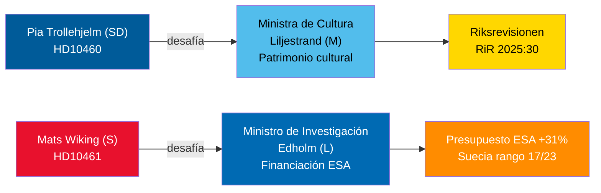

# Debates sobre interpelaciones del 30 de abril de 2026: Descuido del patrimonio cultural y retirada de Suecia del espacio

**Author**: James Pether Sörling  
**Date**: 2026-04-30  
**Classification**: PUBLIC — GDPR Art 9(2)(e,g)  
**Confidence**: MEDIUM [B2]  

## 🎯 BLUF

Dos interpelaciones presentadas el 29-30 de abril de 2026 ponen de relieve fallos de gobernanza contrastados en la coalición Tidö: SD responsabiliza a su socio de coalición, la ministra de Cultura Liljestrand (M), por el mantenimiento diferido de propiedades con subvenciones estatales (auditoría de la Riksrevisionen RiR 2025:30); mientras que el socialdemócrata de la oposición Mats Wiking desafía al ministro de Investigación Edholm (L) por la anómala retirada de Suecia de la financiación de la ESA — uno de solo tres miembros de la ESA que redujeron contribuciones a pesar de un aumento récord del 31 % en la reunión ministerial de noviembre de 2025. Ambos debates se programarán antes del 5 de mayo de 2026, con respuestas ministeriales antes del 21 de mayo de 2026.

## 🧭 3 decisiones que este informe apoya

1. **Gestores de carteras de patrimonio cultural y sociedad civil**: Vigilar si la ministra Liljestrand se compromete a realizar un estudio de mantenimiento integral y un plan a largo plazo para las propiedades con subvenciones estatales — condición previa para las solicitudes de financiación del Patrimonio de la UE y la co-inversión del sector privado.
2. **Actores de la industria espacial y socios de la ESA**: Evaluar si el ministro Edholm anunciará una reasignación presupuestaria correctiva para restaurar la cuota del programa ESA de Suecia antes del próximo ciclo ministerial de la ESA, evitando que las empresas suecas pierdan el acceso a la contratación pública de la UE.
3. **Presidentes de comisiones parlamentarias (KU, UbU)**: Ambas interpelaciones abren ventanas formales de control — KU sobre la responsabilidad inter-coalición en la gestión de propiedades culturales; UbU sobre la coherencia de la política de investigación e industrial en el sector espacial.

## Puntos de inteligencia en 60 segundos

- Pia Trollehjelm (SD) (interpelación HD10460) invoca la auditoría de la Riksrevisionen RiR 2025:30 para presionar a Liljestrand (M) sobre las propiedades subvencionadas de Statens fastighetsverk — una iniciativa de control multipartidista dentro de la coalición [B2]
- Mats Wiking (S) (HD10461) documenta la caída de Suecia al rango 17/23 en la ESA y una cuota récord mínima en programas voluntarios de la ESA, atribuyéndola a que el gobierno aprobó solo 100 MSEK de la solicitud de Rymdstyrelens para 2026–2028 [A2]
- Alemania, Francia, Italia, España, Polonia y Canadá aumentaron significativamente sus contribuciones a la ESA en la reunión ministerial de noviembre de 2025; Suecia redujo su cuota junto con solo dos otros miembros [A2]
- Ambas interpelaciones fueron remitidas a los ministros el 2026-04-30; debates anunciados el 2026-05-05; plazo de respuesta 2026-05-21 [A1]
- Ninguna votación está vinculada a ninguna de las interpelaciones — son únicamente mecanismos de responsabilidad; el impacto en la disciplina parlamentaria es limitado, pero la presión sobre la reputación es significativa [B1]

## Principal indicador prospectivo

Si el ministro Edholm no anuncia ninguna medida presupuestaria correctiva para la ESA antes de que concluyan las negociaciones del presupuesto del gobierno sueco en septiembre, las asociaciones de la industria espacial sueca probablemente escalarán públicamente y el tema podría resurgir en el proyecto de ley de política de investigación de otoño.

## Descripción general de Mermaid

<!-- source-sha: 1f8ac3fadc3c7198b50f9e6519083702a0185cd8 -->
