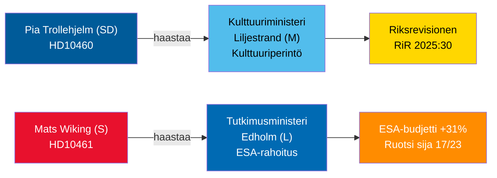

# Interpellaatiodebatit 30. huhtikuuta 2026: Kulttuuriperinnön laiminlyönti ja Ruotsin avaruusvetäytyminen

**Author**: James Pether Sörling  
**Date**: 2026-04-30  
**Classification**: PUBLIC — GDPR Art 9(2)(e,g)  
**Confidence**: MEDIUM [B2]  

## �� BLUF

Kaksi 29.–30. huhtikuuta 2026 jätettua interpellaatiota tuovat esiin Tidö-koalition vastakkaiset hallintopuutteet: SD vaatii koalitiokumppani kulttuuriministeri Liljestrandia (M) vastuuseen valtion tukikiinteistöjen lykätystä kunnossapidosta (Riksrevisionenin tarkastus RiR 2025:30); kun taas oppositiososialidemokraatti Mats Wiking haastaa tutkimusministeri Edholmin (L) Ruotsin poikkeuksellisesta ESA-rahoituksen vähennyksestä — yksi vain kolmesta ESA-jäsenestä, joka vähensi maksuja huolimatta marraskuun 2025 ministeritapaamisessa tehdystä 31 prosentin ennätysnoususta. Molemmat debatit aikataulutetaan viimeistään 5. toukokuuta 2026, ja ministerivastauksille on määräaika 21. toukokuuta 2026.

## 🧭 3 päätöstä, joita tämä tiedote tukee

1. **Kulttuuriperinnön portfolionhoitajat ja kansalaisyhteiskunta**: Seuraa, sitoutuuko ministeri Liljestrand kattavaan kunnossapitoselvitykseen ja pitkäaikaiseen suunnitelmaan valtion tukikiinteistöjä varten — edellytys EU:n kulttuuriperintörahoitushakemuksille ja yksityiselle yhteisrahoitukselle.
2. **Avaruusteollisuuden sidosryhmät ja ESA-kumppanit**: Arvioi, ilmoittaako ministeri Edholm korjaavasta budjetin uudelleenjaosta Ruotsin ESA-ohjelmaosakkuuden palauttamiseksi ennen seuraavaa ESA-ministerikokousta, jotta ruotsalaiset yritykset eivät menettäisi EU:n julkisten hankintojen saantia.
3. **Parlamentaaristen valiokuntien puheenjohtajat (KU, UbU)**: Molemmat interpellaatiot avaavat viralliset valvontaikkunat — KU koalition sisäisestä vastuusta kulttuuriomaisuuden hoidossa; UbU tutkimus- ja teollisuuspolitiikan johdonmukaisuudesta avaruussektorilla.

## 60 sekunnin tietopisteet

- SD:n Pia Trollehjelm (interpellaatio HD10460) vetoaa Riksrevisionenin tarkastukseen RiR 2025:30 painostaakseen M:n Liljestrandia Statens fastighetsverkin tukikiinteistöistä — koalition sisäinen puolueiden välinen valvonta-aloite [B2]
- S:n Mats Wiking (HD10461) dokumentoi Ruotsin putoamisen ESA-sijoitukselle 17/23 ja vapaaehtoisten ESA-ohjelmien ennätyksellisen alhaisen osuuden, johtuen siitä, että hallitus hyväksyi vain 100 MSEK Rymdstyrelsenin pyynnöstä vuosille 2026–2028 [A2]
- Saksa, Ranska, Italia, Espanja, Puola ja Kanada lisäsivät merkittävästi ESA-maksuosuuksiaan marraskuun 2025 ministeritapaamisessa; Ruotsi vähensi osuuttaan vain kahden muun jäsenen tavoin [A2]
- Molemmat interpellaatiot toimitettiin ministereille 2026-04-30; debatit ilmoitettu 2026-05-05; vastausmääräaika 2026-05-21 [A1]
- Kumpaankaan interpellaatioon ei liity äänestystä — ne ovat ainoastaan vastuuvelvollisuusmekanismeja; parlamentaarisen kurinalaisuuden vaikutus on rajallinen, mutta mainevaikutus on merkittävä [B1]

## Johtava eteenpäin katsova indikaattori

Jos ministeri Edholm ei ilmoita korjaavasta ESA-budjettitoimenpiteestä ennen Ruotsin hallituksen talousarviovalmistelun päättymistä syyskuussa, ruotsalaiset avaruusteollisuusjärjestöt todennäköisesti eskaloivat julkisesti ja asia voi nousta uudelleen syksyn tutkimuspoliittisessa esityksessä.

## Mermaid-yleiskatsaus

<!-- source-sha: 1f8ac3fadc3c7198b50f9e6519083702a0185cd8 -->
