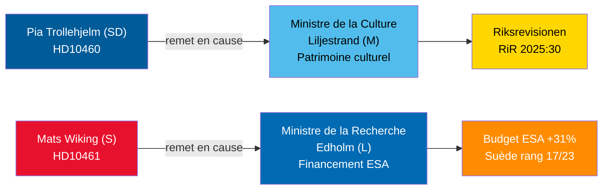

# Débats sur les interpellations du 30 avril 2026 : Négligence du patrimoine culturel et retrait de la Suède du programme spatial

**Author**: James Pether Sörling  
**Date**: 2026-04-30  
**Classification**: PUBLIC — GDPR Art 9(2)(e,g)  
**Confidence**: MEDIUM [B2]  

## 🎯 BLUF

Deux interpellations déposées les 29-30 avril 2026 mettent en lumière des défaillances de gouvernance contrastées au sein de la coalition Tidö : le SD tient son partenaire de coalition, la ministre de la Culture Liljestrand (M), responsable du report de l'entretien des propriétés bénéficiant de subventions d'État (audit de la Riksrevisionen RiR 2025:30) ; tandis que le socialiste de l'opposition Mats Wiking interroge le ministre de la Recherche Edholm (L) sur le retrait anomal de la Suède du financement de l'ESA — l'un des seulement trois membres de l'ESA à avoir réduit ses contributions malgré une augmentation record de 31 % lors de la réunion ministérielle de novembre 2025. Les deux débats seront programmés avant le 5 mai 2026, avec des réponses ministérielles attendues avant le 21 mai 2026.

## 🧭 3 décisions que ce briefing soutient

1. **Gestionnaires du portefeuille du patrimoine culturel et société civile** : Surveiller si la ministre Liljestrand s'engage à réaliser un état des lieux complet de l'entretien et un plan à long terme pour les propriétés subventionnées par l'État — condition préalable aux demandes de financement EU Heritage et au co-investissement du secteur privé.
2. **Acteurs de l'industrie spatiale et partenaires de l'ESA** : Évaluer si le ministre Edholm annoncera une réallocation budgétaire corrective pour restaurer la part de programme ESA de la Suède avant le prochain cycle ministériel de l'ESA, empêchant les entreprises suédoises de perdre l'accès aux marchés publics européens.
3. **Présidents de commissions parlementaires (KU, UbU)** : Les deux interpellations ouvrent des fenêtres de contrôle formelles — KU sur la responsabilité inter-coalition pour la gestion des propriétés culturelles ; UbU sur la cohérence de la politique de recherche et industrielle dans le secteur spatial.

## Informations en 60 secondes

- Pia Trollehjelm du SD (interpellation HD10460) invoque l'audit de la Riksrevisionen RiR 2025:30 pour faire pression sur Liljestrand (M) concernant les propriétés subventionnées de Statens fastighetsverk — une initiative de contrôle transpartisane au sein de la coalition [B2]
- Mats Wiking (S) (HD10461) documente la chute de la Suède au rang 17/23 de l'ESA et une part record au plus bas des programmes ESA volontaires, attribuant cela à l'approbation par le gouvernement de seulement 100 MSEK de la demande de Rymdstyrelens pour 2026–2028 [A2]
- L'Allemagne, la France, l'Italie, l'Espagne, la Pologne et le Canada ont considérablement augmenté leurs contributions à l'ESA lors de la réunion ministérielle de novembre 2025 ; la Suède a réduit sa part avec seulement deux autres membres [A2]
- Les deux interpellations ont été transmises aux ministres le 2026-04-30 ; débats annoncés le 2026-05-05 ; délai de réponse 2026-05-21 [A1]
- Aucun vote n'est lié à l'une ou l'autre des interpellations — elles constituent uniquement des mécanismes de responsabilité ; l'impact sur la discipline parlementaire est limité, mais la pression sur la réputation est significative [B1]

## Principal indicateur avancé

Si le ministre Edholm n'annonce aucune mesure corrective budgétaire concernant l'ESA avant la clôture des négociations budgétaires du gouvernement suédois en septembre, les associations de l'industrie spatiale suédoise risquent d'escalader publiquement et la question pourrait ressurgir dans le projet de loi sur la politique de recherche de l'automne.

## Aperçu Mermaid

<!-- source-sha: 1f8ac3fadc3c7198b50f9e6519083702a0185cd8 -->
