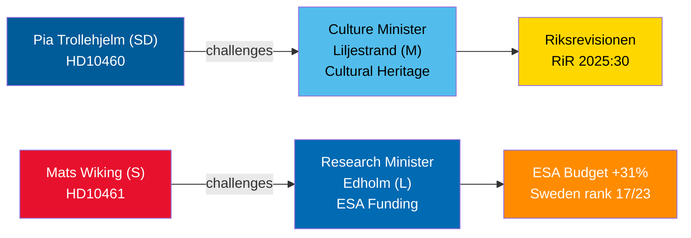

<!-- dir: rtl -->
# דיוני שאילתות ב-30 באפריל 2026: הזנחת מורשת תרבות ונסיגת שוודיה מהחלל

**Author**: James Pether Sörling  
**Date**: 2026-04-30  
**Classification**: PUBLIC — GDPR Art 9(2)(e,g)  
**Confidence**: MEDIUM [B2]  

## 🎯 תמצית מנהלים

שתי שאילתות שהוגשו ב-29-30 באפריל 2026 מאירות כשלי ממשל מנוגדים בקואליציית טידו: SD מבקשת דין וחשבון משותפת הקואליציה שרת התרבות ליליסטרנד (M) על דחיית תחזוקת נכסי המענקים הממשלתיים (ביקורת Riksrevisionen RiR 2025:30)؛ בעוד הסוציאל-דמוקרט מן האופוזיציה מאטס ויקינג מאתגר את שר המחקר אדהולם (L) על נסיגתה החריגה של שוודיה ממימון ה-ESA — אחד מרק שלושה חברים ב-ESA שהפחיתו תרומות למרות עלייה שיא של 31% בישיבת השרים בנובמבר 2025. שני הדיונים יתוכננו עד 5 במאי 2026 עם מועד אחרון לתשובות שרים עד 21 במאי 2026.

## 🧭 3 החלטות שסיכום זה תומך בהן

1. **מנהלי תיק מורשת התרבות ואנשי החברה האזרחית**: לעקוב אחר שאלת ההתחייבות של שרת ליליסטרנד לסקר תחזוקה מקיף ותוכנית ארוכת טווח לנכסי מענקים ממשלתיים — תנאי מוקדם לבקשות מימון מורשת האיחוד האירופי ולהשקעה משותפת מהמגזר הפרטי.
2. **בעלי עניין בתעשיית החלל ושותפי ESA**: להעריך אם שר אדהולם יכריז על הקצאת תקציב מתקנת לשיקום נתח התוכנית של שוודיה ב-ESA לפני מחזור השרים הבא של ESA, ולמנוע מחברות שוודיות לאבד גישה לרכש ציבורי של האיחוד האירופי.
3. **יושבי ראש ועדות פרלמנטריות (KU, UbU)**: שתי השאילתות פותחות חלונות פיקוח רשמיים — KU על אחריות קואליציונית הדדית לניהול נכסים תרבותיים; UbU על עקביות מדיניות המחקר והתעשייה במגזר החלל.

## נקודות מודיעין ב-60 שניות

- פיה טרולהיה (SD) (שאילתה HD10460) מסתמכת על ביקורת Riksrevisionen RiR 2025:30 כדי להפעיל לחץ על ליליסטרנד (M) בנוגע לנכסי Statens fastighetsverk — יוזמת פיקוח חוצת מפלגות בתוך הקואליציה [B2]
- מאטס ויקינג (S) (HD10461) מתעד את נפילת שוודיה לדרגה 17/23 ב-ESA ונתח שיא נמוך בתוכניות ESA הוולונטריות, בשל אישור הממשלה רק 100 מיליון כרונות שוודיות מבקשת Rymdstyrelens לשנים 2026–2028 [A2]
- גרמניה, צרפת, איטליה, ספרד, פולין וקנדה הגדילו משמעותית את תרומותיהן ל-ESA בישיבת השרים בנובמבר 2025; שוודיה הפחיתה את נתחה יחד עם שני חברים בלבד [A2]
- שתי השאילתות הועברו לשרים ב-2026-04-30; דיונים הוכרזו ב-2026-05-05; מועד אחרון לתשובה 2026-05-21 [A1]
- שום הצבעה אינה מצורפת לאף אחת מהשאילתות — הן מנגנוני אחריות בלבד; ההשפעה על משמעת פרלמנטרית מוגבלת אך הלחץ התדמיתי משמעותי [B1]

## מחוון קדימה מוביל

אם שר אדהולם לא יכריז על צעד תקציבי מתקן ל-ESA לפני סיום משא ומתן תקציב הממשלה השוודית בספטמבר, ארגוני תעשיית החלל השוודיים עשויים להסלים את הנושא בפומבי והוא עלול לחזור בהצעת מדיניות המחקר בסתיו.

## סקירת Mermaid

<!-- source-sha: 1f8ac3fadc3c7198b50f9e6519083702a0185cd8 -->
