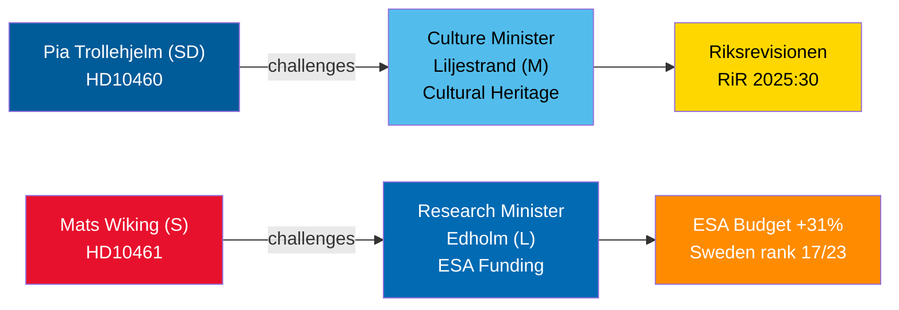

# 2026年4月30日の質問討論：文化遺産の放置とスウェーデンの宇宙からの撤退

**Author**: James Pether Sörling  
**Date**: 2026-04-30  
**Classification**: PUBLIC — GDPR Art 9(2)(e,g)  
**Confidence**: MEDIUM [B2]  

## 🎯 要旨

2026年4月29〜30日に提出された二つの質問は、ティドー連立政権内の対照的なガバナンス上の欠陥を浮き彫りにしています。SDは連立パートナーのリリエストランド文化大臣（M）に対し、国家補助金対象物件の保守点検が先送りされていることへの責任を追及しており（リクスレビション監査 RiR 2025:30）、一方で野党社会民主党のマッツ・ヴィキングはESA資金拠出におけるスウェーデンの異例な削減についてエドホルム研究大臣（L）に説明を求めています。スウェーデンは2025年11月の閣僚会議で記録的な31%増となったにもかかわらず、拠出金を減らしたわずか3カ国のうちの一国です。両討論は2026年5月5日までにスケジュールされ、大臣回答の期限は2026年5月21日です。

## 🧭 この報告が支援する3つの意思決定

1. **文化遺産ポートフォリオ管理者と市民社会**: リリエストランド大臣が国家補助金対象物件の包括的な保守調査と長期計画に取り組む意向を示すかどうかを監視する — EU文化遺産助成申請および民間の共同投資の前提条件となります。
2. **宇宙産業関係者とESAパートナー**: エドホルム大臣が次のESA閣僚サイクルの前にスウェーデンのESAプログラム分担を回復するための是正予算再配分を発表するかどうかを評価する — スウェーデン企業がEU公共調達へのアクセスを失うことを防ぐためです。
3. **国会委員会委員長（KU、UbU）**: 両質問は正式な監視機会を開きます — KU：文化財管理における連立内の相互説明責任について；UbU：宇宙分野における研究・産業政策の一貫性について。

## 60秒インテリジェンス・ポイント

- SDのピア・トロレヘルム（質問 HD10460）はリクスレビション監査 RiR 2025:30 を援用し、Statens fastighetsverkの補助金対象物件についてMのリリエストランドに圧力をかけています — 連立内における超党派の監視イニシアチブ [B2]
- Sのマッツ・ヴィキング（HD10461）はスウェーデンのESA順位が17/23位に低下し、任意ESAプログラムへの参加が過去最低水準となっていることを記録しており、政府が2026〜2028年のRymdstyrelensの要求額のうちわずか1億スウェーデンクローナ（MSEK）しか承認しなかったことが原因と指摘しています [A2]
- ドイツ、フランス、イタリア、スペイン、ポーランド、カナダは2025年11月の閣僚会議でESA拠出金を大幅に増額。スウェーデンはわずか2カ国とともに分担を削減しました [A2]
- 両質問は2026-04-30に大臣に送付；討論は2026-05-05に告知；回答期限 2026-05-21 [A1]
- いずれの質問にも採決は伴っていません — それらは説明責任のメカニズムに過ぎません。国会の規律への影響は限定的ですが、レピュテーションへの圧力は相当なものです [B1]

## 主要な先行指標

もしエドホルム大臣が9月のスウェーデン政府予算交渉が終わるまでにESA予算の是正措置を発表しなければ、スウェーデンの宇宙産業団体が公に問題を拡大し、秋の研究政策法案でこの問題が再び浮上する可能性が高いです。

## Mermaid概要

<!-- source-sha: 1f8ac3fadc3c7198b50f9e6519083702a0185cd8 -->
