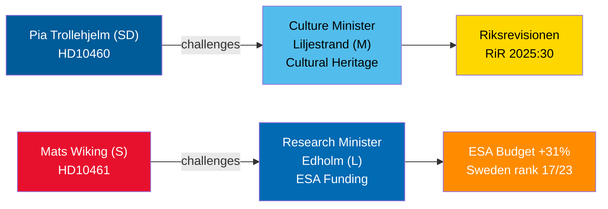

# 2026년 4월 30일 질문 토론: 문화유산 방치와 스웨덴의 우주 후퇴

**Author**: James Pether Sörling  
**Date**: 2026-04-30  
**Classification**: PUBLIC — GDPR Art 9(2)(e,g)  
**Confidence**: MEDIUM [B2]  

## 🎯 요약

2026년 4월 29~30일에 제출된 두 건의 질문서는 티도 연립정부 내의 대조적인 거버넌스 실패를 조명합니다. SD는 연립 파트너인 릴리에스트란드 문화부장관(M)에게 국가 보조금 부동산의 유지보수 지연에 대한 책임을 묻고 있으며(릭스레비시온 감사 RiR 2025:30), 반면 야당 사민당의 마츠 비킹은 ESA 자금 지원에서 스웨덴이 이례적으로 후퇴한 것에 대해 에드홀름 연구부장관(L)에게 도전장을 던지고 있습니다. 스웨덴은 2025년 11월 장관 회의에서 기록적인 31% 증가에도 불구하고 기여금을 줄인 단 3개 ESA 회원국 중 하나입니다. 두 토론은 모두 2026년 5월 5일까지 일정이 잡힐 예정이며, 장관 답변 기한은 2026년 5월 21일입니다.

## 🧭 이 브리핑이 지원하는 3가지 결정

1. **문화유산 포트폴리오 관리자 및 시민사회**: 릴리에스트란드 장관이 국가 보조금 부동산에 대한 포괄적인 유지보수 조사와 장기 계획을 약속하는지 모니터링 — EU 문화유산 자금 신청과 민간 공동 투자를 위한 전제조건.
2. **우주산업 이해관계자 및 ESA 파트너**: 에드홀름 장관이 다음 ESA 장관 사이클 전에 스웨덴의 ESA 프로그램 점유율을 회복하기 위한 수정 예산 재배분을 발표할지 평가 — 스웨덴 기업들이 EU 공공조달 접근권을 잃지 않도록 하기 위함.
3. **국회 위원회 의장(KU, UbU)**: 두 질문서 모두 공식 감독 기회를 엽니다 — KU: 문화재 관리에 대한 연립 내 상호 책임; UbU: 우주 분야 연구 및 산업 정책의 일관성.

## 60초 정보 포인트

- SD의 피아 트롤레헬름(질문 HD10460)은 릭스레비시온 감사 RiR 2025:30을 근거로 Statens fastighetsverks의 보조금 부동산에 대해 M의 릴리에스트란드를 압박 — 연립 내 초당파 감독 이니셔티브 [B2]
- S의 마츠 비킹(HD10461)은 스웨덴이 ESA 순위 17/23위로 하락하고 자발적 ESA 프로그램 점유율이 사상 최저를 기록했음을 문서화했으며, 정부가 2026~2028년 Rymdstyrelens 요청 중 불과 1억 크로나(MSEK)만 승인한 것이 원인이라고 지적 [A2]
- 독일, 프랑스, 이탈리아, 스페인, 폴란드, 캐나다는 2025년 11월 장관 회의에서 ESA 기여금을 대폭 늘렸으며, 스웨덴은 단 두 나라와 함께 점유율을 줄였습니다 [A2]
- 두 질문서 모두 2026-04-30에 장관에게 전달; 토론 2026-05-05에 공고; 답변 기한 2026-05-21 [A1]
- 두 질문서 모두 표결이 없습니다 — 책임 메커니즘에 불과하므로 의회 규율에 미치는 영향은 제한적이지만 평판 압박은 상당합니다 [B1]

## 주요 선행 지표

에드홀름 장관이 9월 스웨덴 정부 예산 협상이 마무리되기 전에 ESA 예산 수정 조치를 발표하지 않으면, 스웨덴 우주산업 협회들이 공개적으로 문제를 확대할 가능성이 높으며 가을 연구정책 법안에서 이 문제가 다시 대두될 수 있습니다.

## Mermaid 개요

<!-- source-sha: 1f8ac3fadc3c7198b50f9e6519083702a0185cd8 -->
