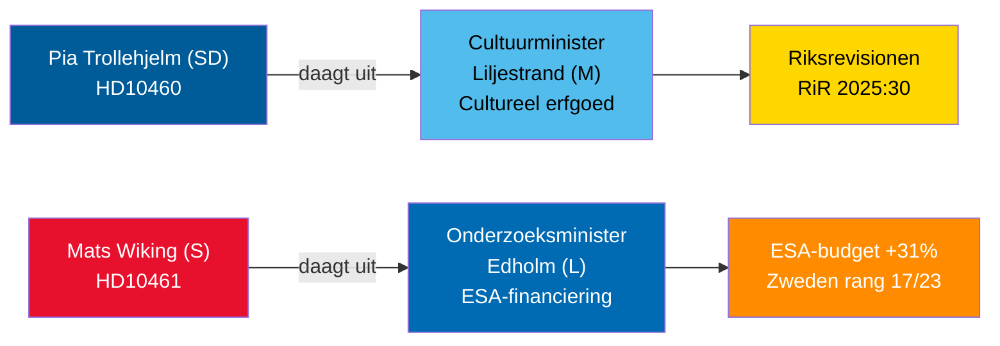

# Interpellatiededbatten 30 april 2026: Verwaarlozing cultureel erfgoed en de terugtrekking van Zweden uit de ruimtevaart

**Author**: James Pether Sörling  
**Date**: 2026-04-30  
**Classification**: PUBLIC — GDPR Art 9(2)(e,g)  
**Confidence**: MEDIUM [B2]  

## 🎯 BLUF

Twee op 29-30 april 2026 ingediende interpellaties belichten contrasterende bestuursfalen in de Tidö-coalitie: SD houdt coalitiegenoot cultuurminister Liljestrand (M) verantwoordelijk voor uitgesteld onderhoud van staatsgefinancierde panden (Riksrevisionen-audit RiR 2025:30); terwijl oppositiesociaaldemocraatMats Wiking onderzoeksminister Edholm (L) uitdaagt over Zweden's anomale terugtrekking uit ESA-financiering — een van slechts drie ESA-leden die bijdragen verminderden ondanks een recordstijging van 31% op de ministeriële vergadering van november 2025. Beide debatten worden gepland vóór 5 mei 2026 met ministeriële reacties uiterlijk 21 mei 2026.

## 🧭 3 beslissingen die dit briefing ondersteunt

1. **Erfgoedbeheerders en maatschappelijk middenveld**: Monitor of minister Liljestrand zich committeert aan een uitgebreid onderhoudsonderzoek en langetermijnplan voor staatsgefinancierde panden — een vereiste voor EU Heritage-financieringsaanvragen en private co-investering.
2. **Ruimtevaartindustrieactoren en ESA-partners**: Beoordeel of minister Edholm een corrigerende budgetherverdeling zal aankondigen om het ESA-programma-aandeel van Zweden te herstellen vóór de volgende ESA-ministercyclus, zodat Zweedse bedrijven geen toegang tot EU-overheidsopdrachten verliezen.
3. **Parlementaire commissievoorzitters (KU, UbU)**: Beide interpellaties openen formele controlemogelijkheden — KU over inter-coalitie aansprakelijkheid voor het beheer van cultureel erfgoed; UbU over de samenhang van het onderzoeks- en industriebeleid in de ruimtevaartsector.

## 60-seconden inlichtingenpunten

- SD's Pia Trollehjelm (interpellatie HD10460) beroept zich op de Riksrevisionen-audit RiR 2025:30 om druk uit te oefenen op M's Liljestrand over de gesubsidieerde panden van Statens fastighetsverk — een partijoverschrijdend controle-initiatief binnen de coalitie [B2]
- S's Mats Wiking (HD10461) documenteert Zweden's val naar ESA-rang 17/23 en een recordlage deelname aan vrijwillige ESA-programma's, toegeschreven aan de goedkeuring door de regering van slechts 100 MSEK van Rymdstyrelens verzoek voor 2026–2028 [A2]
- Duitsland, Frankrijk, Italië, Spanje, Polen en Canada verhoogden hun ESA-bijdragen aanzienlijk op de ministeriële vergadering van november 2025; Zweden verlaagde zijn aandeel samen met slechts twee andere leden [A2]
- Beide interpellaties werden op 2026-04-30 doorgestuurd naar ministers; debatten aangekondigd op 2026-05-05; antwoorddeadline 2026-05-21 [A1]
- Geen stemming is gekoppeld aan een van de interpellaties — het zijn uitsluitend verantwoordingsmechanismen; impact op parlementaire discipline is beperkt maar reputatiedruk is aanzienlijk [B1]

## Belangrijkste vooruitlopende indicator

Als minister Edholm geen corrigerende ESA-budgetmaatregel aankondigt voordat de onderhandelingen over de Zweedse staatsbegroting in september afsluiten, zullen Zweedse ruimtevaartsbrancheorganisaties waarschijnlijk publiekelijk escaleren en het onderwerp kan terugkeren in het herfst-onderzoeksbeleidswetsvoorstel.

## Mermaid-overzicht

<!-- source-sha: 1f8ac3fadc3c7198b50f9e6519083702a0185cd8 -->
