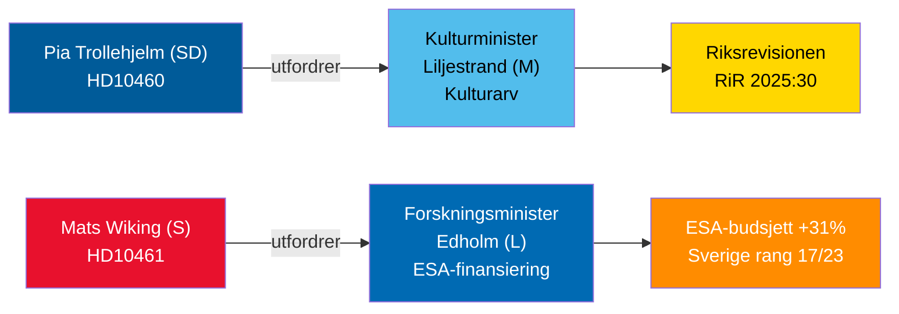

# Interpellasjonsdeabatter 30. april 2026: Forsømmelse av kulturarv og Sveriges romretreat

**Author**: James Pether Sörling  
**Date**: 2026-04-30  
**Classification**: PUBLIC — GDPR Art 9(2)(e,g)  
**Confidence**: MEDIUM [B2]  

## 🎯 BLUF

To interpellasjoner innlevert 29.–30. april 2026 belyser kontrasterende styringssvikt i Tidö-koalisjonen: SD holder koalisjonspartneren kulturminister Liljestrand (M) ansvarlig for utsatt vedlikehold av statlige tilskuddeiendommer (Riksrevisjonens revisjon RiR 2025:30); mens opposisjonens sosialdemokrat Mats Wiking utfordrer forskningsminister Edholm (L) om Sveriges avvikende tilbaketrekning fra ESA-finansiering — ett av kun tre ESA-medlemmer som reduserte bidrag til tross for en rekordøkning på 31 % ved ministermøtet i november 2025. Begge debattene vil bli planlagt innen 5. mai 2026, med ministerielle svar innen 21. mai 2026.

## 🧭 3 Beslutninger dette briefet støtter

1. **Kulturarvsporteføljeforvaltere og sivilsamfunn**: Følg med på om minister Liljestrand forplikter seg til en omfattende vedlikeholdsundersøkelse og langsiktig plan for statlige tilskuddeiendommer — en forutsetning for EUs kulturarvsstøtteansøkninger og privat medfinansiering.
2. **Romfartsindustriaktører og ESA-partnere**: Vurder om minister Edholm vil kunngjøre en korrigerende budsjettomfordeling for å gjenopprette Sveriges ESA-programandel før neste ESA-ministersyklus, og forhindre at svenske selskaper mister tilgang til EUs offentlige anskaffelser.
3. **Parlamentariske utvalgsformenn (KU, UbU)**: Begge interpellasjoner åpner formelle tilsynsvinduer — KU om inter-koalisjonsansvar for forvaltning av kultureiendommer; UbU om sammenheng i forsknings- og industripolitikken i romsektoren.

## 60-sekunders etterretningspunkter

- SDs Pia Trollehjelm (interpellasjon HD10460) påberoper Riksrevisjonens revisjon RiR 2025:30 for å presse Ms Liljestrand om Statens fastighetsverks tilskuddeiendommer — et tverrpolitisk tilsynstiltak innenfor koalisjonen [B2]
- Ss Mats Wiking (HD10461) dokumenterer Sveriges fall til ESA-rang 17/23 og en rekordlav andel av frivillige ESA-programmer, tilskrevet at regjeringen godkjente bare 100 MSEK av Rymdstyrelens forespørsel for 2026–2028 [A2]
- Tyskland, Frankrike, Italia, Spania, Polen og Canada økte sine ESA-bidrag betydelig ved ministermøtet i november 2025; Sverige reduserte sin andel sammen med kun to andre medlemmer [A2]
- Begge interpellasjoner ble videresendt til ministrene 2026-04-30; debatter kunngjort 2026-05-05; svarfrist 2026-05-21 [A1]
- Ingen avstemning er knyttet til noen av interpellasjonene — de er utelukkende ansvarlighetsmekanismer; innvirkning på parlamentarisk disiplin er begrenset, men omdømmemessig press er betydelig [B1]

## Ledende fremoverindikator

Dersom minister Edholm ikke kunngjør noen korrigerende ESA-budsjettiltak før forhandlingene om det svenske statsbudsjettet avsluttes i september, vil svenske romfartsbransjeorganisasjoner sannsynligvis eskalere offentlig, og saken kan gjenta seg i høstens forskningspolitiske forslag.

## Mermaid-oversikt

<!-- source-sha: 1f8ac3fadc3c7198b50f9e6519083702a0185cd8 -->
