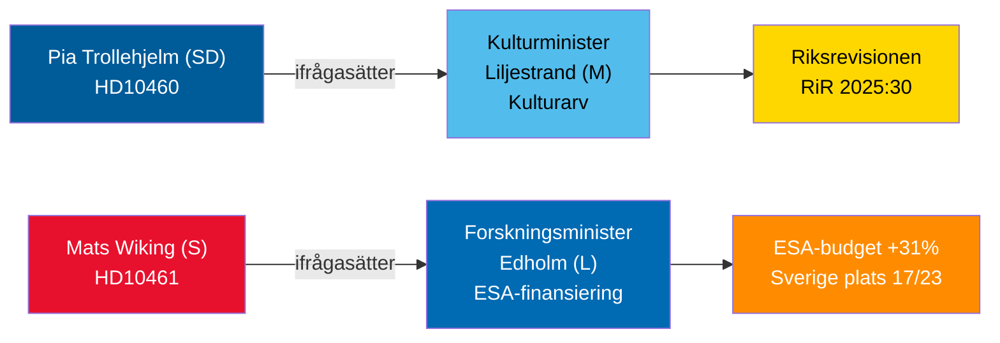

# Interpellationsdebatter 30 april 2026: Försummelse av kulturarv och Sveriges rymdreträtt

**Author**: James Pether Sörling  
**Date**: 2026-04-30  
**Classification**: PUBLIC — GDPR Art 9(2)(e,g)  
**Confidence**: MEDIUM [B2]  

## 🎯 BLUF

Två interpellationer inlämnade 29–30 april 2026 belyser kontrasterande styrningsbrister i Tidökoalitionen: SD ställer koalitionspartnern kulturminister Liljestrand (M) till svars för uppskjutet underhåll av statsbidragsfastigheter (Riksrevisionens granskning RiR 2025:30); medan oppositionens socialdemokrat Mats Wiking ifrågasätter forskningsminister Edholm (L) om Sveriges avvikande minskning av ESA-finansiering — ett av endast tre ESA-länder som minskade bidrag trots en rekordökning på 31 % vid ministermötet i november 2025. Båda debatterna kommer att schemaläggas senast 5 maj 2026 med ministersvar senast 21 maj 2026.

## 🧭 3 Beslut som detta briefing stödjer

1. **Fastighetsansvariga för kulturarv och civilsamhälle**: Övervaka om minister Liljestrand förbinder sig till en heltäckande underhållsutredning och långsiktig plan för statsbidragsfastigheter — en förutsättning för EU:s kulturarvsfinansieringsansökningar och privat samfinansiering.
2. **Rymdaktörer och ESA-partners**: Bedöm om minister Edholm kommer att avisera en korrigerande budgetomfördelning för att återställa Sveriges ESA-programandel inför nästa ESA-ministercykel och förhindra att svenska företag förlorar tillgång till EU:s offentliga upphandling.
3. **Riksdagsutskottsordförande (KU, UbU)**: Båda interpellationerna öppnar formella tillsynsfönster — KU om koalitionens interna ansvar för förvaltning av kulturegendomar; UbU om sammanhang i forsknings- och industripolitiken inom rymdsektorn.

## 60-sekunders underrättelse

- SD:s Pia Trollehjelm (interpellation HD10460) åberopar Riksrevisionens granskning RiR 2025:30 för att pressa M:s Liljestrand om Statens fastighetsverks bidragsfastigheter — ett tvärpolitiskt tillsynsinitiativ inom koalitionen [B2]
- S:s Mats Wiking (HD10461) dokumenterar Sveriges fall till ESA-plats 17/23 och en rekordlåg andel av frivilliga ESA-program, vilket tillskrivs att regeringen godkände endast 100 MSEK av Rymdstyrelens begäran för 2026–2028 [A2]
- Tyskland, Frankrike, Italien, Spanien, Polen och Kanada ökade avsevärt sina ESA-bidrag vid ministermötet i november 2025; Sverige minskade sin andel tillsammans med endast två andra medlemmar [A2]
- Båda interpellationerna vidarebefordrades till ministrarna 2026-04-30; debatter tillkännagivna 2026-05-05; svarsfrist 2026-05-21 [A1]
- Ingen omröstning är kopplad till någon av interpellationerna — de är enbart ansvarsutkrävningsmekanismer; inverkan på parlamentarisk disciplin är begränsad men det anseendemässiga trycket är betydande [B1]

## Ledande framåtindikator

Om minister Edholm inte aviserar någon korrigerande ESA-budgetåtgärd innan förhandlingarna om den svenska statsbudgeten avslutas i september, kommer svenska rymdaktörsorganisationer sannolikt att eskalera offentligt och frågan kan återkomma i höstens forskningspolitiska proposition.

## Mermaid-översikt

<!-- source-sha: 1f8ac3fadc3c7198b50f9e6519083702a0185cd8 -->
